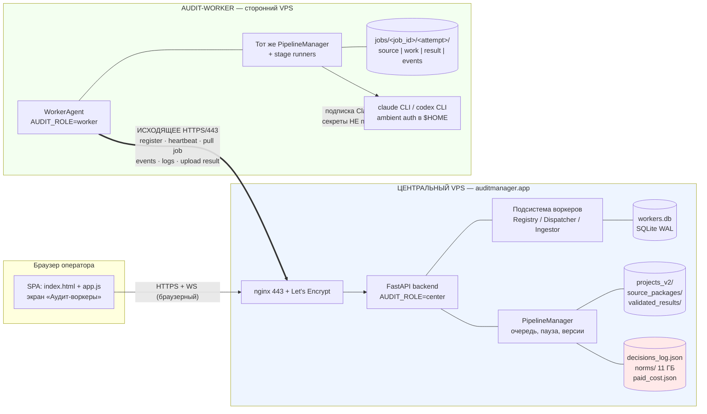
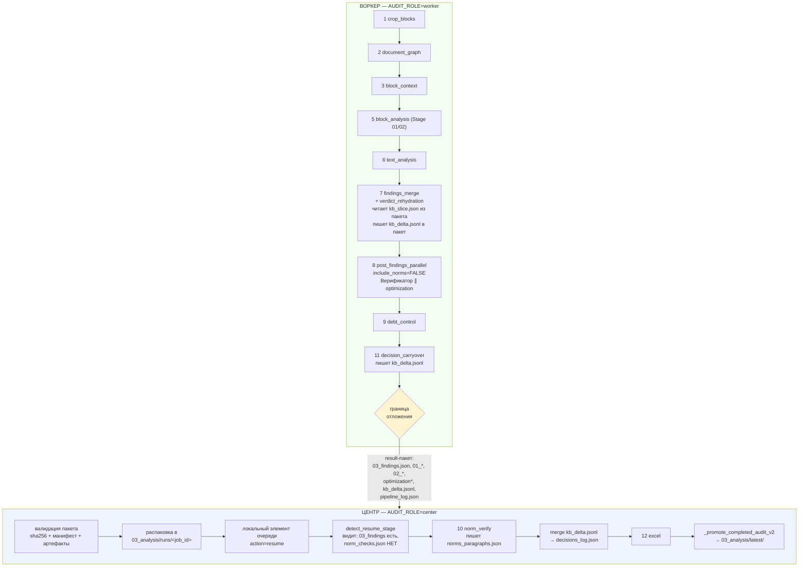
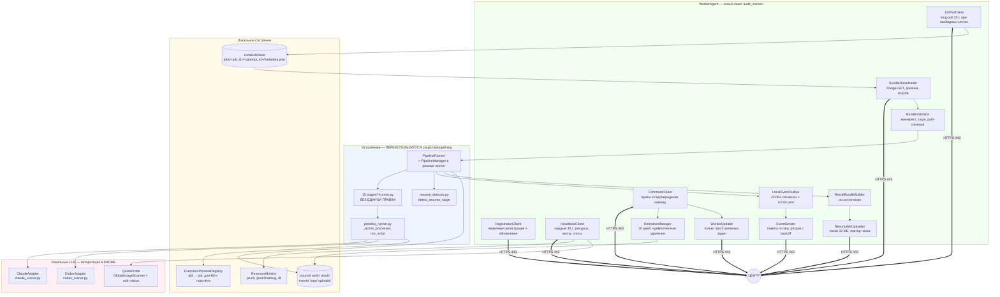
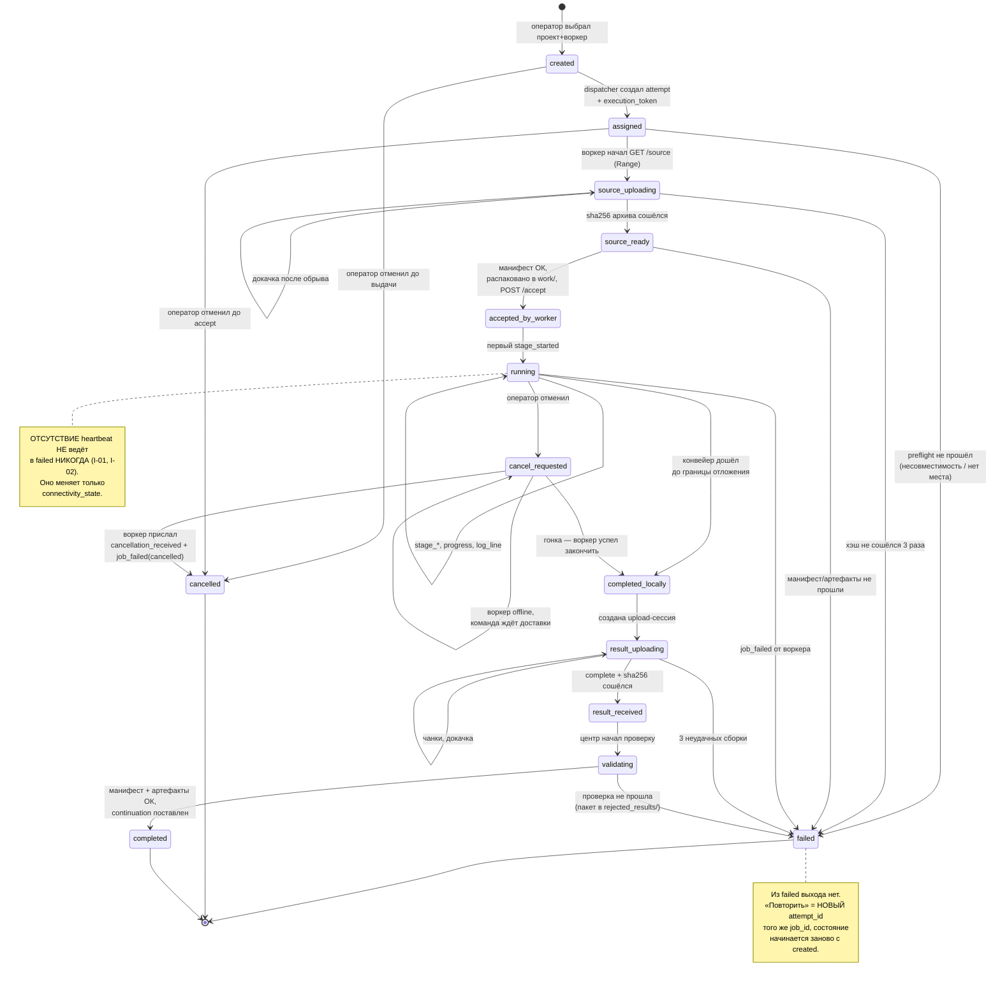
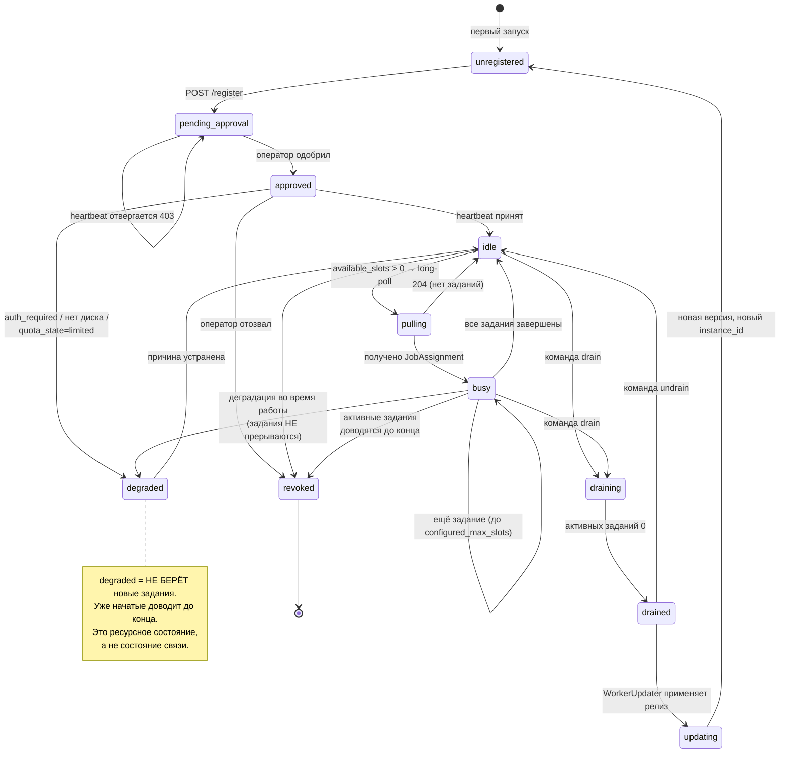
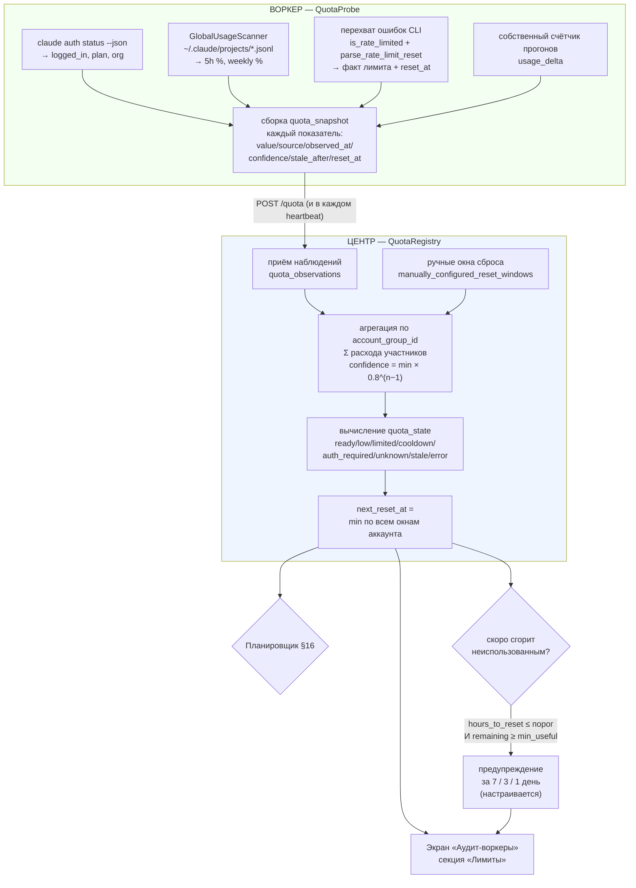
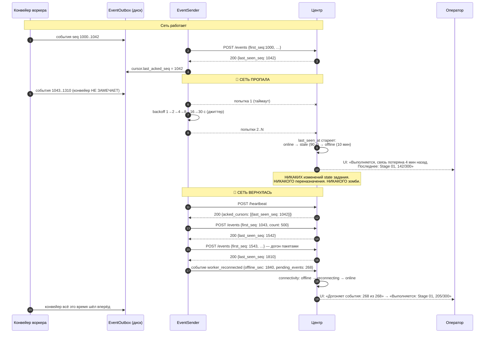

# Технический проект распределённой системы audit-worker

**Дата:** 2026-08-07
**Статус:** технический проект. **Кода нет, рабочий код не изменялся, конфигурация не менялась, миграций нет.**
**Ветка:** `feature/block-vector-graphs`
**HEAD на начало работы:** `bdc5c87f0a15aced0b5ef766d96d911d44b0b016` («feat(аудит): изолированный бенчмарк перепроверки отклонённых замечаний»)
**Основание:** [01_current_architecture_audit.md](01_current_architecture_audit.md) — все ссылки вида «§N» без указания документа ведут в **этот** технический проект; ссылки «отчёт §N» — в первый аудит.

> **Соглашение о ссылках.** Каждая точка интеграции подтверждена путём, классом/функцией и диапазоном строк на HEAD `bdc5c87f`. Строки перепроверены заново в начале этой работы (см. §2), а не перенесены из первого отчёта.
>
> **Секреты.** Значения токенов, паролей, cookie и файлов авторизации Claude/Codex не читались и не приводятся — только имена переменных и контракты.

---

## 1. Исходные условия

### 1.1. Состояние репозитория

| Проверка | Результат |
|---|---|
| `git branch --show-current` | `feature/block-vector-graphs` |
| `git rev-parse HEAD` | `bdc5c87f0a15aced0b5ef766d96d911d44b0b016` |
| `git log -1 --oneline` | `bdc5c87f feat(аудит): изолированный бенчмарк перепроверки отклонённых замечаний` |
| `git status` | чисто, кроме неотслеженного `docs/distributed_audit_workers/` |

HEAD **совпадает** с HEAD на момент завершения первого аудита — параллельных коммитов за время работы не было, то есть весь код, на который ссылается первый отчёт, актуален байт-в-байт. Тем не менее критические для проектирования якоря перепроверены заново (§2.1) — там, где строки сместились или формулировка первого отчёта была неточна, это отмечено явно.

Не выполнялось: `reset`, `clean`, `checkout`, `switch`, `stash`, `rebase`, `commit`, `add`. Чужие незавершённые файлы не изменялись. Длительные процессы и LLM-аудиты не запускались.

### 1.2. Что уже установлено на центральном хосте (проверено)

| Компонент | Значение | Следствие для проекта |
|---|---|---|
| Python бэкенда | **3.12.13** (`/opt/py312`) | `tarfile.data_filter` **доступен** (`hasattr(tarfile,'data_filter') → True`) → безопасная распаковка TAR штатными средствами, без своего парсера |
| SQLite | **3.53.1** (модуль `sqlite3` в stdlib) | WAL, `RETURNING`, частичные индексы, `STRICT`-таблицы доступны → §21 |
| `zstd` CLI | `/usr/bin/zstd` есть; GNU tar понимает `--zstd` | компрессия возможна и без Python-пакета |
| Python-пакет `zstandard` | **НЕ установлен** | добавляется в `requirements-worker.txt`; до этого — фолбэк `gzip` (§12.2) |
| nginx | `client_max_body_size 200M`, `proxy_read_timeout/send_timeout 3600s` | пакет 100–637 МБ **не пролезает одним запросом** → чанкованная загрузка обязательна, размер чанка < 200 МБ (§11.7) |

### 1.3. Что этот документ определяет, а что — нет

**Определяет:** границы компонентов, контракты HTTP-эндпоинтов с request/response, схему данных, машины состояний с допустимыми переходами, формат пакета и манифеста, правила идемпотентности, правила совместимости версий, формулы слотов и приоритета, сценарии работы без связи, модель безопасности, разбиение реализации на обратимые шаги.

**Не определяет:** реализацию (кода нет), точные тексты миграций, тюнинг порогов под конкретное железо воркера (пороги конфигурируемы, предложены безопасные значения), механизм доставки бинарного пакета обновления (заложен только контракт, §13.6).

---

## 2. Проверенные выводы первого аудита

### 2.1. Перепроверка якорей на HEAD `bdc5c87f`

Проверено `grep -n` / `sed -n` по текущему дереву. Все ссылки ниже — фактические, не перенесённые.

| Факт первого отчёта | Проверка на HEAD | Статус |
|---|---|---|
| Единая точка диспетчеризации | `async def _dispatch_action(self, item, job, default_action="full", action_override=None)` — [manager.py:5998-6004](../../backend/app/pipeline/manager.py#L5998-L6004) | ✅ подтверждено, **сигнатура зафиксирована** |
| Вызов диспетчера из слота | `await self._dispatch_action(item, job, default_action=queue.action, action_override=_action_override)` — [manager.py:5878-5881](../../backend/app/pipeline/manager.py#L5878-L5881); `_action_override = "resume"` при `was_interrupted` — [:5870-5877](../../backend/app/pipeline/manager.py#L5870-L5877) | ✅ подтверждено |
| Воркер слота | `async def _batch_slot_worker(self, queue, meta_job)` — [manager.py:5752](../../backend/app/pipeline/manager.py#L5752) | ✅ |
| Таймаут зомби | `ZOMBIE_TIMEOUT_SEC = 600` — [manager.py:321](../../backend/app/pipeline/manager.py#L321) | ✅ |
| Гейты живости | `_has_live_project_audit` [:550](../../backend/app/pipeline/manager.py#L550), `_protected_pids` [:571](../../backend/app/pipeline/manager.py#L571), `_batch_worker_alive` [:513](../../backend/app/pipeline/manager.py#L513), `cleanup_zombies` [:1176](../../backend/app/pipeline/manager.py#L1176), `_reconcile_stale_queue` [:6496](../../backend/app/pipeline/manager.py#L6496) | ✅ все пять на месте |
| Отмена | `async def cancel(self, project_id)` — [manager.py:1330](../../backend/app/pipeline/manager.py#L1330); `cancel_batch` [:6405](../../backend/app/pipeline/manager.py#L6405) | ✅ |
| Ключ задания | `def job_key(project_id, version_id=None)` — [manager.py:1110](../../backend/app/pipeline/manager.py#L1110) | ✅ (в первом отчёте указано `:1109` — фактически `:1110`) |
| Резолв путей / контекст этапа | `_resolve_job_paths` [:1459](../../backend/app/pipeline/manager.py#L1459), `_make_stage_context` [:1627](../../backend/app/pipeline/manager.py#L1627), `_make_audit_env_for_job` [:1432](../../backend/app/pipeline/manager.py#L1432) | ✅ |
| Публикация результата | `_promote_completed_audit_v2` [:1940](../../backend/app/pipeline/manager.py#L1940) | ✅ |
| `job_id` = имя run-каталога | `output_dir = version_dir / "03_analysis" / "runs" / safe_run` — [v2_primary_wiring.py:202](../../backend/app/services/storage/v2_primary_wiring.py#L202); `safe_run = os.path.basename(run_id)` с отсечением `.`/`..` [:198-200](../../backend/app/services/storage/v2_primary_wiring.py#L198-L200) | ✅ **и уже защищено от path traversal** |
| Очередь и её элемент | `BatchQueueItem` — [models/audit.py:111-131](../../backend/app/models/audit.py#L111-L131): `project_id, version_id, action, retry_stage, status, error, extra_params, job_id, started_at, finished_at, hidden` | ✅ |
| `AuditJob` | [models/audit.py:38-68](../../backend/app/models/audit.py#L38-L68): есть `job_id, object_id, version_id, stage, status, progress_current/total, last_heartbeat, batch_durations, pause_total_sec, tokens_*, cost_usd, cli_calls` | ✅ |
| Персист очереди / восстановление | `_persist_queue` [:473](../../backend/app/pipeline/manager.py#L473), `load_persisted_queue` [:620](../../backend/app/pipeline/manager.py#L620), `auto_resume_interrupted_batch` [:688](../../backend/app/pipeline/manager.py#L688), `_ensure_batch_worker` [:6220](../../backend/app/pipeline/manager.py#L6220) | ✅ |
| Интерлок prepare↔батч | `is_project_in_active_batch` [:493](../../backend/app/pipeline/manager.py#L493) | ✅ |
| WS-ретрансляция | `ConnectionManager.schedule_broadcast_to_project` — [ws/manager.py:38](../../backend/app/ws/manager.py#L38) | ✅ |
| Типы WS-сообщений | [models/websocket.py](../../backend/app/models/websocket.py): `log_reset:15, log:25, progress:34, status_change:49, error:62, heartbeat:71, complete:91, finding_stage:108, finding_added:121, cli_summary:138, prepare_queue_progress:163, finding_verdict:175` | ✅ 12 конструкторов |

### 2.2. Три уточнения к первому отчёту

Проектирование опирается на уточнённые формулировки, а не на исходные.

**(1) `detect_resume_stage` — функция от `project_id`, а не от каталога.**
Сигнатура: `detect_resume_stage(project_id: str, *, version_id: Optional[str] = None)` ([resume_detector.py:30](../../backend/app/pipeline/resume_detector.py#L30)), внутри — `resolve_project_dir(project_id)` + `version_service.get_version_dir(...)`. Формулировка первого отчёта «чистая функция от каталога проекта» верна по **сути** (никакой памяти менеджера, сети и очереди не требуется), но не по **сигнатуре**: чтобы она сработала на воркере, проект должен резолвиться в `AUDIT_PROJECTS_V2_DIR` воркера, то есть распаковка пакета обязана воссоздать форму дерева `objects/<obj>/disciplines/<D>/documents/<код>/versions/<vid>/`. Это ограничение зафиксировано в требованиях к пакету (§12.5).

**(2) У норм-этапа уже есть готовый параметр выключения.**
В `_run_ocr_pipeline` норм-этап управляется флагом `PIPELINE_NORMS_AFTER_MERGE_ENABLED`. Точные якоря (проверены на HEAD): параметр объявлен как `include_norms: bool = True` в сигнатуре `_run_post_findings_parallel` ([manager.py:4535](../../backend/app/pipeline/manager.py#L4535)) и используется внутри неё ([:4666-4679](../../backend/app/pipeline/manager.py#L4666-L4679)); вызов из полного конвейера — `include_norms=not norms_after_merge` ([:5274-5278](../../backend/app/pipeline/manager.py#L5274-L5278)); отдельный последовательный прогон — `await self._run_norm_verification(job, standalone=False, wait_before_fix=None)` ([:5309-5311](../../backend/app/pipeline/manager.py#L5309-L5311), определение `:4741`); Excel — `:5322-5323`. То есть **параметр «выполнять ли нормы в этом прогоне» уже существует как аргумент**, и пилотное отложение норм-этапа на центр не требует нового ветвления — требуется третье значение источника этого решения (роль процесса). Это меняет оценку сложности варианта Б (отчёт §9.2) с «нужен частичный возврат» на «нужен флаг роли» (§4.4, ADR-009).

**(3) Пакет не пролезает одним HTTP-запросом.**
Первый отчёт отметил `client_max_body_size 200M` как достоинство инфраструктуры. При медиане версии 30 МБ это так, но p95 = 170 МБ и максимум = 637 МБ, то есть верхняя часть распределения **упирается в лимит nginx**. Отсюда обязательная чанкованная загрузка результата и `Range`-докачка исходника (§11.7, §11.8), а не «multipart одним куском», как предполагал отчёт §9.3.

### 2.3. Выводы первого аудита, принятые без изменений

1. Точка врезки `ExecutionBackend` одна — `_batch_slot_worker` → `_dispatch_action`.
2. Все 15 `stages/*/runner.py` переносимы без правок (`PipelineStageContext` не держит ссылку на менеджер).
3. Пакет проекта — дерево каталогов; БД нет; всё состояние — JSON/JSONL с атомарной записью.
4. TAR, не ZIP: 18 % файлов — хардлинки, ZIP даёт +40 % объёма.
5. Кропы восстановимы офлайн из `02_work/document.pdf` — их можно не везти.
6. Авторизация Claude/Codex ambient в `$HOME`; через env её передать **нельзя** (`_run_cli` вычищает все `CLAUDE*`) — только интерактивный логин на воркере.
7. Главный риск — ложный «зомби»: три существующих гейта живости опираются на локальные сигналы, которых у remote-задания нет по определению.
8. `decisions_log.json`, `norms_paragraphs.json`, `paid_cost.json` — разделяемое изменяемое состояние; `atomic_write_json` пишет **без flock**.
9. Отпечатка версии нет: `/api/info` отдаёт захардкоженное `"1.0.0"`.
10. Точек запуска `claude -p` не менее десяти, под `resource_budget` — одна.

---

## 3. Зафиксированные требования

### 3.1. Функциональные требования (из задания)

| # | Требование | Где решается |
|---|---|---|
| F-01 | Центральный VPS — главный диспетчер; сторонние VPS — audit-worker | §4, §6, §7 |
| F-02 | Воркер использует локально авторизованные Claude Code / Codex | §7.5, §15 |
| F-03 | Центр не получает секреты и файлы авторизации | §20.6 |
| F-04 | Один проект целиком закреплён за одним воркером | §9.3, §10.4 |
| F-05 | На воркер передаётся полный пакет проекта | §12 |
| F-06 | После завершения воркер возвращает полный пакет с результатами | §12.6, §11.8 |
| F-07 | Пакет сохраняется на воркере после завершения | §19.3 |
| F-08 | По умолчанию удаляется через 30 дней после подтверждённого приёма | §19.4 |
| F-09 | Центр может раньше отправить команду удаления | §11.10, §19.4 |
| F-10 | При потере связи аудит не останавливается | §18, ADR-006 |
| F-11 | После восстановления воркер передаёт накопленные события/логи/результаты | §14.4, §18.3 |
| F-12 | Центр показывает все VPS в одном окне | §21 |
| F-13 | Запуск на первом этапе преимущественно ручной | §16.1 |
| F-14 | В будущем — автоматический выбор воркера | §16.3 |
| F-15 | Главный приоритет автовыбора — близость даты сброса лимита | §16.4 |
| F-16 | До 5 проектов на VPS, если хватает ресурсов | §17 |
| F-17 | Центр получает полные логи и динамический прогресс | §14 |
| F-18 | Код воркера должен централизованно обновляться | §13.6, ADR-012 |

### 3.2. Архитектурные ограничения (зафиксированы заданием, не пересматриваются)

| # | Ограничение |
|---|---|
| C-01 | Воркер сам устанавливает исходящее соединение; HTTPS, порт 443; входящего SSH для обработки заданий нет |
| C-02 | SSH — только установка, ремонт, диагностика |
| C-03 | Пилот: периодический heartbeat + pull/long-polling задания + пакеты событий + отдельные HTTPS-запросы для архивов |
| C-04 | Существующий WebSocket центра используется **только** для браузера |
| C-05 | Постоянный WebSocket центр↔воркер не вводится без доказанной необходимости |
| C-06 | Пилот: один центр, один воркер, ручное назначение, без авто-переназначения, центральное хранение пакетов |
| C-07 | Без Redis, RabbitMQ, Kubernetes, S3 |
| C-08 | Пилот: нормативные этапы допустимо оставить на центре |
| C-09 | Прямая одновременная запись нескольких воркеров в `decisions_log.json`, `norms_paragraphs.json`, `paid_cost.json` и прочие глобальные изменяемые файлы **запрещена** |

### 3.3. Инварианты (обязательны к сохранению во всех режимах)

Каждый инвариант ниже имеет исполнителя и тест.

| # | Инвариант | Где обеспечивается | Тест |
|---|---|---|---|
| I-01 | Потеря heartbeat ≠ остановка аудита | воркер не спрашивает разрешения у центра; `PipelineRunner` не имеет обратной связи в диспетчер (§7.4) | `test_offline_pipeline_continues` |
| I-02 | Remote-задание нельзя признать зомби по локальным сигналам центра | `ExecutionBackend.liveness()` — §8.5; `cleanup_zombies` спрашивает бэкенд, а не `_active_processes` | `test_remote_heartbeat_prevents_zombie` |
| I-03 | Центр не переназначает задание из-за временной недоступности воркера | авто-переназначения нет вовсе (ADR-004); переход только вручную оператором | `test_no_auto_reassign_on_offline` |
| I-04 | Повторная отправка события не применяет последствия дважды | монотонный `sequence` + `last_seen_seq`; батч обязан быть непрерывным и возрастающим (§11.6) | `test_event_seq_idempotent` |
| I-05 | Одно задание не исполняется на двух воркерах | `execution_token`: каждое обращение по job проверяется на актуальность попытки (§9.4) | `test_superseded_attempt_rejected` |
| I-06 | Повторная загрузка пакета не создаёт дубликат результата | `UploadSession` + `result_package_hash`; повтор с тем же хэшем → тот же результат (§11.7) | `test_upload_replay_no_duplicate` |
| I-07 | Центральный пакет не перезаписывается до полной загрузки + sha256 + манифеста + обязательных артефактов | staging-каталог + атомарный `os.replace` только после четырёх проверок (§12.7, §19.2) | `test_no_publish_before_validation` |
| I-08 | Воркер не удаляет пакет до подтверждения приёма центром | `retention_until` выставляется **по факту** получения `result_validated`; до этого удаление запрещено (§19.4) | `test_retention_requires_ack` |
| I-09 | Состояния переживают рестарт центра, рестарт воркера, обрыв сети, повтор HTTP | SQLite WAL на центре (§21), файловый `LocalJobStore` + `EventOutbox` на воркере (§7.3) | `test_restart_*` (6 тестов) |
| I-10 | Центр не может послать воркеру произвольную shell-команду | закрытый enum `command_type` (§11.9); воркер валидирует по белому списку и отвергает неизвестные | `test_worker_action_whitelist` |
| I-11 | Воркер выполняет только команды протокола | то же | то же |
| I-12 | Логи перед отправкой очищаются от секретов | `LogRedactor` в `LocalEventOutbox` (§20.8) — редактирование при **записи** в outbox, не при отправке | `test_secret_redaction` |

> **Уточнение к I-12.** В задании сказано «перед отправкой». Проектное решение — редактировать **при записи в outbox**, то есть раньше. Причина: outbox — файл на диске стороннего VPS, и хранить в нём секреты в открытом виде не менее опасно, чем отправлять. Обратная сторона: локальная диагностика теряет часть значений, поэтому нередактированный поток остаётся только в `audit_log.jsonl` (не покидает воркер) — компромисс явный.

---

## 4. Пилотная архитектура

### 4.1. Контекстная схема системы (диаграмма 1)



**Пояснение.** Стрелка воркер → центр **единственная жирная**: весь рабочий обмен инициирует воркер. Центр никогда не соединяется с воркером — у воркера нет открытого порта. Браузерный WebSocket (`/ws`) остаётся ровно тем, чем был: каналом центра к браузеру; события удалённого воркера просто вливаются в него через уже существующий `ws_manager.schedule_broadcast_to_project` ([ws/manager.py:38](../../backend/app/ws/manager.py#L38)), поэтому фронтенд не различает локальное и удалённое исполнение. Красный блок — разделяемое изменяемое состояние, к которому у воркера **нет доступа ни на чтение-запись** (только срез в пакете, §12.5).

### 4.2. Что делает пилот и чего не делает

| Делает | Не делает |
|---|---|
| Один центр + один воркер | Несколько воркеров одновременно (схема готова, но не проверяется) |
| Регистрация, одобрение вручную, токен | mTLS, ротацию по расписанию |
| Ручное назначение проекта на воркер | Автовыбор воркера |
| Полный пакет туда и обратно, центральное хранение | Распределённое хранение, S3 |
| Полный конвейер на воркере **кроме** норм-этапа и Excel | Норм-базу на воркере |
| События с `seq`, догон после обрыва, полные логи | Постоянный WSS центр↔воркер |
| Ручное признание попытки потерянной, новый attempt | Автоматическое переназначение |
| Хранение пакета 30 дней, команда удаления | Централизованное обновление кода (только контракт) |
| Расчёт слотов и отображение; жёсткий верхний предел 5 | Динамическое авто-масштабирование под нагрузку |

### 4.3. Пилотный поток «от кнопки до результата» (кратко)

```
Оператор: «Запустить аудит проекта P на VPS-1»
  → центр проверяет совместимость (§13.4) и создаёт RemoteAuditJob(state=created)
  → собирает source-пакет P.tar.zst, кладёт в source_packages/, state=assigned
  → воркер (long-poll) получает задание, скачивает пакет по Range-GET, state=source_uploading→source_ready
  → воркер валидирует манифест и sha256, распаковывает в jobs/<job>/<attempt>/work, шлёт accept → state=accepted_by_worker
  → воркер запускает конвейер локально; события летят пакетами → state=running
  → конвейер дошёл до границы отложения (норм-этап) → state=completed_locally
  → воркер собирает result-пакет, чанками грузит в центр → state=result_uploading → result_received
  → центр сверяет sha256/манифест/обязательные артефакты → state=validating
  → центр распаковывает в 03_analysis/runs/<job_id>, ставит ЛОКАЛЬНЫЙ элемент очереди с action=resume
  → штатный detect_resume_stage видит отсутствие norm_checks.json → норм-этап + Excel + промоушен в latest
  → state=completed; воркеру уходит result_validated; воркер ставит retention_until = now + 30д
```

Ключевое: **«частичный возврат» не является отдельным протоколом**. Это обычный `resume` центра по уже существующей машине возобновления (§4.4).

### 4.4. Пилотное разделение нормативного этапа (диаграмма 12)



**Пояснение.** Граница проходит там, где этап начинает писать в разделяемое состояние. Всего таких этапов два: `norm_verify` (пишет `norms/norms_paragraphs.json`) и запись вердиктов в `decisions_log.json` (её делают `verdict_rehydration` внутри `findings_merge` и `decision_carryover`).

Решение разное для этих двух случаев, и это важно:

- **`norm_verify` целиком уезжает на центр.** Обоснование: не только запись, но и 11 ГБ данных + 5,6 ГБ RAM на сессию + хрупкий venv (отчёт §5.3 — venv сломан уже на центральном хосте). Механизм выключения на воркере уже есть — параметр `include_norms` у `_run_post_findings_parallel` и отдельный вызов `_run_norm_verification` (§2.2 п.2). Воркер записывает в `pipeline_log.json` статус `deferred` (новое значение, см. §14.6), чтобы `detect_resume_stage` на центре не спутал отложение с ошибкой.
- **Запись вердиктов остаётся на воркере, но перенаправляется в файл.** Обоснование: `verdict_rehydration` — часть `findings_merge`, вырезать её значило бы деградировать сам свод. Поэтому воркер **читает** срез базы знаний (`kb_slice.json` в пакете — только этот `project_id`) и **пишет** дельту (`kb_delta.jsonl` в result-пакете). Центр применяет дельту к `decisions_log.json` под своим единственным писателем. Это закрывает C-09, не трогая логику этапа.

**Целевая версия (§5):** обе части возвращаются на воркер — норм-этап через узкий RPC к норм-API центра (интерфейс всего из трёх операций), запись вердиктов остаётся дельтой навсегда, потому что дельта — правильная модель и для одного воркера тоже.

---

## 5. Целевая архитектура

Целевая система отличается от пилота **пятью** дельтами. Всё остальное — тот же контракт, те же эндпоинты, та же схема данных. Это осознанное требование к проекту: пилот не должен быть выброшен.

| # | Дельта | Что меняется | Что НЕ меняется |
|---|---|---|---|
| T-1 | **Норм-этап на воркере** | появляется `NormsAdapter` с двумя режимами: `local` (полная база на воркере) и `remote_rpc` (три операции к центру: `resolve_norm_status`, `get_paragraph`, `semantic_search`); `norm_verify` перестаёт быть `deferred` | формат `norm_checks.json`, `03a_norms_verified.json`, запись `norms_paragraphs.json` остаётся эксклюзивом центра (воркер шлёт дельту тем же механизмом, что и вердикты) |
| T-2 | **Автовыбор воркера** | `Scheduler` из §16.3 включается; ручной выбор остаётся как override | контракт `assign`, состояния задания |
| T-3 | **Несколько воркеров, до 5 проектов на каждом** | `available_slots` начинает влиять на выдачу (в пилоте — только отображается); появляется `account_group` арбитраж | формула §17.2 (она сразу написана под N воркеров) |
| T-4 | **Централизованное обновление кода** | `WorkerUpdateManager` + `WorkerUpdater` активируются; canary-канал, откат | контракт `GET /worker/update/manifest` заложен в пилоте (§13.6), просто всегда отвечает «обновлений нет» |
| T-5 | **Ручное признание потери → полуавтоматическое** | появляется правило «если воркер offline > N часов И оператор подтвердил политику — центр сам ротирует attempt» | инвариант I-03 сохраняется: **без** явно включённой политики авто-переназначения нет никогда |

**Чего нет и в целевой версии** (сознательные отказы, ADR-003, ADR-007):
- очереди сообщений (RabbitMQ/Redis): поток событий строго последовательный внутри `job_id`, а `last_seen_seq` даёт ту же гарантию доставки дешевле;
- объектного хранилища (S3): пакеты хранятся централизованно по условию задания, а прямая отдача файла с `Range` уже работает через nginx;
- Kubernetes: воркер не эфемерен — у него локальная авторизация CLI, локальные пакеты и 30-дневный retention;
- внешнего сервера БД: весь объём центрального состояния — единицы миллионов строк за годы (§19.6).

**Что станет первым кандидатом на пересмотр при росте:** если воркеров станет больше ~20 или суточный поток событий превысит ~5 млн строк, SQLite-файл стоит разделить на «оперативный» (задания, воркеры) и «журнальный» (события) или заменить журнальную часть на PostgreSQL. Не раньше — и это отдельное решение с отдельным замером.

---

## 6. Компоненты центрального VPS

### 6.1. Схема компонентов центра (диаграмма 2)

```mermaid
graph TB
    subgraph EXIST["Существующий код — правки минимальны"]
        PM["PipelineManager<br/>manager.py:287"]
        BQ[("batch_queue.json<br/>очередь как есть")]
        AL["audit_logger<br/>update_pipeline_log:143"]
        WS["ws_manager<br/>schedule_broadcast_to_project:38"]
        PS["project_service<br/>resolve_project_dir:450"]
        US["usage_service<br/>GlobalUsageScanner:650"]
    end

    subgraph NEW["Новая подсистема backend/app/services/workers/"]
        REG["WorkerRegistry<br/>регистрация, токены, одобрение, отзыв"]
        MON["WorkerConnectionMonitor<br/>online/stale/offline — ТОЛЬКО связь"]
        DISP["RemoteJobDispatcher<br/>назначение, execution_token, attempt"]
        JSS["JobStateStore<br/>единственный владелец state задания"]
        ING["WorkerEventIngestor<br/>дедуп по seq, ретрансляция"]
        LOGS["WorkerLogStore<br/>job_logs/*.jsonl, ротация"]
        ART["ArtifactStore<br/>source/result пакеты, staging"]
        UPL["UploadSessionManager<br/>чанки, sha256, докачка"]
        QR["QuotaRegistry<br/>аккаунты, окна сброса, группы"]
        RSS["ResourceSnapshotStore<br/>RAM/CPU/диск/слоты"]
        UPD["WorkerUpdateManager<br/>контракт, в пилоте no-op"]
        SCH["Scheduler<br/>фильтры + ранжирование (T-2)"]
    end

    subgraph BACKENDS["ExecutionBackend — §8"]
        EB{{"ExecutionBackend<br/>протокол"}}
        LEB["LocalExecutionBackend<br/>= сегодняшний _dispatch_action"]
        REB["RemoteWorkerExecutionBackend"]
    end

    DB[("workers.db — SQLite WAL")]
    FSS[("source_packages/ · incoming/<br/>validated_results/ · rejected_results/")]

    API["/api/v1/worker/* — роутер воркеров"]
    APIA["/api/workers/* — роутер оператора"]

    API --> REG & MON & DISP & ING & UPL & UPD & QR & RSS
    APIA --> REG & DISP & JSS & ART & SCH
    REG & MON & DISP & JSS & ING & UPL & QR & RSS & UPD --> DB
    ART & UPL --> FSS
    ING --> AL
    ING --> WS
    ING --> LOGS
    PM --> EB
    EB --> LEB & REB
    REB --> DISP & JSS & ART
    LEB --> PM
    DISP --> SCH
    QR --> US
    JSS --> BQ

    style NEW fill:#f0fff0
    style EXIST fill:#eef5ff
    style BACKENDS fill:#fff8e8
```



**Пояснение.** Синий блок — существующий код, в него вносится ровно то, что перечислено в §22. Зелёный блок — новая подсистема, целиком аддитивная (новые файлы, новый роутер, новая БД). Жёлтый — единственная точка, где новое встречается со старым.

Обратите внимание на две развязки:
- `WorkerConnectionMonitor` **не имеет права** менять состояние задания. Он владеет только `connection_status`. Это машинная реализация инварианта I-02 и ADR-006.
- `JobStateStore` — единственный, кто пишет `state` задания. Все остальные компоненты просят его о переходе, и он проверяет допустимость по таблице §10.3. Переход, не описанный в таблице, — программная ошибка, а не «просто присвоение поля».

### 6.2. Обязанности и границы компонентов центра

| Компонент | Владеет | Читает | Пишет | Не имеет права |
|---|---|---|---|---|
| **WorkerRegistry** | `workers`, `worker_tokens` | — | регистрацию, статус одобрения, хэши токенов, `revoked_at` | хранить токен в открытом виде; менять состояние заданий |
| **WorkerConnectionMonitor** | `workers.connection_status`, `last_seen_at` | heartbeat-и | только поля связи | трогать `remote_jobs.state` (I-02) |
| **RemoteJobDispatcher** | назначение: `assigned_worker_id`, `attempt_id`, `execution_token` | реестр, слоты, совместимость | создание attempt, выдача задания, отзыв | назначить второй активный attempt тому же job (I-05) |
| **JobStateStore** | `remote_jobs.state`, `job_state_transitions` | всё | **единственный писатель** `state` | выполнить переход вне таблицы §10.3 |
| **ArtifactStore** | `source_packages/`, `validated_results/`, `rejected_results/` | манифесты | атомарное перемещение из staging | перезаписать подтверждённый результат (I-07) |
| **UploadSessionManager** | `upload_sessions`, `upload_chunks`, `incoming/` | — | чанки, сборка, sha256 | опубликовать результат — только передать `ArtifactStore` |
| **QuotaRegistry** | `subscription_accounts`, `quota_observations`, `account_workers` | наблюдения воркеров + ручной ввод | оценку остатка, `next_reset_at` | считать один аккаунт на двух VPS двумя независимыми запасами (§15.5) |
| **ResourceSnapshotStore** | `resource_snapshots` | снимки воркеров | последний снимок + скользящее окно | вычислять слоты — это делает воркер, центр только проверяет |
| **WorkerEventIngestor** | `worker_events`, `job_cursors` | пакеты событий | вставку с дедупом, ретрансляцию в WS и `update_pipeline_log` | принять пакет с разрывом в `seq` (§11.6) |
| **WorkerLogStore** | `job_logs/<job_id>/<attempt_id>.jsonl` | — | append + ротация + суточный cap | хранить `log_line` в SQLite |
| **WorkerUpdateManager** | `worker_releases`, канал воркера | — | манифест обновления | инициировать обновление занятого воркера (§13.6) |
| **RemoteExecutionBackend** | жизненный цикл одного remote-прогона | `JobStateStore` | ничего напрямую — только через store/dispatcher | считать задание мёртвым по локальным сигналам |
| **LocalExecutionBackend** | — | — | — | **вообще ничего нового**: тонкая обёртка над `_dispatch_action` |
| **Scheduler** (T-2) | правило выбора | реестр, квоты, ресурсы | предложение + объяснение | назначать в обход `RemoteJobDispatcher` |

### 6.3. Интеграция с существующим `PipelineManager`

`PipelineManager` **остаётся главным диспетчером** — это решение первого аудита, оно не пересматривается. Он продолжает владеть: очередью `_batch_queue` и `batch_queue.json`, паузой, фиксацией `version_id`/`object_id` на enqueue, приоритетом элементов, `load_persisted_queue`, `auto_resume_interrupted_batch` и локальным исполнением.

Добавляется ровно три вещи:

1. **Выбор бэкенда** — одна ветка в `_batch_slot_worker` вместо прямого `await self._dispatch_action(...)` ([manager.py:5878-5881](../../backend/app/pipeline/manager.py#L5878-L5881)).
2. **Делегирование живости** — `cleanup_zombies` ([:1176](../../backend/app/pipeline/manager.py#L1176)) и `_reconcile_stale_queue` ([:6496](../../backend/app/pipeline/manager.py#L6496)) спрашивают `ExecutionBackend.liveness(job)` вместо того, чтобы напрямую смотреть в `_active_processes` и `_tasks`.
3. **Повторное присоединение после рестарта** — в `load_persisted_queue` ([:620](../../backend/app/pipeline/manager.py#L620)) элементы с `execution_mode="remote"` и незавершённым `RemoteAuditJob` **не** демотируются в `interrupted`, а передаются `RemoteWorkerExecutionBackend.reattach()`.

Пункт 3 критичен и не был раскрыт в первом аудите: сегодня awaiting-корутина слота **не переживает рестарт бэкенда**. Для локального задания это правильно (процессы умерли вместе с бэкендом). Для удалённого — категорически нет: воркер продолжает работать, и центр обязан снова начать ждать, а не считать задание прерванным.

### 6.4. Интеграция с существующими WebSocket-событиями

Изменений в `ws/manager.py` **нет**. `WorkerEventIngestor` при приёме события конструирует ровно те же `WSMessage` ([models/websocket.py](../../backend/app/models/websocket.py)), что сегодня создаёт локальный пайплайн, и вызывает `schedule_broadcast_to_project` ([ws/manager.py:38](../../backend/app/ws/manager.py#L38)), который **уже спроектирован** для вызова из чужого потока (`run_coroutine_threadsafe` на запомненный loop).

| Событие воркера | Конструктор WSMessage | Строка |
|---|---|---|
| `stage_started` / `stage_completed` | `WSMessage.status_change(project, pipeline, pipeline_summary)` | [websocket.py:49](../../backend/app/models/websocket.py#L49) |
| `stage_progress` | `WSMessage.progress(project, current, total, stage)` | [:34](../../backend/app/models/websocket.py#L34) |
| `log_line` | `WSMessage.log(project, message, level, stage)` | [:25](../../backend/app/models/websocket.py#L25) |
| `job_completed` | `WSMessage.complete(project, total_findings, by_severity, duration_minutes, pause_minutes)` | [:91](../../backend/app/models/websocket.py#L91) |
| `job_failed` | `WSMessage.error(project, message, stage)` | [:62](../../backend/app/models/websocket.py#L62) |
| `heartbeat` (job-level) | `WSMessage.heartbeat(project, stage, elapsed_sec, process_alive, batch_current, batch_total, eta_sec, tokens)` | [:71](../../backend/app/models/websocket.py#L71) |
| `llm_call_finished` | `WSMessage.cli_summary(...)` | [:138](../../backend/app/models/websocket.py#L138) |
| `finding_added` | `WSMessage.finding_added(project, finding)` | [:121](../../backend/app/models/websocket.py#L121) |
| `worker_state_changed` | **новый** тип `worker_status` для экрана «Воркеры» | — |

Только последняя строка — новый тип. Остальные восемь переиспользуют существующие конструкторы полностью, поэтому фронтенд узнаёт удалённый прогон без единой правки в обработчиках сообщений.

### 6.5. Экран «Аудит-воркеры»

Проектируется в §21. Здесь фиксируется лишь принадлежность: экран потребляет **только** `/api/workers/*` (роутер оператора), никогда — `/api/v1/worker/*` (роутер воркеров). Это две разные схемы аутентификации: первая — портальная cookie-сессия оператора, вторая — bearer-токен воркера. Смешение недопустимо (§20.2).

---

## 7. Компоненты audit-worker

### 7.1. Схема компонентов воркера (диаграмма 3)



**Пояснение.** Синий блок — это существующий код репозитория, запущенный с `AUDIT_ROLE=worker`. Требование задания «переиспользовать существующие stage-runner'ы, а не дублировать их» выполняется буквально: воркер — тот же backend с другим профилем окружения (обоснование в отчёте §6.6). Зелёный блок — новый устанавливаемый пакет `audit_worker/`, который **управляет** backend'ом, но не дублирует его.

### 7.2. Обязанности компонентов воркера

| Компонент | Обязанность | Состояние на диске | Инвариант, который держит |
|---|---|---|---|
| **WorkerAgent** | супервизор: поднимает клиентов, следит за их живостью, переживает рестарт | `worker_state.json` (`worker_id`, `instance_id`, `protocol_version`) | I-09 |
| **RegistrationClient** | первичная регистрация, обновление `capabilities` при изменении окружения | токен в файле с правами `0600`, вне пакета | §20.3 |
| **HeartbeatClient** | раз в 30 с: `resource_snapshot`, `quota_snapshot`, `active_jobs[]`, `available_slots` | — (всё вычисляется) | I-02 (даёт центру признак живости) |
| **JobPullClient** | long-poll `jobs/next` **только когда** `available_slots > 0` | — | I-05 (не тянет задание, если нет места) |
| **LocalJobStore** | реестр заданий воркера, состояния, `execution_token`, ретеншн | `jobs/<job_id>/<attempt_id>/metadata.json` (атомарно) | I-09 |
| **LocalEventOutbox** | append событий с монотонным `seq`, редакция секретов при записи | `events/outbox-NNNN.jsonl` + `events/cursor.json` | I-04, I-12 |
| **EventSender** | отправка непрерывных батчей, экспоненциальный backoff, продвижение `last_acked_seq` | — | I-04 |
| **BundleDownloader** | скачивание source-пакета с `Range`, докачка после обрыва | `source/<package_id>.tar.zst.part` → `.tar.zst` | I-06 |
| **BundleValidator** | sha256 архива, манифест, безопасная распаковка (`filter="data"` + свои лимиты) | — | §20.9 |
| **PipelineRunner** | запуск существующего конвейера в границах задания | `work/` = корень `AUDIT_PROJECTS_V2_DIR` для этого job | I-01 |
| **ExecutionProcessRegistry** | pid → (job_id, attempt_id) для kill и честного подсчёта живых CLI | in-memory + `runtime/processes.json` для восстановления после рестарта | §17.3 |
| **ResourceMonitor** | RAM/swap/диск/LA/ядра/живые CLI | — | §17 |
| **ClaudeAdapter / CodexAdapter** | тонкие обёртки над существующими runner'ами: проверка авторизации, детект лимита, эмиссия `quota_warning` | — | §15 |
| **QuotaProbe** | косвенная оценка остатка: `GlobalUsageScanner` + `claude auth status --json` + разбор ошибок CLI | `quota_cache.json` (TTL) | §15.2 |
| **ResultBundleBuilder** | сборка result-пакета потоком, манифест, sha256 | `result/<attempt_id>.tar.zst` | I-07 |
| **ResumableUploader** | чанки 32 МБ, повтор конкретного чанка, `complete` | `uploads/<upload_id>/state.json` | I-06 |
| **RetentionManager** | 30 дней после `result_validated`; удаление только по `job_id`; идемпотентно | `retention.json` | I-08 |
| **WorkerUpdater** | контракт обновления; применяет **только** при `active_jobs == 0` | `releases/<version>/` + симлинк `current` | §13.6 |

### 7.3. Локальное состояние воркера — что переживает рестарт

```
<WORKER_ROOT>/
  worker_state.json                  ← worker_id, instance_id (новый на каждый старт), token_path
  runtime/processes.json             ← pid → job, для реконструкции после рестарта
  jobs/<job_id>/<attempt_id>/
      metadata.json                  ← state, execution_token, timestamps, retention_until, хэши
      source/<package_id>.tar.zst    ← полученный исходный пакет (не удаляется до retention)
      work/                          ← AUDIT_PROJECTS_V2_DIR для этого job (распакованное дерево)
      result/<attempt_id>.tar.zst    ← собранный результат
      events/outbox-NNNN.jsonl       ← сегменты событий
      events/cursor.json             ← {last_written_seq, last_acked_seq, segment}
      logs/audit_log.jsonl           ← локальный полный лог (НЕ уезжает целиком, см. §14.5)
      uploads/<upload_id>/state.json ← прогресс чанкованной отдачи
  releases/…                         ← только для T-4
```

**Правило восстановления после рестарта воркера:** `WorkerAgent` при старте перечитывает `jobs/*/*/metadata.json`, и для каждого задания в состоянии `running`:
1. проверяет по `runtime/processes.json`, живы ли процессы (по pid + времени старта, чтобы не поймать переиспользованный pid);
2. если живы — **не трогает**, просто снова начинает слать heartbeat (сценарий «backend воркера упал, а `codex exec` жив» реален);
3. если не живы — переводит задание в локальное `interrupted`, пишет событие `worker_restarted`, и запускает конвейер заново **через `resume`**, то есть с `detect_resume_stage`;
4. в обоих случаях `seq` продолжается с `last_written_seq + 1` — нумерация не сбрасывается никогда (это и есть смысл её персистентности).

### 7.4. Почему PipelineRunner не спрашивает разрешения у центра (инвариант I-01)

`PipelineRunner` получает задание **один раз** — в момент `accept`. После этого он не имеет ни одного вызова к центру на своём критическом пути: события уходят в **локальный** outbox (файл), а `EventSender` разгребает его асинхронно и независимо. Если `EventSender` не может достучаться до центра — конвейер этого не замечает.

Единственная точка, где центр может остановить работу, — команда `cancel_job`, и она приходит **не в конвейер**, а в `CommandClient`, который выставляет уже существующий механизм отмены (`kill_all_processes(project_id)`, [process_runner.py:133](../../backend/app/services/common/process_runner.py#L133)). Нет команды — нет остановки. Это и есть I-01, реализованный структурно, а не проверкой.

### 7.5. Авторизация LLM на воркере

Из отчёта §12.2 следует жёсткое ограничение: **авторизовать воркер через переменные окружения нельзя**. `_run_cli` делает `env_overrides = {k: None for k in os.environ if k.startswith("CLAUDE")}` ([claude_runner.py:336](../../backend/app/services/llm/claude_runner.py#L336)), а `_build_clean_env_overrides` оставляет только шесть переменных ([:279-289](../../backend/app/services/llm/claude_runner.py#L279-L289)). Значит:

- установка воркера включает **интерактивный логин** `claude` и `codex` под тем системным пользователем, от которого работает воркер (это шаг runbook'а, не автоматизируется);
- центр проверяет результат косвенно — по ответу `claude auth status --json` ([audit.py:225-247](../../backend/app/api/routers/audit.py#L225-L247)), который возвращает `{email, org, plan, loggedIn}` **без единого секрета**;
- при `loggedIn=false` воркер сам переводит свой `quota_state` в `auth_required` и перестаёт тянуть задания (фильтр §16.2), а на экране «Воркеры» загорается предупреждение.

`ClaudeAdapter`/`CodexAdapter` — тонкие: они не подменяют `claude_runner.py`/`codex_runner.py`, а оборачивают их, чтобы (а) зарегистрировать процесс в `ExecutionProcessRegistry`, (б) распознать лимит через уже существующие `is_rate_limited` ([cli_utils.py:45](../../backend/app/services/common/cli_utils.py#L45)) и `parse_rate_limit_reset` ([:62](../../backend/app/services/common/cli_utils.py#L62)) и эмитировать `quota_warning`.

---

## 8. ExecutionBackend

### 8.1. Где именно встраивается

Ровно одна точка ветвления, подтверждённая на HEAD:

```
backend/app/pipeline/manager.py
└── PipelineManager._batch_slot_worker            :5752
    └── ... захват item, регистрация job ...
        └── _action_override = "resume" если was_interrupted   :5870-5877
        └── await self._dispatch_action(item, job,             :5878-5881   ← ЗДЕСЬ
                default_action=queue.action,
                action_override=_action_override)
        └── if job.status == JobStatus.COMPLETED: item.status = "completed"  :5883-5884
```

Становится:

```python
        backend = self._execution_backend_for(item)      # НОВОЕ, 3 строки
        await backend.run(
            item, job,
            default_action=queue.action,
            action_override=_action_override,
        )
```

где

```python
def _execution_backend_for(self, item: BatchQueueItem) -> ExecutionBackend:
    if getattr(item, "worker_id", None):
        return self._remote_backend          # RemoteWorkerExecutionBackend
    return self._local_backend               # LocalExecutionBackend
```

`LocalExecutionBackend.run()` — **однострочный делегат**:

```python
async def run(self, item, job, *, default_action, action_override):
    await self._manager._dispatch_action(
        item, job, default_action=default_action, action_override=action_override
    )
```

Это и есть гарантия «локальное выполнение не меняет поведение»: аргументы те же, порядок тот же, побочные эффекты те же, `job` мутируется на месте — как и обещает докстринг `_dispatch_action` («Выполнить action из item, мутируя job на месте», [manager.py:6005](../../backend/app/pipeline/manager.py#L6005)).

### 8.2. Полный интерфейс

```python
@dataclass(frozen=True)
class Liveness:
    alive: bool
    source: str                  # "local_process" | "local_task" | "remote_heartbeat" | "unknown"
    last_signal_at: float | None # monotonic-независимая метка: epoch seconds
    ttl_sec: int                 # сколько ещё считать живым без нового сигнала
    detail: str = ""

@dataclass(frozen=True)
class FinalizeResult:
    published: bool
    run_dir: Path | None
    continuation_enqueued: bool   # для remote: поставлен ли локальный resume-элемент
    conflict: str | None          # "superseded_attempt" | "already_completed" | None

class ExecutionBackend(Protocol):
    name: Literal["local", "remote"]

    async def preflight(self, item: BatchQueueItem, job: AuditJob) -> PreflightVerdict: ...
    async def run(self, item, job, *, default_action: str,
                  action_override: str | None) -> None: ...
    async def cancel(self, job: AuditJob, *, reason: str, actor: str) -> bool: ...
    def liveness(self, job: AuditJob) -> Liveness: ...
    async def reattach(self, item: BatchQueueItem, job: AuditJob) -> bool: ...
    async def finalize(self, item: BatchQueueItem, job: AuditJob) -> FinalizeResult: ...
    async def abandon(self, job: AuditJob, *, actor: str, reason: str) -> None: ...
```

| Метод | Что принимает | Что делает local | Что делает remote |
|---|---|---|---|
| `preflight` | item, job | проверяет наличие MD (`_require_project_md`, [:1575](../../backend/app/pipeline/manager.py#L1575)) — то есть **ничего нового** | + совместимость версий (§13.4), + свободный слот, + сборка/наличие source-пакета |
| `run` | item, job, default_action, action_override | `await _dispatch_action(...)` | назначить attempt → выдать задание → **ждать** финального события → `finalize` |
| `cancel` | job, reason, actor | сегодняшний `cancel()` ([:1330](../../backend/app/pipeline/manager.py#L1330)): `kill_all_processes` + отмена таска | `state → cancel_requested`, поставить команду `cancel_job`, **ждать ack**; локальных процессов не убивает |
| `liveness` | job | три текущих гейта: `_protected_pids` [:571](../../backend/app/pipeline/manager.py#L571), `has_live_processes` [:1198](../../backend/app/pipeline/manager.py#L1198), живой таск [:1206-1208](../../backend/app/pipeline/manager.py#L1206-L1208) | свежесть remote-heartbeat по `job_id` + `attempt_id` |
| `reattach` | item, job | `False` — процессы умерли вместе с бэкендом, поведение прежнее | `True`, если `RemoteAuditJob` в нетерминальном состоянии: снова начать ждать |
| `finalize` | item, job | `_promote_completed_audit_v2` ([:1940](../../backend/app/pipeline/manager.py#L1940)) — как сегодня | валидация → распаковка в `runs/<job_id>` → постановка локального `resume`-элемента → промоушен делает уже локальный прогон |
| `abandon` | job, actor, reason | не применяется | ручное «признать попытку потерянной»: отзыв `execution_token`, `state → failed(abandoned)`, разрешение на новый attempt |

### 8.3. Данные, которые получает бэкенд

`run()` не получает ничего сверх сегодняшних `item` и `job` — это принципиально. Всё, что нужно удалённому исполнению, выводится из них плюс из центрального состояния:

| Что | Откуда берётся | Уже существует? |
|---|---|---|
| `job_id` | `AuditJob.job_id` | ✅ и он же — имя run-каталога ([v2_primary_wiring.py:202](../../backend/app/services/storage/v2_primary_wiring.py#L202)) |
| `project_id`, `version_id`, `object_id` | `AuditJob` ([models/audit.py:40-51](../../backend/app/models/audit.py#L40-L51)) | ✅ |
| `action`, `retry_stage`, `extra_params` | `BatchQueueItem` ([:111-131](../../backend/app/models/audit.py#L111-L131)) | ✅ |
| `worker_id` | **новое поле** `BatchQueueItem.worker_id` | ➕ |
| пути | `_resolve_job_paths(job)` ([:1459](../../backend/app/pipeline/manager.py#L1459)) | ✅ |
| «конверт задания» для процесса | `_make_audit_env_for_job(job)` ([:1432-1440](../../backend/app/pipeline/manager.py#L1432-L1440)) + `audit_scope.as_env()` ([audit_scope.py:86-98](../../backend/app/services/common/audit_scope.py#L86-L98)) | ✅ — **это уже готовый сериализуемый конверт**, он расширяется до `JobAssignment` (§11.3) |
| отпечаток конфигурации | `pipeline_revision`, `prompt_bundle_hash`, `model_config_hash`, `feature_flags_hash` | ➕ §13 |

### 8.4. Какие события возвращает бэкенд

Оба бэкенда обязаны привести исполнение к **одному и тому же** наблюдаемому эффекту, иначе UI и `pipeline_log.json` разойдутся между режимами. Список эффектов:

| Эффект | Local (сегодня) | Remote (как достигается) |
|---|---|---|
| `pipeline_log.json` обновляется по этапам | `update_pipeline_log` из стадии ([audit_logger.py:143](../../backend/app/services/common/audit_logger.py#L143)) | `WorkerEventIngestor` вызывает **ту же** функцию при приёме `stage_started`/`stage_completed` |
| `audit_log.jsonl` пополняется | `persist_log` ([:363](../../backend/app/services/common/audit_logger.py#L363)) | `WorkerLogStore` пишет в тот же файл проекта на центре из событий `log_line` |
| WS-сообщения уходят в браузер | из `send_progress` ([:414](../../backend/app/services/common/audit_logger.py#L414)) и хука внутри `update_pipeline_log` ([:253-274](../../backend/app/services/common/audit_logger.py#L253-L274)) | `WorkerEventIngestor` → `schedule_broadcast_to_project` (§6.4) |
| `job.progress_current/total`, `job.stage` | мутируются пайплайном | мутируются ингестором из `stage_progress` |
| `job.tokens_*`, `job.cost_usd`, `job.cli_calls` | из `cli_summary` | из события `llm_call_finished` |
| `job.status = COMPLETED/FAILED` | ставит пайплайн | ставит `finalize()` после валидации результата |
| Excel и промоушен в `latest` | стадия 12 + `_promote_completed_audit_v2` | **на центре**, в continuation-прогоне (§4.4) |

Формально: `run()` ничего не возвращает (как и `_dispatch_action`), а «возвращаемые события» — это поток `WorkerEvent` (§14.2), который ингестор транслирует в те же побочные эффекты. Такой контракт выбран сознательно: он не требует переписывать ни одного потребителя.

### 8.5. Кто отвечает за отмену, финализацию, восстановление, истину

| Вопрос | Ответ | Обоснование |
|---|---|---|
| **Кто инициирует отмену** | всегда центр (оператор или `cancel_batch`) | у воркера нет причин отменять чужое задание |
| **Кто исполняет отмену** | воркер: `kill_all_processes(project_id)` ([process_runner.py:133](../../backend/app/services/common/process_runner.py#L133)) | процессы физически там |
| **Когда задание считается отменённым** | **только** после события `cancellation_received` + финального `job_failed(reason=cancelled)` от воркера | иначе центр «отменит» задание, которое продолжает жечь квоту (I-03 по духу) |
| **Что если воркер offline при отмене** | состояние остаётся `cancel_requested`; UI показывает «отмена запрошена, воркер offline»; команда доставится при возврате связи | автоматический переход в `cancelled` — запрещён |
| **Кто финализирует** | центр: только он валидирует пакет и публикует в `latest` | инвариант I-07 + отчёт §15 риск 5 (конфликт записи в `latest`) |
| **Кто восстанавливает после рестарта центра** | `RemoteWorkerExecutionBackend.reattach()` из `load_persisted_queue` | §6.3 п.3 |
| **Кто восстанавливает после рестарта воркера** | `WorkerAgent` по локальным `metadata.json` (§7.3) | центр в этом не участвует и не должен |
| **Где истина о состоянии ИСПОЛНЕНИЯ** | у воркера: `pipeline_log.json` + `runs/<job_id>/` внутри `work/` | это буквально то, что читает `detect_resume_stage` |
| **Где истина о состоянии ЗАДАНИЯ** | у центра: `remote_jobs.state` в SQLite, единственный писатель — `JobStateStore` | иначе два владельца одного факта |
| **Где истина о РЕЗУЛЬТАТЕ** | у центра: провалидированный пакет в `validated_results/` | пакет на воркере — копия, а не оригинал |

Разграничение «истина об исполнении у воркера, истина о задании у центра» — центральное решение всего проекта. Оно означает: центр **никогда** не вычисляет, на каком этапе находится воркер; он лишь отражает последнее полученное событие. Если событий не было час — центр показывает «последнее известное: Stage 01, 42/300 блоков, связь потеряна 58 минут назад», а не «зависло» и не «упало».

### 8.6. Как избежать раздвоения логики

Четыре правила, каждое проверяется тестом:

1. **`LocalExecutionBackend` не содержит своей логики.** Все его методы — делегаты в уже существующие функции `PipelineManager`. Тест `test_execution_backend_local_parity` фиксирует, что `run()` вызывает `_dispatch_action` с идентичными аргументами.
2. **Стадии не знают о бэкенде.** `PipelineStageContext` ([context.py:20](../../backend/app/pipeline/context.py#L20)) не расширяется полями воркера. Всё, что воркеру нужно знать, приходит через env-конверт задания и `AUDIT_ROLE`.
3. **Побочные эффекты сводятся в одну воронку.** Remote-события не пишут `pipeline_log.json` своим кодом — они вызывают `update_pipeline_log`, ту же функцию, что и локальный пайплайн. Это исключает «два формата одного файла».
4. **Ветвление по режиму только в трёх местах.** `_execution_backend_for` (выбор), `cleanup_zombies`/`_reconcile_stale_queue` (живость через `liveness()`), `load_persisted_queue` (reattach). Любое новое `if remote:` за пределами этих трёх — сигнал ошибки проектирования; проверяется грепом в CI (`test_no_stray_remote_branches`).

### 8.7. Как `liveness()` чинит риск ложного зомби

Сегодня ([manager.py:1176-1232](../../backend/app/pipeline/manager.py#L1176-L1232)) `cleanup_zombies` решает по трём локальным признакам. Правка минимальна по объёму и максимальна по важности:

```python
# было (по смыслу):
if pid in self._protected_pids():        continue
if has_live_processes(pid):              continue
if task and not task.done():             continue
# → зомби

# станет:
lv = self._execution_backend_for_job(job).liveness(job)
if lv.alive:                             continue
if now - (lv.last_signal_at or 0) < lv.ttl_sec:   continue
# → зомби
```

Для локального задания `liveness()` возвращает ровно сегодняшний результат, а `ttl_sec = ZOMBIE_TIMEOUT_SEC = 600` ([manager.py:321](../../backend/app/pipeline/manager.py#L321)) — поведение не меняется ни на йоту. Для удалённого — `source="remote_heartbeat"`, `ttl_sec = REMOTE_ZOMBIE_TIMEOUT_SEC` (**предлагаемый дефолт 2700 с = 45 мин**, конфигурируемо).

Обоснование 45 минут, а не 10: heartbeat идёт раз в 30 с, значит 45 минут — это 90 подряд пропущенных heartbeat'ов. Такое молчание при живом VPS означает сетевую катастрофу, а не «интернет моргнул». При этом даже по истечении 45 минут **автоматического переназначения не происходит** (I-03): задание лишь помечается `connectivity_state=offline`, а решение принимает оператор. То есть таймаут влияет только на цвет индикатора и на то, освободится ли слот в расчёте — но не на данные.

**И отдельно, самое главное:** для `execution_mode="remote"` вызов `_clean_stage_files` ([manager.py:2560](../../backend/app/pipeline/manager.py#L2560)) в resume-ветке **запрещён безусловно**. Артефакты удалённого прогона живут на воркере; центр не имеет права их «чистить», потому что у него их и нет — а вот `03_findings.json` предыдущей успешной версии на центре он снести может. Это тест №9 из плана (§24).

---

## 9. Модель данных

### 9.1. Worker

| Поле | Тип | Источник | Примечание |
|---|---|---|---|
| `worker_id` | TEXT PK | центр при регистрации | стабилен на всю жизнь VPS; формат `wrk_<8hex>` |
| `display_name` | TEXT | оператор | «VPS-2 Хетцнер FSN1» |
| `instance_id` | TEXT | воркер | **новый на каждый старт процесса**; отличает «тот же VPS, но перезапущен» |
| `registration_status` | TEXT | центр | `pending` / `approved` / `revoked` |
| `connection_status` | TEXT | `WorkerConnectionMonitor` | `online` / `stale` / `offline` / `reconnecting` — **только связь** |
| `last_seen_at` | REAL | heartbeat | epoch seconds |
| `worker_version` | TEXT | воркер | версия пакета `audit_worker` |
| `protocol_version` | INTEGER | воркер | целое; правила совместимости §13.3 |
| `pipeline_revision` | TEXT | воркер | §13.1 |
| `capabilities` | JSON | воркер | `{providers, models, compressions, has_norms_db, max_package_bytes, python, os}` |
| `configured_max_slots` | INTEGER | оператор | 1..5, жёсткий потолок 5 |
| `calculated_free_slots` | INTEGER | воркер | по формуле §17.2; центр **не пересчитывает**, только валидирует диапазон |
| `active_jobs` | JSON | воркер | `[{job_id, attempt_id, project_id, stage}]` |
| `resource_snapshot` | JSON | воркер | последний снимок (§17.1) |
| `created_at` / `updated_at` | REAL | центр | |
| `update_channel` | TEXT | оператор | `stable` / `canary` — для T-4 |
| `notes` | TEXT | оператор | |

### 9.2. SubscriptionAccount

Ключевое решение: **аккаунт — самостоятельная сущность, а не поле воркера**, потому что дата сброса относится к аккаунту, а один аккаунт может жить на нескольких VPS.

| Поле | Тип | Примечание |
|---|---|---|
| `account_id` | TEXT PK | `acc_<8hex>` |
| `provider` | TEXT | `claude` / `codex` |
| `display_name` | TEXT | «Claude Max — рабочий №1» — **не email**, чтобы не тащить PII без нужды |
| `account_group_id` | TEXT | аккаунты, делящие **один** лимит (напр. одна подписка на двух VPS) |
| `worker_ids` | таблица `account_workers` | M:N |
| `plan` | TEXT | `max` / `pro` / `team` / `unknown` — из `claude auth status --json` |
| `manually_configured_reset_windows` | JSON | ручной ввод оператора: `[{kind, anchor_at, period_hours, note}]` |
| `observed_quota_windows` | JSON | автоматически: `[{kind: "5h"/"weekly", resets_at, usage_pct, observed_at, source}]` |
| `estimated_remaining_pct` | REAL | **вычисляется центром по группе**, не берётся у одного воркера (§15.5) |
| `quota_state` | TEXT | `ready`/`low`/`limited`/`cooldown`/`auth_required`/`unknown`/`stale`/`error` (§15.4) |
| `confidence` | REAL | 0..1, §15.3 |
| `source` | TEXT | `manual`/`cli_auth_status`/`cli_error`/`usage_scanner`/`platform_stats` |
| `last_checked_at` | REAL | |
| `next_reset_at` | REAL | ближайший сброс среди всех окон |
| `notes` | TEXT | |

**Запрещено хранить:** пароль, OAuth-токен, cookie, содержимое файлов авторизации. Схема этих полей не содержит физически — это структурная, а не процедурная гарантия (§20.6).

### 9.3. RemoteAuditJob

| Поле | Тип | Кто пишет | Примечание |
|---|---|---|---|
| `job_id` | TEXT PK | центр | **тот же**, что `AuditJob.job_id` и имя `runs/<job_id>` |
| `project_id`, `version_id`, `object_id` | TEXT | центр | из `AuditJob` |
| `attempt_id` | TEXT | `RemoteJobDispatcher` | `att_<8hex>`, новый на каждую попытку |
| `attempt_no` | INTEGER | центр | 1, 2, 3… для UI |
| `execution_token` | TEXT | центр | секрет попытки; предъявляется воркером на каждом job-вызове (§9.4) |
| `assigned_worker_id` | TEXT FK | центр | |
| `execution_mode` | TEXT | центр | `remote` (поле есть и у локальных для единообразия отчётов) |
| `state` | TEXT | **только** `JobStateStore` | §10.2 |
| `connectivity_state` | TEXT | `WorkerConnectionMonitor` | §10.5 — **отдельная ось** |
| `retention_state` | TEXT | `RetentionManager` через события | `retained`/`deletion_pending`/`deleted_from_worker`/`expired_auto_deleted` (§10.6) |
| `package_id` | TEXT | центр | id source-пакета |
| `source_package_hash` | TEXT | центр | sha256 архива |
| `result_package_hash` | TEXT | воркер → центр | sha256 архива; **ключ идемпотентности приёма** (I-06) |
| `created_at`, `assigned_at`, `started_at`, `completed_locally_at`, `returned_at`, `validated_at` | REAL | соответствующие переходы | |
| `retention_until` | REAL | центр после `validated_at` | `validated_at + 30 дней`, транслируется воркеру |
| `last_event_seq` | INTEGER | `WorkerEventIngestor` | = `job_cursors.last_seen_seq` |
| `error` | JSON | | `{code, message, stage, at, worker_reported}` |
| `progress_snapshot` | JSON | ингестор | §14.3 — то, что показывает UI между событиями |
| `compat_override` | JSON | оператор | если задание назначено вопреки предупреждению совместимости (§13.4) |
| `superseded_by_attempt` | TEXT | центр | заполняется при ротации attempt |

### 9.4. Модель владения заданием

Защита от двойного исполнения строится на **четырёх** идентификаторах, каждый со своей ролью:

| Идентификатор | Область | Меняется | Роль |
|---|---|---|---|
| `job_id` | вечный для (проект, версия, прогон) | никогда | адрес результата; **равен имени run-каталога** |
| `attempt_id` | одна попытка исполнения | при ручной ротации | изоляция артефактов и событий разных попыток |
| `execution_token` | секрет одной попытки | вместе с `attempt_id` | **право действовать от имени попытки** |
| `sequence` | монотонный номер события в пределах (`job_id`,`attempt_id`) | +1 на событие | порядок и идемпотентность |

Правила:

1. **Когда задание закреплено.** В момент успешного `POST /jobs/next` (воркер получил `JobAssignment`). До этого — `created`; никакой «мягкой резервации» нет.
2. **Когда допускается новый `attempt_id`.** Только в трёх случаях: (а) оператор нажал «признать попытку потерянной» и подтвердил; (б) воркер прислал финальное `job_failed`, и оператор нажал «повторить»; (в) воркер явно отказался от задания (`POST /jobs/{id}/reject`). Автоматической ротации нет (ADR-004).
3. **Что происходит после длительного отсутствия воркера.** Ничего автоматического. `connectivity_state → offline`, слот считается занятым (это важно: занятый слот у молчащего воркера не освобождается сам), в UI — «Выполняется, связь потеряна, N минут». Оператор видит и решает.
4. **Как оператор признаёт попытку потерянной.** Кнопка активна только при `connectivity_state == offline` И `now - last_seen_at > abandon_threshold` (дефолт 60 мин, конфигурируемо). Диалог требует ввести имя проекта — как в существующих деструктивных действиях портала. Действие: `execution_token` отзывается, `state → failed(reason=abandoned_by_operator)`, `superseded_by_attempt` заполняется при создании новой попытки.
5. **Как исключается одновременная работа старой и новой попытки.** Каждый job-вызов воркера несёт `execution_token`. Центр сверяет его с текущим `attempt_id` задания. Несовпадение → `409 Conflict {"error":"attempt_superseded","current_attempt":"att_..."}`. Воркер, получив 409, **немедленно останавливает конвейер** этой попытки (`kill_all_processes`), помечает локальное задание `superseded`, но **не удаляет** его данные.
6. **Что если старый VPS вернулся с готовым результатом.** Он попытается создать upload-сессию и получит 409. Тогда он вызывает `POST /jobs/{job_id}/superseded-result` — специальный эндпоинт, который принимает пакет в `rejected_results/<job_id>/<attempt_id>/` и создаёт запись `state=superseded_result_received`. Пакет **не публикуется никогда**, но и не выбрасывается: UI показывает конфликт «есть результат отозванной попытки от VPS-1 (att_3a1f), скачать / удалить». Решает человек.
7. **Как хранить такой результат, не затирая актуальную попытку.** Физически другой каталог (`rejected_results/`, не `validated_results/`), другой ключ (`attempt_id` в пути), и `ArtifactStore` не имеет метода перемещения оттуда в `validated_results/` вообще — только «скачать» и «удалить». Структурный запрет вместо процедурного.

### 9.5. WorkerEvent

| Поле | Тип | Примечание |
|---|---|---|
| `event_id` | TEXT | UUID, генерирует воркер; используется для дедупа на уровне записи в файл-лог |
| `job_id` | TEXT | |
| `attempt_id` | TEXT | |
| `worker_id` | TEXT | |
| `sequence` | INTEGER | монотонный в пределах (`job_id`,`attempt_id`), **начинается с 1**, не сбрасывается при рестарте воркера |
| `event_type` | TEXT | закрытый enum §14.2 |
| `occurred_at` | REAL | часы воркера |
| `received_at` | REAL | часы центра — **обе метки хранятся**, потому что часы расходятся (отчёт §11.3) |
| `payload` | JSON | схема зависит от типа |
| `schema_version` | INTEGER | версия схемы payload; неизвестная старшая версия → событие принимается и сохраняется, но не интерпретируется |

`UNIQUE(job_id, attempt_id, sequence)` — физическая гарантия I-04.

**Разделение хранения:** события типа `log_line` **не попадают** в таблицу — они уходят в `job_logs/<job_id>/<attempt_id>.jsonl`. В таблице остаются структурные события (десятки на прогон), в файле — поток строк (тысячи). Курсор `last_seen_seq` при этом **один** на оба потока, что и делает дедуп корректным (§11.6).

### 9.6. UploadSession

| Поле | Тип | Примечание |
|---|---|---|
| `upload_id` | TEXT PK | `upl_<12hex>` |
| `job_id`, `attempt_id` | TEXT | |
| `package_type` | TEXT | `result` / `superseded_result` / `diagnostic` |
| `expected_size` | INTEGER | байт |
| `received_size` | INTEGER | вычисляемое: сумма принятых чанков |
| `chunk_size` | INTEGER | назначает центр (дефолт 32 МиБ), воркер обязан соблюдать |
| `expected_hash` | TEXT | sha256 всего архива, заявлен воркером при создании сессии |
| `received_chunks` | JSON/таблица | `upload_chunks(upload_id, idx, sha256, size, received_at)`; `UNIQUE(upload_id, idx)` |
| `status` | TEXT | `open` / `assembling` / `verified` / `failed` / `expired` / `aborted` |
| `expires_at` | REAL | дефолт `created_at + 24 ч`; продлевается при каждом принятом чанке |

### 9.7. WorkerCommand

| Поле | Тип | Примечание |
|---|---|---|
| `command_id` | TEXT PK | |
| `worker_id` | TEXT | |
| `command_type` | TEXT | **закрытый enum**: `cancel_job`, `delete_package`, `extend_retention`, `abort_attempt`, `refresh_quota`, `collect_diagnostics`, `drain`, `undrain`, `update_to_version` |
| `payload` | JSON | схема на каждый тип, валидируется на обеих сторонах |
| `created_at`, `delivered_at`, `acknowledged_at` | REAL | |
| `result` | JSON | `{status: "ok"/"noop"/"error", detail}` |
| `idempotency_key` | TEXT | `UNIQUE`; для `delete_package` = `del:<job_id>:<attempt_id>` — повторная команда на то же удаление не создаёт новую запись |

Отсутствие `command_type = "run_shell"` — не упущение, а требование I-10. Enum закрыт на обеих сторонах: воркер отвергает неизвестный тип с `result.status="error"` и типом ошибки `unsupported_command`, а не пытается «как-нибудь исполнить».

### 9.8. Схема SQLite (центр)

Решение по хранилищу обосновано в §19.6; здесь — схема.

```sql
PRAGMA journal_mode = WAL;
PRAGMA synchronous  = NORMAL;
PRAGMA busy_timeout = 5000;
PRAGMA foreign_keys = ON;

CREATE TABLE schema_migrations (version INTEGER PRIMARY KEY, applied_at REAL NOT NULL);

CREATE TABLE workers (
  worker_id TEXT PRIMARY KEY, display_name TEXT NOT NULL, instance_id TEXT,
  registration_status TEXT NOT NULL DEFAULT 'pending',
  connection_status  TEXT NOT NULL DEFAULT 'offline',
  last_seen_at REAL, worker_version TEXT, protocol_version INTEGER NOT NULL DEFAULT 1,
  pipeline_revision TEXT, capabilities TEXT NOT NULL DEFAULT '{}',
  configured_max_slots INTEGER NOT NULL DEFAULT 1,
  calculated_free_slots INTEGER NOT NULL DEFAULT 0,
  active_jobs TEXT NOT NULL DEFAULT '[]', resource_snapshot TEXT,
  update_channel TEXT NOT NULL DEFAULT 'stable', notes TEXT,
  created_at REAL NOT NULL, updated_at REAL NOT NULL
);

CREATE TABLE worker_tokens (
  token_id TEXT PRIMARY KEY, worker_id TEXT NOT NULL REFERENCES workers(worker_id),
  token_sha256 TEXT NOT NULL UNIQUE,     -- ХЭШ, не токен
  created_at REAL NOT NULL, expires_at REAL, revoked_at REAL, label TEXT
);
CREATE INDEX ix_tokens_worker ON worker_tokens(worker_id) WHERE revoked_at IS NULL;

CREATE TABLE subscription_accounts (
  account_id TEXT PRIMARY KEY, provider TEXT NOT NULL, display_name TEXT NOT NULL,
  account_group_id TEXT NOT NULL, plan TEXT,
  manually_configured_reset_windows TEXT NOT NULL DEFAULT '[]',
  observed_quota_windows TEXT NOT NULL DEFAULT '[]',
  estimated_remaining_pct REAL, quota_state TEXT NOT NULL DEFAULT 'unknown',
  confidence REAL, source TEXT, last_checked_at REAL, next_reset_at REAL, notes TEXT
);
CREATE TABLE account_workers (
  account_id TEXT NOT NULL REFERENCES subscription_accounts(account_id),
  worker_id  TEXT NOT NULL REFERENCES workers(worker_id),
  PRIMARY KEY (account_id, worker_id)
);
CREATE TABLE quota_observations (
  obs_id INTEGER PRIMARY KEY AUTOINCREMENT,
  account_id TEXT NOT NULL, worker_id TEXT NOT NULL,
  window_kind TEXT NOT NULL, value REAL, source TEXT NOT NULL,
  confidence REAL, observed_at REAL NOT NULL, reset_at REAL, stale_after REAL,
  raw TEXT
);
CREATE INDEX ix_quota_obs ON quota_observations(account_id, observed_at DESC);

CREATE TABLE remote_jobs (
  job_id TEXT PRIMARY KEY,
  project_id TEXT NOT NULL, version_id TEXT, object_id TEXT,
  attempt_id TEXT NOT NULL, attempt_no INTEGER NOT NULL DEFAULT 1,
  execution_token_sha256 TEXT NOT NULL,
  assigned_worker_id TEXT REFERENCES workers(worker_id),
  execution_mode TEXT NOT NULL DEFAULT 'remote',
  state TEXT NOT NULL, connectivity_state TEXT NOT NULL DEFAULT 'online',
  retention_state TEXT NOT NULL DEFAULT 'retained',
  package_id TEXT, source_package_hash TEXT, result_package_hash TEXT,
  created_at REAL NOT NULL, assigned_at REAL, started_at REAL,
  completed_locally_at REAL, returned_at REAL, validated_at REAL, retention_until REAL,
  last_event_seq INTEGER NOT NULL DEFAULT 0,
  error TEXT, progress_snapshot TEXT, compat_override TEXT, superseded_by_attempt TEXT
);
CREATE INDEX ix_jobs_worker_state ON remote_jobs(assigned_worker_id, state);
-- одно активное задание на (project_id, version_id) — физический запрет двойного запуска
CREATE UNIQUE INDEX ux_jobs_active_project ON remote_jobs(project_id, IFNULL(version_id,''))
  WHERE state NOT IN ('completed','failed','cancelled');

CREATE TABLE job_state_transitions (
  id INTEGER PRIMARY KEY AUTOINCREMENT, job_id TEXT NOT NULL, attempt_id TEXT NOT NULL,
  from_state TEXT, to_state TEXT NOT NULL, actor TEXT NOT NULL,   -- worker|center|operator:<login>
  reason TEXT, at REAL NOT NULL, event_seq INTEGER
);

CREATE TABLE job_cursors (
  job_id TEXT NOT NULL, attempt_id TEXT NOT NULL,
  last_seen_seq INTEGER NOT NULL DEFAULT 0, updated_at REAL NOT NULL,
  PRIMARY KEY (job_id, attempt_id)
);

CREATE TABLE worker_events (
  job_id TEXT NOT NULL, attempt_id TEXT NOT NULL, sequence INTEGER NOT NULL,
  event_id TEXT NOT NULL, worker_id TEXT NOT NULL, event_type TEXT NOT NULL,
  occurred_at REAL NOT NULL, received_at REAL NOT NULL,
  payload TEXT NOT NULL, schema_version INTEGER NOT NULL DEFAULT 1,
  PRIMARY KEY (job_id, attempt_id, sequence)
);
CREATE INDEX ix_events_type ON worker_events(job_id, event_type, sequence);

CREATE TABLE upload_sessions (
  upload_id TEXT PRIMARY KEY, job_id TEXT NOT NULL, attempt_id TEXT NOT NULL,
  package_type TEXT NOT NULL, expected_size INTEGER NOT NULL, chunk_size INTEGER NOT NULL,
  expected_hash TEXT NOT NULL, status TEXT NOT NULL DEFAULT 'open',
  created_at REAL NOT NULL, expires_at REAL NOT NULL, finalized_at REAL, error TEXT
);
CREATE TABLE upload_chunks (
  upload_id TEXT NOT NULL REFERENCES upload_sessions(upload_id),
  idx INTEGER NOT NULL, sha256 TEXT NOT NULL, size INTEGER NOT NULL, received_at REAL NOT NULL,
  PRIMARY KEY (upload_id, idx)
);

CREATE TABLE worker_commands (
  command_id TEXT PRIMARY KEY, worker_id TEXT NOT NULL, command_type TEXT NOT NULL,
  payload TEXT NOT NULL DEFAULT '{}', created_at REAL NOT NULL,
  delivered_at REAL, acknowledged_at REAL, result TEXT,
  idempotency_key TEXT NOT NULL UNIQUE
);
CREATE INDEX ix_cmd_pending ON worker_commands(worker_id) WHERE acknowledged_at IS NULL;

CREATE TABLE idempotency_keys (
  key TEXT PRIMARY KEY, worker_id TEXT NOT NULL, endpoint TEXT NOT NULL,
  request_sha256 TEXT NOT NULL, response_json TEXT NOT NULL,
  status_code INTEGER NOT NULL, created_at REAL NOT NULL
);

CREATE TABLE resource_snapshots (
  id INTEGER PRIMARY KEY AUTOINCREMENT, worker_id TEXT NOT NULL,
  at REAL NOT NULL, snapshot TEXT NOT NULL
);
CREATE INDEX ix_res_worker ON resource_snapshots(worker_id, at DESC);
```

Три места, где схема **сама** обеспечивает инвариант, а не полагается на код:
- `UNIQUE(job_id, attempt_id, sequence)` → I-04 (идемпотентность событий);
- `ux_jobs_active_project` (частичный уникальный индекс) → I-05 (одно активное задание на проект+версию);
- `worker_tokens.token_sha256 UNIQUE` + отсутствие колонки с самим токеном → §20.3.

### 9.9. Где хранятся данные — сводка

| Данные | Где | Почему не иначе |
|---|---|---|
| Реестр воркеров, задания, события (структурные), upload-сессии, команды, квоты | **SQLite WAL** `backend/app/data/workers.db` | §19.6 |
| Строки логов воркеров | файлы `job_logs/<job_id>/<attempt_id>.jsonl` | объём: тысячи строк на прогон; в БД не нужны, поиск — грепом/по смещению |
| Пакеты (source/result) | файлы, §19.1 | бинарь в БД не кладут |
| Артефакты аудита | **как сегодня** — `projects_v2/**` | ничего не меняется |
| Очередь исполнения центра | **как сегодня** — `batch_queue.json` | не трогаем работающий механизм; связь с БД по `job_id` |
| Локальное состояние воркера | файлы, §7.3 | у воркера нет БД и не нужна: один писатель, десятки записей |

**Осознанное дублирование:** `BatchQueueItem.status` и `remote_jobs.state` описывают связанные, но **разные** факты: первое — «где элемент в очереди центра», второе — «что с удалённым исполнением». Синхронизирует их одна сторона — `RemoteWorkerExecutionBackend`, и только в направлении `remote_jobs.state → item.status`. Обратного направления нет.

---

## 10. Машина состояний

### 10.1. Три независимые оси

Смешение осей — источник самой опасной ошибки этой системы (ложный зомби). Поэтому осей ровно три, и они **не влияют друг на друга напрямую**:

| Ось | Кто владеет | Значения | Влияет на |
|---|---|---|---|
| **Исполнение** (`state`) | `JobStateStore` | 15 значений, §10.2 | что можно делать с заданием |
| **Связь** (`connectivity_state`) | `WorkerConnectionMonitor` | `online`/`stale`/`offline`/`reconnecting` | только индикацию и доступность кнопок |
| **Хранение** (`retention_state`) | `RetentionManager` (через события воркера) | `retained`/`deletion_pending`/`deleted_from_worker`/`expired_auto_deleted` | только жизненный цикл копии на воркере |

> **Отклонение от формулировки задания — и почему.** В задании `deletion_pending` и `deleted_from_worker` перечислены среди состояний исполнения. Проектное решение выносит их в отдельную ось, потому что задание может быть **одновременно** `completed` и `deletion_pending` — это два независимых факта, и склейка их в один enum сделала бы невозможным различить «результат принят, копия ещё на воркере» и «результат принят, копию уже удалили». Все переходы, перечисленные в задании, сохранены — просто на своей оси (§10.6).

### 10.2. Машина состояний задания (диаграмма 6)



**Пояснение.** Обратите внимание на три вещи.

Первое: **нет ни одного перехода, инициируемого таймером центра.** Единственный «таймерный» переход в системе — истечение `upload_sessions.expires_at`, и он касается сессии загрузки, а не задания.

Второе: `cancel_requested → completed_locally` — это не ошибка диаграммы, а обязательная ветка гонки. Оператор нажал «отменить» в тот момент, когда конвейер уже дописывал последний артефакт. Игнорировать результат было бы расточительно (это часы работы и деньги), поэтому результат принимается, а UI показывает «завершён, хотя отмена была запрошена».

Третье: из `failed` нет выхода. «Повторить» создаёт **новую попытку** — новый `attempt_id`, новый `execution_token`, новый ряд состояний. Старая попытка остаётся в истории со своими событиями и, если он был, со своим `superseded_result`. Это прямое следствие §9.4.

### 10.3. Таблица допустимых переходов

`W` — воркер, `C` — центр (автоматически), `O` — оператор. Переход, отсутствующий в таблице, `JobStateStore` отвергает с `IllegalTransition`.

| Из | В | Инициатор | Триггер | Побочные эффекты |
|---|---|---|---|---|
| — | `created` | O | «Отправить проект P на VPS-N» | запись `remote_jobs`, `BatchQueueItem.worker_id` |
| `created` | `assigned` | C | preflight пройден, `attempt_id` + `execution_token` выпущены | `assigned_at`; source-пакет собран в `source_packages/` |
| `created` | `cancelled` | O | отмена до выдачи | пакет удаляется |
| `assigned` | `source_uploading` | W | первый `GET /jobs/{id}/source` | — |
| `assigned` | `failed` | C | воркер отверг задание (`POST /reject`) или истёк `assign_ttl` (дефолт 30 мин) | `error.code=assignment_expired` |
| `assigned` | `cancelled` | O | отмена | — |
| `source_uploading` | `source_ready` | W | событие `source_verified` | — |
| `source_uploading` | `failed` | W | событие `source_invalid` ×3 | пакет пересобирается вручную |
| `source_ready` | `accepted_by_worker` | W | `POST /jobs/{id}/accept` | `started_at` резервируется |
| `source_ready` | `failed` | W | `bundle_rejected` | — |
| `accepted_by_worker` | `running` | W | первое `stage_started` | `started_at`; `BatchQueueItem.status="running"` |
| `running` | `running` | W | любое прогрессное событие | `progress_snapshot`, WS-ретрансляция |
| `running` | `completed_locally` | W | `job_completed_locally` | `completed_locally_at` |
| `running` | `failed` | W | `job_failed` | `error` из payload |
| `running` | `cancel_requested` | O | «Отменить» | команда `cancel_job` в очередь |
| `cancel_requested` | `cancelled` | W | `job_failed(reason=cancelled)` после `cancellation_received` | — |
| `cancel_requested` | `completed_locally` | W | `job_completed_locally` (гонка) | флаг `cancel_lost_race` в UI |
| `completed_locally` | `result_uploading` | W | `POST /uploads` | `upload_sessions` |
| `result_uploading` | `result_received` | W | `POST /uploads/{id}/complete`, sha256 сошёлся | `returned_at`, `result_package_hash` |
| `result_uploading` | `failed` | C | 3 неудачные сборки или истёк `expires_at` | сессия `failed`; **пакет на воркере не трогаем** |
| `result_received` | `validating` | C | запуск валидатора | — |
| `validating` | `completed` | C | 4 проверки пройдены (§12.7) | `validated_at`, `retention_until`, распаковка в `runs/<job_id>`, локальный `resume`-элемент |
| `validating` | `failed` | C | любая проверка не прошла | пакет → `rejected_results/`, **исходный `latest` не тронут** |
| любое нетерминальное | `failed` | O | «признать попытку потерянной» | `execution_token` отозван; `reason=abandoned_by_operator` |

**Запрещено явно** (проверяется тестом `test_forbidden_transitions`):
- `running → failed` по инициативе центра из-за молчания;
- `running → assigned` (переназначение) — в пилоте нет вообще;
- `validating → completed` без всех четырёх проверок;
- любой переход в `completed`, кроме как из `validating`;
- любой переход, инициированный `WorkerConnectionMonitor`.

### 10.4. Машина состояний воркера (диаграмма 7)



**Пояснение.** Состояние воркера — это про **готовность принимать работу**, и оно ортогонально `connection_status` (который вообще вычисляется на центре по свежести heartbeat). Ключевые свойства:

- `busy → degraded` **не прерывает** активные задания. Кончился лимит Claude — новые не берём, текущие доводим (у них уже есть свои механизмы ожидания сброса: `_wait_for_rate_limit`, [manager.py:825](../../backend/app/pipeline/manager.py#L825)).
- `revoked` при активных заданиях — «мягкий отзыв»: воркер дорабатывает и отдаёт результаты, но новых не получает. Жёсткий отзыв (немедленный разрыв) — отдельное действие оператора с подтверждением, и оно означает потерю текущей работы.
- `updating` возможно **только** из `drained` — это §13.6 и ADR-012.

### 10.5. Ось связи

Вычисляется `WorkerConnectionMonitor` **исключительно** из `last_seen_at`:

| Состояние | Условие (дефолты конфигурируемы) | Что показывает UI | Что меняется в поведении |
|---|---|---|---|
| `online` | `now - last_seen_at ≤ 90 с` (3 пропущенных heartbeat) | зелёный | всё доступно |
| `stale` | `90 с < Δ ≤ 10 мин` | жёлтый, «связь нестабильна» | новые задания **не назначаются**; текущие идут |
| `offline` | `Δ > 10 мин` | красный, «связь потеряна N мин назад» | + активна кнопка «признать попытку потерянной» после 60 мин |
| `reconnecting` | воркер прислал `worker_reconnected`, идёт догон событий | синий, «догоняет события: N из M» | ждём завершения догона перед назначением |

Три обязательных правила:
1. Переход `online → stale → offline` **не меняет** `state` задания ни разу.
2. `offline` **не освобождает** слот: `active_jobs` молчащего воркера продолжают считаться занятыми. Иначе центр «нашёл бы» свободные слоты у мёртвого VPS.
3. `reconnecting` завершается, когда `last_acked_seq == last_written_seq` по всем активным заданиям воркера — то есть догон окончен.

### 10.6. Ось хранения (retention)

```
retained ──(команда delete_package)──▶ deletion_pending ──(ack воркера)──▶ deleted_from_worker
   │                                            │
   │                                            └──(воркер offline)──▶ остаётся deletion_pending
   │                                                                     (команда ждёт доставки)
   └──(retention_until истёк, авто)──▶ expired_auto_deleted
```

| Переход | Инициатор | Условие | Идемпотентность |
|---|---|---|---|
| `retained → deletion_pending` | O или C (авто-политика) | **обязательно** `validated_at IS NOT NULL` (I-08) | `idempotency_key = del:<job_id>:<attempt_id>` |
| `deletion_pending → deleted_from_worker` | W | ack команды | повторный ack → `result.status="noop"`, состояние не меняется |
| `retained → expired_auto_deleted` | W | `now > retention_until`, локальная проверка воркера | воркер шлёт событие `package_expired`; если центр его не получил — пришлёт `delete_package`, воркер ответит `noop` |

**Ключевая деталь:** `retention_until` выставляется центром **и транслируется воркеру** в ответе на `POST /uploads/{id}/complete` и повторно в каждом heartbeat-ответе. Если воркер не получил подтверждения — `retention_until` у него `NULL`, и авто-удаление **не сработает никогда**. Это и есть I-08, реализованный отсутствием значения, а не проверкой флага.

### 10.7. Вычисляемое состояние для UI

UI **не показывает** сырые значения `state`. Он показывает комбинацию, потому что оператору важна пара «что происходит + видно ли это».

| `state` | `connectivity` | Что показывает UI | Цвет |
|---|---|---|---|
| `running` | `online` | «Выполняется: Stage 01, 142/300 блоков» | зелёный |
| `running` | `stale` | «Выполняется, связь нестабильна (2 мин)» | жёлтый |
| `running` | `offline` | «Выполняется, связь потеряна 47 мин назад. Последнее: Stage 01, 142/300» | красный, но **не** «ошибка» |
| `completed_locally` | `online`/`offline` | «Завершён на воркере, ожидается передача» | синий |
| `result_uploading` | любое | «Результат передаётся: 6 из 10 чанков (192 МБ из 310 МБ)» | синий |
| `validating` | — | «Результат принят, идёт проверка» | синий |
| `completed` | — | «Результат принят и проверен» | зелёный |
| `cancel_requested` | `offline` | «Отмена запрошена, воркер недоступен — команда доставится при возврате связи» | жёлтый |
| `failed` | — | «Ошибка: <текст от воркера>» + кнопка «Новая попытка» | красный |

Формулировки из задания («Выполняется, связь потеряна» и т.д.) — это ровно строки этой таблицы.

---

## 11. Протокол центра и воркера

### 11.1. Общие правила

| Правило | Значение |
|---|---|
| Базовый путь воркера | `https://auditmanager.app/api/v1/worker` |
| Базовый путь оператора | `https://auditmanager.app/api/workers` (портальная cookie-сессия) |
| Авторизация воркера | `Authorization: Bearer <worker_token>` + `X-Worker-Id` + `X-Instance-Id` |
| Авторизация в рамках задания | дополнительно `X-Execution-Token: <execution_token>` |
| Версия протокола | `X-Protocol-Version: 1` в каждом запросе; несовместимость → `426 Upgrade Required` |
| Идемпотентность | `Idempotency-Key: <uuid>` на всех небезопасных методах; повтор с тем же ключом и тем же телом → тот же ответ и тот же код |
| Формат | JSON UTF-8; бинарь — только `application/octet-stream` в теле чанка и `Range`-GET |
| Часы | все временны́е поля — epoch seconds float; центр всегда пишет и своё `received_at` |
| Ошибки | `{"error": "<code>", "message": "<рус. текст>", "detail": {...}}`; коды — закрытый список |
| Retry-политика воркера | экспоненциальный backoff 1→2→4→8→16→30 с, потолок 30 с, джиттер ±20 %; **бесконечно** для heartbeat и событий, 3 попытки для конечных операций |

### 11.2. Сводная таблица эндпоинтов

| # | Метод | Путь | Назначение | Кто инициирует | Идемпотентность | Ошибки |
|---|---|---|---|---|---|---|
| 1 | POST | `/register` | первичная регистрация | воркер | по `instance_id`+`bootstrap_token` | 401, 409 (уже зарегистрирован) |
| 2 | PUT | `/registration` | обновление `capabilities`, версий | воркер | естественная (PUT) | 401, 403 (revoked) |
| 3 | POST | `/heartbeat` | живость + ресурсы + квоты + активные задания | воркер | естественная (last-write-wins) | 401, 403, 426 |
| 4 | POST | `/jobs/next` | получить задание (long-poll ≤ 25 с) | воркер | `Idempotency-Key` | 204 (нет), 401, 409 (нет слотов) |
| 5 | POST | `/jobs/{job_id}/accept` | подтвердить принятие | воркер | по `attempt_id` | 401, 409 (superseded), 410 (отменено) |
| 6 | POST | `/jobs/{job_id}/reject` | отказаться от задания | воркер | по `attempt_id` | 401, 409 |
| 7 | GET | `/jobs/{job_id}/source` | скачать source-пакет (`Range`) | воркер | естественная (GET) | 401, 404, 409, 416 |
| 8 | POST | `/events` | пакет событий | воркер | `first_seq` + `last_seen_seq` | 401, 409 (разрыв seq) |
| 9 | POST | `/logs` | пакет строк лога | воркер | тот же курсор, что у событий | 401, 409 |
| 10 | POST | `/resources` | внеочередной снимок ресурсов | воркер | естественная | 401 |
| 11 | POST | `/quota` | снимок состояния Claude/Codex | воркер | естественная | 401 |
| 12 | POST | `/uploads` | создать upload-сессию | воркер | `Idempotency-Key` = `result_package_hash` | 401, 409, 413 |
| 13 | PUT | `/uploads/{upload_id}/chunks/{idx}` | загрузить чанк | воркер | по `(upload_id, idx, sha256)` | 401, 409 (иной хэш), 410 (expired) |
| 14 | POST | `/uploads/{upload_id}/complete` | завершить загрузку | воркер | по `upload_id` | 401, 409 (неполный), 422 (хэш) |
| 15 | GET | `/uploads/{upload_id}` | состояние сессии (для докачки) | воркер | естественная | 401, 404 |
| 16 | POST | `/jobs/{job_id}/superseded-result` | сдать результат отозванной попытки | воркер | по `attempt_id` | 401, 404 |
| 17 | GET | `/commands` | забрать невыполненные команды | воркер | естественная | 401 |
| 18 | POST | `/commands/{command_id}/ack` | подтвердить команду | воркер | по `command_id` | 401, 404 |
| 19 | GET | `/update/manifest` | манифест обновления | воркер | естественная | 401, 204 |
| 20 | POST | `/reconcile` | сверка после рестарта любой стороны | воркер | естественная | 401 |

Операторские (портальная сессия, не токен воркера): `GET /api/workers`, `GET /api/workers/{id}`, `POST /api/workers/{id}/approve|revoke|rotate-token`, `POST /api/workers/{id}/commands`, `GET /api/workers/jobs`, `POST /api/workers/jobs` (назначить), `POST /api/workers/jobs/{job_id}/cancel|abandon|retry`, `GET /api/workers/jobs/{job_id}/logs`, `GET /api/workers/jobs/{job_id}/result` (скачать пакет), `GET/PUT /api/workers/accounts/{account_id}` (ручные даты сброса).

### 11.3. Примеры JSON — задание и его жизненный цикл

**(1) Регистрация — `POST /api/v1/worker/register`**

```jsonc
// Request. Bootstrap-токен выдаётся оператором вне протокола (SSH-установка).
// Headers: Authorization: Bearer <bootstrap_token>, X-Protocol-Version: 1
{
  "instance_id": "inst_2026080719a4f1c8",
  "display_name_hint": "VPS-2 Hetzner FSN1",
  "worker_version": "0.1.0",
  "protocol_version": 1,
  "pipeline_revision": "git:bdc5c87f0a15aced0b5ef766d96d911d44b0b016+dirty",
  "project_layout_version": 2,
  "storage_mode": "projects_v2_primary",
  "capabilities": {
    "providers": ["claude", "codex"],
    "models": ["claude-opus-5", "claude-sonnet-5", "codex/gpt-5.4"],
    "compressions": ["zstd", "gzip", "none"],
    "has_norms_db": false,
    "has_pymupdf": true,
    "has_openpyxl": true,
    "max_package_bytes": 2147483648,
    "python": "3.12.13",
    "os": "Ubuntu 26.04",
    "cores": 8,
    "ram_total_gb": 32.0,
    "disk_total_gb": 200.0
  },
  "configured_max_slots_hint": 3
}

// Response 201
{
  "worker_id": "wrk_5c1a93f0",
  "registration_status": "pending",
  "worker_token": "wtk_<единственный раз в жизни; далее только хэш на центре>",
  "token_expires_at": null,
  "heartbeat_interval_sec": 30,
  "poll_timeout_sec": 25,
  "chunk_size_bytes": 33554432,
  "protocol_version": 1,
  "message": "Зарегистрирован. Ожидает одобрения оператора."
}
```

**(2) Heartbeat — `POST /api/v1/worker/heartbeat`**

```jsonc
// Request
{
  "instance_id": "inst_2026080719a4f1c8",
  "sent_at": 1786248900.412,
  "worker_state": "busy",
  "configured_max_slots": 3,
  "calculated_free_slots": 1,
  "active_jobs": [
    {"job_id": "caa2b574-9f3e-4b21-8a77-1d0e5c2b6f44",
     "attempt_id": "att_9b2c1e77", "project_id": "13АВ-РД-ЭМ-К4",
     "version_id": "v002", "stage": "block_analysis",
     "last_event_seq": 1043, "started_at": 1786240110.0}
  ],
  "resource_snapshot": { "...": "см. пример 8" },
  "quota_snapshot":    { "...": "см. пример 7" },
  "warnings": [
    {"code": "disk_low", "severity": "warn",
     "message": "Свободно 24 ГБ из 200 ГБ", "at": 1786248880.1}
  ]
}

// Response 200
{
  "server_time": 1786248900.907,
  "connection_status": "online",
  "has_pending_commands": true,
  "has_available_work": false,
  "next_heartbeat_in_sec": 30,
  "retention_updates": [
    {"job_id": "aa11bb22-...", "attempt_id": "att_11aa22bb",
     "retention_until": 1788840900.0}
  ],
  "acked_cursors": [
    {"job_id": "caa2b574-...", "attempt_id": "att_9b2c1e77", "last_seen_seq": 1043}
  ]
}
```

**(3) Выдача задания — `POST /api/v1/worker/jobs/next`**

```jsonc
// Request (long-poll до 25 с)
{
  "free_slots": 1,
  "accepts": {"compressions": ["zstd", "gzip"], "max_package_bytes": 2147483648},
  "wait_sec": 25
}

// Response 200 — JobAssignment. Ответ 204 = заданий нет.
{
  "job_id": "caa2b574-9f3e-4b21-8a77-1d0e5c2b6f44",
  "attempt_id": "att_9b2c1e77",
  "attempt_no": 1,
  "execution_token": "etk_<секрет попытки>",
  "assigned_at": 1786240100.0,
  "assign_ttl_sec": 1800,

  "project": {
    "project_id": "13АВ-РД-ЭМ-К4",
    "version_id": "v002",
    "object_id": "obj_7f1c2a9e",
    "discipline": "ЭОМ",
    "display_name": "13АВ-РД-ЭМ-К4 (версия 2)"
  },

  "action": "full",
  "retry_stage": null,
  "extra_params": {},
  "deferred_stages": ["norm_verify", "excel"],

  "package": {
    "package_id": "pkg_3f9a2b1c",
    "package_type": "source",
    "url": "/api/v1/worker/jobs/caa2b574-9f3e-4b21-8a77-1d0e5c2b6f44/source",
    "size_bytes": 168442112,
    "sha256": "9f2c...e41a",
    "compression": "zstd",
    "manifest_version": 1
  },

  "runtime": {
    "storage_mode": "projects_v2_primary",
    "project_layout_version": 2,
    "audit_scope": {
      "project_id": "13АВ-РД-ЭМ-К4", "version_id": "v002",
      "version_dir":  "work/objects/obj_7f1c2a9e/disciplines/ЭОМ/documents/13АВ-РД-ЭМ-К4/versions/v002",
      "output_dir":   "work/objects/.../versions/v002/03_analysis/runs/caa2b574-9f3e-4b21-8a77-1d0e5c2b6f44"
    },
    "env_profile": {
      "PIPELINE_BLOCKS_BEFORE_TEXT_ENABLED": "true",
      "STAGE01_ABORT_ON_LEG_FAILURE_ENABLED": "true",
      "STAGE01_LEG_FAILURE_THRESHOLD": "0.3",
      "PAID_API_ENABLED": "true",
      "AUDIT_CROP_CACHE_SOURCE": "local_pdf",
      "BLOCK_CROP_RESTORE_ALLOW_NETWORK": "false",
      "AUDIT_CODEX_SANDBOX": "workspace-write",
      "AUDIT_STRICT_MCP_FOR_NON_NORM_STAGES": "true"
    },
    "budgets": {
      "BATCH_MAX_PARALLEL": 1,
      "BUDGET_CLAUDE_CLI": 6,
      "BUDGET_CODEX_CLI": 8,
      "paid_api_quota_usd": 12.50
    }
  },

  "fingerprints": {
    "pipeline_revision":  "git:bdc5c87f...",
    "prompt_bundle_hash": "sha256:41ba...9c02",
    "model_config_hash":  "sha256:7d13...aa8f",
    "feature_flags_hash": "sha256:0c9e...52b1",
    "package_manifest_version": 1,
    "protocol_version": 1
  },

  "event_start_seq": 1,
  "heartbeat_interval_sec": 30
}
```

Заметьте: `env_profile` — **белый список** переменных, а не копия `.env`. Секретов там нет физически (§20.6), а `paid_api_quota_usd` — персональная квота этого задания вместо глобального `PAID_API_DAILY_LIMIT_USD`, который при N воркерах перестал бы быть глобальным (отчёт §16 №5).

**(4) Подтверждение принятия — `POST /api/v1/worker/jobs/{job_id}/accept`**

```jsonc
// Request. Headers: X-Execution-Token: etk_..., Idempotency-Key: <uuid>
{
  "attempt_id": "att_9b2c1e77",
  "accepted_at": 1786240140.7,
  "source_verified": {
    "sha256_ok": true,
    "manifest_version": 1,
    "files_checked": 1284,
    "files_total": 1284,
    "unpacked_bytes": 312500224,
    "hardlinks_restored": 0,
    "path_rewrites": 37
  },
  "resume_point": {
    "stage": "crop_blocks",
    "stage_label": "Кропинг блоков",
    "can_resume": true,
    "detail": "артефактов предыдущего прогона нет — старт с начала"
  },
  "planned_stages": ["crop_blocks","document_graph","block_context","block_analysis",
                     "text_analysis","findings_merge","post_findings_parallel",
                     "debt_control","decision_carryover"],
  "deferred_stages": ["norm_verify","excel"]
}

// Response 200
{"state": "accepted_by_worker", "event_start_seq": 1, "server_time": 1786240141.2}
// Response 409 — попытка отозвана, воркер обязан остановиться
{"error": "attempt_superseded", "message": "Попытка отозвана оператором",
 "detail": {"current_attempt": "att_c40b19da"}}
```

**(5) Progress-событие (внутри пакета `POST /events`)**

```jsonc
{
  "seq": 1043,
  "event_id": "ev_7a1c9e02",
  "job_id": "caa2b574-9f3e-4b21-8a77-1d0e5c2b6f44",
  "attempt_id": "att_9b2c1e77",
  "event_type": "stage_progress",
  "occurred_at": 1786248870.315,
  "schema_version": 1,
  "payload": {
    "stage": "block_analysis",
    "stage_index": 5,
    "stage_total": 11,
    "unit": "blocks",
    "processed": 142,
    "total": 300,
    "percent": 47.3,               // ТОЛЬКО потому, что total достоверно известен
    "percent_reliable": true,
    "elapsed_sec": 8760.4,
    "throughput_per_min": 0.97,
    "delta_5min": {"processed": 5, "throughput_per_min": 1.0},
    "eta_sec": 9773,
    "eta_basis": "linear_on_last_5min",
    "last_significant_event": "блок 6L97-3VTH завершён: 2 замечания",
    "detectors_ok": ["codex/gpt-5.4", "claude-opus-5"],
    "detectors_failed": []
  }
}
```

**(6) Log-событие**

```jsonc
{
  "seq": 1044,
  "event_id": "ev_7a1c9e03",
  "job_id": "caa2b574-...",
  "attempt_id": "att_9b2c1e77",
  "event_type": "log_line",
  "occurred_at": 1786248871.002,
  "schema_version": 1,
  "payload": {
    "level": "info",
    "stage": "block_analysis",
    "message": "codex exec: блок 6L97-3VTH-XTC, 1 из 2 ног завершена",
    "source": "stdout",
    "redacted": false
  }
}
```

**(7) Quota-снимок — `POST /api/v1/worker/quota`**

```jsonc
{
  "observed_at": 1786248900.0,
  "providers": [
    {
      "provider": "claude",
      "account_ref": "acc_ba91c7e2",
      "auth": {"logged_in": true, "plan": "max", "org": "…", "checked_at": 1786248300.0,
               "source": "cli_auth_status"},
      "windows": [
        {"kind": "5h",     "usage_pct": 61.0, "resets_at": 1786259700.0,
         "source": "usage_scanner", "confidence": 0.75, "stale_after": 1786249500.0},
        {"kind": "weekly", "usage_pct": 38.0, "resets_at": 1786608000.0,
         "source": "usage_scanner", "confidence": 0.60, "stale_after": 1786252500.0}
      ],
      "quota_state": "ready",
      "last_rate_limit_error": null
    },
    {
      "provider": "codex",
      "account_ref": "acc_1f77aa30",
      "auth": {"logged_in": true, "plan": "unknown", "checked_at": 1786248300.0,
               "source": "cli_auth_status"},
      "windows": [],
      "quota_state": "unknown",
      "last_rate_limit_error": {
        "at": 1786190400.0, "raw_excerpt": "usage limit reached",
        "parsed_reset_at": 1786208400.0, "parsed_reset_tz": "Europe/Moscow",
        "source": "cli_error"
      }
    }
  ]
}
// Response 200
{"accepted": 2, "server_time": 1786248900.4,
 "account_hints": [{"account_ref": "acc_ba91c7e2", "account_group_id": "grp_main",
                    "shared_with_workers": ["wrk_5c1a93f0", "wrk_a0b1c2d3"]}]}
```

Ответ несёт `shared_with_workers` — так воркер узнаёт, что его лимит **общий** с другим VPS, и может это отразить в своей диагностике. Решение о распределении принимает центр (§15.5).

**(8) Resource-снимок — `POST /api/v1/worker/resources`** (тот же объект уходит внутри heartbeat)

```jsonc
{
  "at": 1786248900.0,
  "ram": {"total_gb": 32.0, "available_gb": 19.4, "swap_used_gb": 0.0},
  "cpu": {"cores": 8, "la1": 3.2, "la5": 2.9, "la15": 2.4},
  "disk": {"path": "/var/lib/audit-worker", "total_gb": 200.0, "free_gb": 118.6},
  "processes": {"live_codex": 2, "live_claude": 0,
                "registry": [{"pid": 41207, "job_id": "caa2b574-...", "kind": "codex"}]},
  "budgets": {"claude_cli": {"limit": 6, "in_use": 0},
              "codex_cli":  {"limit": 8, "in_use": 2},
              "norms_mcp":  {"limit": 0, "in_use": 0}},
  "cpu_pool": {"workers": 6, "reserved_cores": 2, "busy": 2},
  "slots": {
    "configured_max": 3, "calculated_free": 1,
    "components": {"s_ram": 1, "s_disk": 5, "s_cpu": 2, "s_la": 2, "s_proc": 3},
    "binding_constraint": "s_ram",
    "explanation": "RAM: (19.4 − 8) / 6.5 = 1.75 → 1"
  }
}
```

Поле `binding_constraint` — не украшение: оператор на экране «Воркеры» должен видеть, **что именно** ограничивает воркер, иначе «свободно 1 из 3» невозможно интерпретировать.

**(9) Создание upload-сессии — `POST /api/v1/worker/uploads`**

```jsonc
// Request. Idempotency-Key: <result_package_hash>
{
  "job_id": "caa2b574-...",
  "attempt_id": "att_9b2c1e77",
  "package_type": "result",
  "expected_size": 84213760,
  "expected_hash": "sha256:1c77...b3e0",
  "compression": "zstd",
  "manifest_version": 1,
  "manifest_preview": {
    "required_artifacts": ["03_findings.json","01_blocks_analysis.json",
                           "02_text_analysis.json","pipeline_log.json"],
    "files": 942, "uncompressed_bytes": 121634816
  }
}

// Response 201
{"upload_id": "upl_6b21fa03c9d4", "chunk_size": 33554432, "chunks_total": 3,
 "received_chunks": [], "expires_at": 1786335300.0,
 "chunk_url_template": "/api/v1/worker/uploads/upl_6b21fa03c9d4/chunks/{idx}"}

// Response 200 при повторе с тем же Idempotency-Key (докачка после обрыва)
{"upload_id": "upl_6b21fa03c9d4", "chunk_size": 33554432, "chunks_total": 3,
 "received_chunks": [0, 1], "expires_at": 1786335300.0, "replayed": true}
```

**(10) Завершение загрузки — `POST /api/v1/worker/uploads/{upload_id}/complete`**

```jsonc
// Request
{"job_id": "caa2b574-...", "attempt_id": "att_9b2c1e77",
 "sha256": "sha256:1c77...b3e0", "total_size": 84213760, "chunks_sent": 3}

// Response 200
{
  "state": "result_received",
  "validation": {"queued": true, "upload_id": "upl_6b21fa03c9d4"},
  "server_time": 1786249900.7
}
// позже, по heartbeat/reconcile, приходит:
// {"job_id": "...", "state": "completed", "retention_until": 1788841900.0}

// Response 422 — хэш не сошёлся
{"error": "hash_mismatch",
 "message": "SHA-256 собранного архива не совпал с заявленным",
 "detail": {"expected": "sha256:1c77...b3e0", "actual": "sha256:1c77...0000",
            "action": "сессия закрыта, создайте новую"}}
```

**(11) Команда удаления — `GET /commands` → `POST /commands/{id}/ack`**

```jsonc
// GET /api/v1/worker/commands → 200
{"commands": [
  {"command_id": "cmd_88a1f0c2", "command_type": "delete_package",
   "created_at": 1789100000.0,
   "payload": {"job_id": "aa11bb22-...", "attempt_id": "att_11aa22bb",
               "scope": "all",           // all | source | result | work
               "reason": "retention_expired_by_center"},
   "idempotency_key": "del:aa11bb22-...:att_11aa22bb"}
]}

// POST /api/v1/worker/commands/cmd_88a1f0c2/ack
{"result": {"status": "ok",
            "detail": {"removed_bytes": 402653184,
                       "removed_paths": ["source","work","result"],
                       "kept": ["events","logs","metadata.json"]}},
 "acknowledged_at": 1789100065.3}

// Повторный ack того же command_id → 200, тот же ответ, состояние не меняется
{"result": {"status": "noop", "detail": {"reason": "already_deleted"}}, "replayed": true}
```

Обратите внимание: `kept: ["events","logs","metadata.json"]`. Удаляются **данные проекта**, но журнал попытки остаётся — иначе после удаления пакета невозможно ответить на вопрос «а что там вообще происходило». Журнал сам чистится по своей политике (§14.5).

**(12) Reconciliation — `POST /api/v1/worker/reconcile`**

```jsonc
// Request — воркер после рестарта (или центр после рестарта запрашивает через heartbeat)
{
  "instance_id": "inst_2026080721b7d3e0",     // НОВЫЙ — процесс перезапущен
  "previous_instance_id": "inst_2026080719a4f1c8",
  "restarted_at": 1786252000.0,
  "known_jobs": [
    {"job_id": "caa2b574-...", "attempt_id": "att_9b2c1e77",
     "local_state": "running", "last_written_seq": 1102, "last_acked_seq": 1043,
     "pipeline_stage": "block_analysis", "processes_alive": true},
    {"job_id": "aa11bb22-...", "attempt_id": "att_11aa22bb",
     "local_state": "completed_locally", "last_written_seq": 880, "last_acked_seq": 880,
     "result_ready": true, "result_hash": "sha256:1c77...b3e0",
     "retention_until": 1788841900.0}
  ]
}

// Response 200
{
  "server_time": 1786252001.4,
  "jobs": [
    {"job_id": "caa2b574-...", "attempt_id": "att_9b2c1e77",
     "center_state": "running", "attempt_valid": true,
     "expected_next_seq": 1044,
     "action": "continue"},
    {"job_id": "aa11bb22-...", "attempt_id": "att_11aa22bb",
     "center_state": "completed_locally", "attempt_valid": true,
     "expected_next_seq": 881,
     "action": "upload_result",
     "upload_hint": {"upload_id": "upl_6b21fa03c9d4", "received_chunks": [0,1]}}
  ],
  "unknown_jobs": [],
  "superseded_jobs": [],
  "pending_commands": 0
}
```

`action` — закрытый enum: `continue`, `upload_result`, `stop_superseded`, `discard_unknown`, `await_operator`. Воркер не принимает решений о судьбе задания сам; он спрашивает и исполняет. Единственное исключение — `continue` по умолчанию при недоступности центра (I-01).

### 11.4. Нормальный обмен (диаграмма 4)

```mermaid
sequenceDiagram
    autonumber
    participant O as Оператор
    participant C as Центр
    participant W as Воркер
    participant P as Конвейер (локально)

    O->>C: POST /api/workers/jobs {project, version, worker}
    C->>C: preflight: совместимость, слоты, сборка пакета
    C->>C: state=created → assigned, attempt_id, execution_token
    O-->>O: UI: «Назначено на VPS-2»

    loop каждые 30 с
        W->>C: POST /heartbeat {ресурсы, квоты, active_jobs}
        C-->>W: 200 {has_available_work, acked_cursors}
    end

    W->>C: POST /jobs/next (long-poll 25 c)
    C-->>W: 200 JobAssignment

    W->>C: GET /jobs/{id}/source (Range, докачка)
    C-->>W: 206/200 tar.zst
    W->>W: sha256 → манифест → безопасная распаковка в work/
    W->>C: POST /jobs/{id}/accept {resume_point, planned_stages}
    C->>C: state=accepted_by_worker

    W->>P: запуск конвейера (AUDIT_ROLE=worker)
    P->>W: stage_started / stage_progress / log_line → outbox

    loop пока идёт аудит
        W->>C: POST /events {first_seq, events[]}
        C->>C: seq-дедуп → update_pipeline_log → WS
        C-->>W: 200 {last_seen_seq}
        C-->>O: WS: прогресс в браузере (тот же канал, что у локальных)
    end

    P->>W: конвейер дошёл до границы отложения
    W->>C: POST /events [job_completed_locally]
    C->>C: state=completed_locally
    W->>W: сборка result.tar.zst + манифест
    W->>C: POST /uploads {expected_hash}
    C-->>W: 201 {upload_id, chunk_size}

    loop по чанкам
        W->>C: PUT /uploads/{id}/chunks/{idx}
        C-->>W: 200 {received}
    end

    W->>C: POST /uploads/{id}/complete {sha256}
    C->>C: state=result_received → validating
    C->>C: 4 проверки → распаковка в runs/&lt;job_id&gt;
    C->>C: локальный элемент очереди action=resume
    C->>C: norm_verify → excel → promote в latest
    C->>C: state=completed, retention_until = now + 30д
    C-->>W: (в ближайшем heartbeat) retention_updates
    W->>W: RetentionManager: таймер 30 дней запущен
    C-->>O: UI: «Результат принят и проверен»
```

**Пояснение.** Обратите внимание на порядок в конце: `retention_until` приходит воркеру **после** валидации, а не после загрузки. До этого момента воркер физически не знает, когда можно удалять — инвариант I-08 (§10.6).

### 11.5. Поток передачи исходного пакета (диаграмма 8)

```mermaid
sequenceDiagram
    autonumber
    participant C as Центр (ArtifactStore)
    participant FS as source_packages/
    participant W as Воркер (BundleDownloader)
    participant V as BundleValidator
    participant WK as work/

    C->>C: собрать дерево версии по is_source_file() + artefacts
    C->>C: исключить: кропы, кэши, .env, credentials, _system
    C->>C: tar (GNU, хардлинки) → zstd -3 → sha256 потоком
    C->>FS: атомарно: tmp → os.replace → pkg_&lt;id&gt;.tar.zst
    C->>C: package_manifest.json рядом + внутри архива

    W->>C: GET /jobs/{id}/source, Range: bytes=0-
    C-->>W: 200/206, Content-Length, ETag=sha256
    Note over W: обрыв на 62 %
    W->>C: GET ... Range: bytes=104857600-
    C-->>W: 206 (докачка)
    W->>W: sha256(.part) == package.sha256 ?
    alt хэш не сошёлся
        W->>W: удалить .part, повтор (до 3 раз)
        W->>C: POST /events [source_invalid]
    else сошёлся
        W->>V: проверить манифест
        V->>V: manifest_version ≤ max_supported
        V->>V: обязательные артефакты присутствуют
        V->>V: per-file sha256 (потоково, при распаковке)
        V->>V: TAR-safety: filter="data" + свои лимиты
        V->>WK: распаковка в staging → атомарный rename в work/
        V->>V: переписать абсолютные пути (path_rewrites)
        W->>C: POST /jobs/{id}/accept
    end
```

**Пояснение.** Три детали, каждая из которых закрывает конкретный найденный риск:

- `ETag = sha256` архива позволяет воркеру после докачки убедиться, что центр не пересобрал пакет посреди скачивания (иначе склеились бы куски двух разных архивов);
- распаковка идёт в **staging** внутри задания и только потом атомарно переименовывается в `work/` — то есть «наполовину распакованного» состояния не бывает;
- переписывание абсолютных путей — обязательный шаг, а не опция: отчёт §4.3 перечисляет шесть артефактов с путями исходного хоста, из которых `pipeline_log.artifacts_dir` и `optimization_merge_report.output_dir` — это адреса **для записи**.

### 11.6. Пакет событий — контракт непрерывности

`POST /api/v1/worker/events`:

```jsonc
// Request
{"job_id": "caa2b574-...", "attempt_id": "att_9b2c1e77",
 "first_seq": 1040, "count": 5, "events": [ /* seq 1040..1044, строго возрастающие */ ]}

// Response 200 — принято (полностью или частично, префикс отброшен как дубль)
{"last_seen_seq": 1044, "accepted": 5, "skipped_duplicates": 0}

// Response 200 — весь пакет уже был
{"last_seen_seq": 1044, "accepted": 0, "skipped_duplicates": 5, "replayed": true}

// Response 409 — РАЗРЫВ: центр не примет пакет, начинающийся позже ожидаемого
{"error": "sequence_gap", "message": "Пропущены события",
 "detail": {"expected_seq": 1035, "received_first_seq": 1040}}
```

Правило центра (ровно три строки логики, зато провабельно корректные):

```
если first_seq >  last_seen + 1  → 409 {expected: last_seen+1}       (разрыв)
если first_seq <= last_seen      → отбросить префикс, применить хвост  (дубль)
иначе                            → применить весь пакет
транзакционно: вставка событий + UPDATE job_cursors в ОДНОЙ транзакции SQLite
```

Это даёт одновременно: идемпотентность (I-04), сохранение порядка, и — главное — **центр сам сообщает воркеру, с какого места повторять**. Воркеру не нужно угадывать: он получает `expected_seq` и перематывает свой outbox.

Почему пакет обязан быть непрерывным: если разрешить дыры, `last_seen_seq` перестаёт быть достаточным описанием принятого, и понадобится хранить множество принятых номеров. Требование непрерывности превращает состояние в одно число.

### 11.7. Загрузка результата — чанки и докачка

Ограничение реально: nginx `client_max_body_size 200M` (проверено, [auditmanager.app.conf:12](../../scripts/server/nginx/auditmanager.app.conf)), а пакеты бывают до 637 МБ. Поэтому:

| Параметр | Значение | Обоснование |
|---|---|---|
| Размер чанка | **32 МиБ** (назначает центр, воркер обязан соблюдать) | c запасом под `200M`; 300-МБ пакет = 10 чанков; при обрыве теряется ≤ 32 МБ работы |
| Метод | `PUT /uploads/{id}/chunks/{idx}`, тело — `application/octet-stream` | не multipart: не нужен парсинг границ, тело стримится на диск |
| Проверка чанка | заголовок `X-Chunk-SHA256`; центр считает свой и сверяет | битый чанк отбивается сразу, а не на сборке |
| Идемпотентность чанка | `(upload_id, idx)` PK; тот же хэш → `200 {"replayed": true}`; иной хэш → `409 chunk_conflict` | I-06 |
| Параллельность | до 2 чанков одновременно (конфигурируемо), порядок не важен | сборка идёт по `idx`, а не по порядку прихода |
| Сборка | при `complete`: конкатенация по `idx` → sha256 всего → сверка с `expected_hash` | несовпадение → `422`, сессия закрыта, данные на воркере целы |
| nginx | для `location /api/v1/worker/uploads/` рекомендуется `proxy_request_buffering off` и `client_max_body_size 64M` | иначе nginx буферизует каждый чанк на диск целиком перед проксированием |

### 11.8. Поток возврата результата (диаграмма 9)

```mermaid
sequenceDiagram
    autonumber
    participant P as Конвейер воркера
    participant B as ResultBundleBuilder
    participant U as ResumableUploader
    participant C as Центр
    participant S as staging/
    participant V as Валидатор
    participant PM as PipelineManager (центр)

    P->>B: конвейер дошёл до границы отложения
    B->>B: собрать список: 03_analysis/runs/&lt;job_id&gt;/**, 99_service/**,<br/>kb_delta.jsonl, pipeline_log.json, package_manifest.json
    B->>B: НЕ включать: 01_input, 02_work/document.pdf, кропы, кэши
    B->>B: tar → zstd → sha256 потоком, ЗАПИСАТЬ НА ДИСК ДО уведомления центра
    B->>P: result/&lt;attempt&gt;.tar.zst готов
    P->>C: событие job_completed_locally {result_hash, result_size}

    U->>C: POST /uploads {expected_hash, manifest_preview}
    C-->>U: 201 {upload_id, chunk_size, received_chunks: []}
    loop чанки 0..N
        U->>C: PUT /uploads/{id}/chunks/{idx} + X-Chunk-SHA256
        C->>S: записать чанк
        C-->>U: 200
    end
    Note over U,C: обрыв связи на чанке 7
    U->>C: GET /uploads/{id}
    C-->>U: {received_chunks: [0..6]}
    U->>C: PUT chunks/7..N (продолжение)

    U->>C: POST /uploads/{id}/complete {sha256}
    C->>S: конкатенация → sha256
    alt хэш не сошёлся
        C-->>U: 422 hash_mismatch (данные на воркере целы)
    else сошёлся
        C->>C: state=result_received → validating
        C->>V: 4 проверки
        V->>V: 1. sha256 архива
        V->>V: 2. манифест: версия, обязательные поля, package_type=result
        V->>V: 3. обязательные артефакты присутствуют и непусты
        V->>V: 4. белый список путей (не затирает 04_review, discussions)
        alt провал любой проверки
            V->>C: → rejected_results/&lt;job_id&gt;/&lt;attempt_id&gt;/
            C->>C: state=failed, latest НЕ ТРОНУТ
        else всё ОК
            V->>C: распаковка в 03_analysis/runs/&lt;job_id&gt;/ (атомарно через staging)
            C->>C: применить kb_delta.jsonl к decisions_log.json (единственный писатель)
            C->>PM: enqueue локальный элемент {project, version, action=resume}
            PM->>PM: detect_resume_stage → norm_verify → excel → promote в latest
            C->>C: state=completed, retention_until = now + 30д
        end
    end
```

**Пояснение.** Самая важная стрелка — «ЗАПИСАТЬ НА ДИСК ДО уведомления центра». Воркер сначала материализует архив, и только потом сообщает, что результат готов. Это закрывает требование «готовый пакет не должен потеряться»: если после этого воркер упадёт, архив уже лежит на диске и будет отправлен после рестарта по `reconcile` с `action: "upload_result"`.

Вторая важная деталь — четвёртая проверка (белый список путей). Отчёт §15 риск 6 зафиксировал, что `04_review/expert_review.json` и `discussions/` живут вне `03_analysis` и их **нельзя** перезаписывать содержимым воркера. Валидатор отвергает пакет, содержащий такие пути, а не «аккуратно пропускает» их при распаковке — потому что их наличие означает, что пакет собран не по контракту, и остальное тоже под подозрением.

### 11.9. Команды: закрытый набор

| `command_type` | payload | Что делает воркер | Идемпотентность |
|---|---|---|---|
| `cancel_job` | `{job_id, attempt_id, reason}` | `kill_all_processes(project_id)`, события `cancellation_received` → `job_failed(cancelled)` | по `(job_id, attempt_id)`; повтор при уже отменённом → `noop` |
| `delete_package` | `{job_id, attempt_id, scope}` | удаляет `source`/`work`/`result` по scope; журнал оставляет | `del:<job_id>:<attempt_id>`; повтор → `noop` |
| `extend_retention` | `{job_id, attempt_id, retention_until}` | обновляет таймер | last-write-wins по значению |
| `abort_attempt` | `{job_id, attempt_id}` | останавливает конвейер, помечает попытку `superseded`, **данные не трогает** | по `attempt_id` |
| `refresh_quota` | `{providers[]}` | внеочередной `QuotaProbe` + `POST /quota` | естественная |
| `collect_diagnostics` | `{job_id?, since}` | собирает диагностический пакет (логи, версии, `pip freeze`) и грузит как `package_type=diagnostic` | по `command_id` |
| `drain` | `{}` | перестаёт брать задания; текущие доводит | естественная |
| `undrain` | `{}` | возобновляет приём | естественная |
| `update_to_version` | `{version, artifact_url, sha256, signature}` | **только при `active_jobs == 0`**; иначе `result.status="error", code="worker_busy"` | по `version` |

Всё, что не в этом списке, воркер отвергает: `{"status":"error","detail":{"code":"unsupported_command","received":"<тип>"}}`. Никакой обобщённой команды «выполни» не существует и не может появиться незаметно — enum проверяется тестом `test_worker_action_whitelist` на обеих сторонах.

### 11.10. Матрица повторяемости

| Операция | Безопасен ли повтор | Механизм |
|---|---|---|
| `register` | да | `instance_id` + bootstrap-токен; повтор возвращает существующий `worker_id` **без** нового токена |
| `heartbeat` | да | last-write-wins, побочных эффектов нет кроме `last_seen_at` |
| `jobs/next` | да | без `Idempotency-Key` мог бы выдать второе задание; с ключом — повтор возвращает то же |
| `accept` | да | по `attempt_id`; повтор → тот же ответ |
| `GET source` | да | обычный GET + `Range` |
| `events` | да | §11.6 |
| `uploads` (создание) | да | `Idempotency-Key = result_package_hash`; повтор возвращает существующую сессию с `received_chunks` |
| `chunks/{idx}` | да | `(upload_id, idx, sha256)` |
| `complete` | да | повтор при `verified` → тот же ответ, повторной валидации нет |
| `commands/ack` | да | по `command_id`, `noop` при повторе |
| `reconcile` | да | чистое чтение + сверка |

---

## 12. Формат пакета проекта

### 12.1. Почему TAR (подтверждение решения первого отчёта)

Решение принято в отчёте §4.3 и здесь не пересматривается: в `projects_v2/objects` **36 673 файла из 199 016 (18 %)** имеют `nlink > 1`, из них 34 932 — PNG-кропы; GNU tar и Python `tarfile` тип записи «жёсткая ссылка» поддерживают, ZIP — нет (в исходнике `zipfile` слова `hardlink` нет вовсе). Замер на реальной версии: `du` 63 МБ против `du -l` 88 МБ → **+40 % при ZIP**.

### 12.2. Выбор компрессии: `.tar.zst`

**Решение: `tar` + `zstd` уровня 3, расширение `.tar.zst`. Обязательный фолбэк — `gzip` (`.tar.gz`); режим `none` (`.tar`) поддерживается для диагностики.** Обе стороны обязаны **читать** все три; выбор при записи — по пересечению `capabilities.compressions` воркера и центра.

| Критерий | tar.zst (выбран) | tar.gz | tar |
|---|---|---|---|
| Время сжатия 200 МБ | ~2–4 с (zstd-3) | ~20–30 с (gzip-6) | 0 |
| Степень на нашем составе | PDF/PNG не жмутся; JSON/MD/HTML — в 6–9 раз | сопоставимо | — |
| Потоковое создание и чтение | да (framing) | да | да |
| Известен размер до распаковки | **да** (frame content size) | нет | да |
| Наличие на хосте | CLI `/usr/bin/zstd` есть; **Python-пакет `zstandard` НЕ установлен** | stdlib `gzip` | stdlib |
| Хардлинки | сохраняются (это свойство tar, не компрессора) | сохраняются | сохраняются |

Обоснование выбора именно zstd, а не «раз всё равно PDF не жмётся, возьмём tar»: сжимаемая часть — это `03_analysis/**` (JSON-артефакты этапов), которая растёт вместе с корпусом и на крупных версиях достигает десятков мегабайт; zstd-3 срезает её почти на порядок при цене в единицы секунд. А `frame content size` даёт возможность проверить ожидаемый объём **до** распаковки — это прямая защита от «zip-бомбы» наоборот (§20.9).

Практическое следствие: `zstandard` попадает в `requirements-worker.txt` (он же закрывает долг из отчёта §5.8). До его установки система работает на `gzip` без изменений в протоколе — компрессия объявлена полем манифеста, а не зашита.

### 12.3. Требования к архиву

| Требование | Как выполняется |
|---|---|
| Сохранение хардлинков | GNU tar / `tarfile` (тип записи `h`); проверяется тестом `test_package_tar_preserves_hardlinks` |
| Потоковое создание | `tarfile.open(fileobj=<zstd stream writer>, mode="w\|")` — режим `w\|` не требует seek |
| Потоковая проверка | sha256 считается тем же проходом, что и запись (обёртка над файловым объектом) |
| Повторная загрузка | чанки + `Range` (§11.7, §11.5) |
| Контроль SHA-256 | архива целиком + per-file в манифесте |
| Версия формата | `manifest_version` в `package_manifest.json` и **дублируется** в имени первой записи архива |
| Переносимость путей | все пути относительны корня пакета; префикс `payload/` |
| Отсутствие абсолютных путей | проверяется при сборке (fail-fast) и при распаковке (`filter="data"`) |
| Исключение восстанавливаемых кропов | `excluded_recoverable[]` в манифесте + правило восстановления |
| Атомарная распаковка | staging-каталог → `os.replace` (§11.5) |

### 12.4. `package_manifest.json`

```jsonc
{
  "manifest_version": 1,
  "package_id": "pkg_3f9a2b1c",
  "package_type": "source",                  // source | result | superseded_result | diagnostic
  "job_id": "caa2b574-9f3e-4b21-8a77-1d0e5c2b6f44",
  "attempt_id": "att_9b2c1e77",
  "project_id": "13АВ-РД-ЭМ-К4",
  "version_id": "v002",
  "object_id": "obj_7f1c2a9e",
  "discipline": "ЭОМ",
  "created_at": 1786240090.115,
  "created_by": {"role": "center", "worker_id": null, "host_fingerprint": "sha256:6b1c…"},

  "pipeline_revision": "git:bdc5c87f0a15aced0b5ef766d96d911d44b0b016",
  "code_dirty": true,
  "worker_version": null,
  "protocol_version": 1,
  "project_layout_version": 2,
  "storage_mode": "projects_v2_primary",
  "prompt_bundle_hash": "sha256:41ba…9c02",
  "model_config_hash":  "sha256:7d13…aa8f",
  "feature_flags_hash": "sha256:0c9e…52b1",
  "norm_snapshot_hash": null,                // для source без норм-этапа — null
  "norm_snapshot_meta": null,                // при T-1: {indexed_at, norms_count, embed_model}

  "compression": "zstd",
  "compression_level": 3,
  "archive": {
    "sha256": "9f2c…e41a",
    "compressed_bytes": 168442112,
    "uncompressed_bytes": 312500224,
    "entries": 1284,
    "hardlink_entries": 0
  },

  "path_root": "payload/",
  "path_rules": {
    "absolute_paths_present": false,
    "rewrite_on_unpack": [
      {"json_path": "$.project_dir",           "file": "payload/03_analysis/latest/block_context_summary.json"},
      {"json_path": "$.stages[*].artifacts_dir","file": "payload/99_service/pipeline_log.json"},
      {"json_path": "$.output_dir",            "file": "payload/03_analysis/latest/optimization_merge_report.json"},
      {"json_path": "$.stage01_meta.runtime_plan_path", "file": "payload/03_analysis/latest/01_blocks_analysis.json"}
    ],
    "clear_on_unpack": [
      {"json_path": "$.legacy_folder_path",  "file": "payload/version.json"},
      {"json_path": "$.legacy_project_path", "file": "payload/../document.json"}
    ]
  },

  "required_artifacts": [
    "payload/01_input/13АВ-РД-ЭМ-К4.pdf",
    "payload/02_work/document.pdf",
    "payload/02_work/document.md",
    "payload/version.json"
  ],

  "excluded_recoverable": [
    {"path": "payload/03_analysis/latest/blocks_stage02_100/",
     "reason": "восстановимо офлайн из 02_work/document.pdf",
     "recovery": "block_crop_store.resolve_block_image → hydrate_blocks_dir",
     "approx_bytes": 214958080, "files": 312}
  ],
  "excluded_forbidden": [
    ".env", "*.credentials*", "~/.claude/**", "~/.codex/**",
    "_stage02_paid_response_cache/", "cache/block_crops/", "**/*.tmp", "**/.git/**"
  ],

  "files": [
    {"path": "payload/01_input/13АВ-РД-ЭМ-К4.pdf", "bytes": 148213760,
     "sha256": "e0a1…77bd", "mtime": 1785900000.0, "mode": "0644"},
    {"path": "payload/02_work/document.pdf", "bytes": 148213760,
     "sha256": "e0a1…77bd", "mtime": 1785900010.0, "mode": "0644",
     "hardlink_group": "hl_1"},
    {"path": "payload/02_work/document.md", "bytes": 2841902,
     "sha256": "3c9f…12ae", "mtime": 1785900012.0, "mode": "0644"}
    // … остальные записи
  ],
  "hardlink_groups": {
    "hl_1": {"members": ["payload/01_input/13АВ-РД-ЭМ-К4.pdf",
                         "payload/02_work/document.pdf"],
             "canonical": "payload/01_input/13АВ-РД-ЭМ-К4.pdf",
             "bytes_saved": 148213760}
  },

  "tree_hash": "sha256:b81d…04f7",          // хэш отсортированного списка (path, sha256)
  "input_manifest_present": true,            // ~32 версии из 559 его не имеют — это норма
  "previous_version_included": {"version_id": "v001",
                                "files": ["payload/_prev/03_findings.json",
                                          "payload/_prev/expert_review.json"]},
  "kb_slice": {"path": "payload/_kb/kb_slice.json",
               "scope": "project_id=13АВ-РД-ЭМ-К4, all versions",
               "records": 418, "sha256": "aa02…9f31"},
  "prompts_snapshot": {"path": "payload/_config/prompts/", "files": 152,
                       "sha256_tree": "sha256:41ba…9c02"},
  "config_snapshot": {"stage_models.json": "sha256:7d13…aa8f",
                      "stage_batch_modes.json": "sha256:11cd…8a04",
                      "env_profile.json": "sha256:0c9e…52b1"}
}
```

### 12.5. Что входит в исходный пакет

Основа определения «что исходник» — **уже существующая функция** `is_source_file()` ([project_service.py:3774-3788](../../backend/app/services/common/project_service.py#L3774-L3788)), которая используется в `clean_project_data` ([:3721](../../backend/app/services/common/project_service.py#L3721)). Изобретать список заново запрещено (тест №22 первого отчёта, здесь — §24).

| Раздел | Включается | Обоснование |
|---|---|---|
| `01_input/**` | **да**, кроме дублей по хардлинк-группам | неизменяемый исходник портала + `input_manifest.json` с per-file sha256 |
| `02_work/document.pdf` | **да, обязательно** | без него невозможна офлайн-вырезка кропов; 15 % `crop_url` в корпусе мертвы |
| `02_work/{document.md, ocr.html, result.json, blocks.json}` | да | MD обязателен: `_require_project_md` ([manager.py:1575](../../backend/app/pipeline/manager.py#L1575)) бросает `RuntimeError` |
| `version.json`, `document.json`, `project_info.json`, `current_version.txt` | да | `section` определяет дисциплину → промпты и профили |
| `03_analysis/latest/**` | **да** | `_seed_prepared_inputs_from_latest` ([:2156](../../backend/app/pipeline/manager.py#L2156)) и `_seed_run_dir_from_latest` ([:2092](../../backend/app/pipeline/manager.py#L2092)) читают именно их; без них воркер полезет качать кропы с портала |
| `99_service/**` | да | у части версий `pipeline_log.json` лежит именно там (раскладка неоднородна, отчёт §4.1) |
| `04_review/expert_review.json` | **только на чтение**, помечается `readonly: true` | нужен `decision_carryover`; возврат этого пути в result-пакете запрещён |
| кропы `blocks_*/**` | **нет** по умолчанию | восстановимы; экономия 15–420 МБ. Флаг задания `include_crops: true` — на случай проекта без вектор-слоя |
| `_prev/` (предыдущая версия) | да, если V2+ | `decision_carryover_service.py:191 previous_checked_version`, `:140 _load_findings` |
| `_kb/kb_slice.json` | да | срез `decisions_log.json` только по этому `project_id` (§4.4) |
| `_config/prompts/**` | **да, снапшотом** | промпты редактируются из UI (`task_builder.py:348 save_template`) → иначе центр и воркер разъедутся |
| `_config/stage_models.json`, `stage_batch_modes.json` | да | файл в `.gitignore:171`; чистый клон прогонит **не на тех моделях** |
| `_config/env_profile.json` | да | **белый список** флагов, не копия `.env` |
| `_config/reference_catalog_hash.txt` | да | сам каталог едет с кодом (в git), передаётся только хэш для сверки |
| `.env`, `~/.claude/**`, `~/.codex/**`, `PORTAL_*`, `OPENROUTER_API_KEY` | **никогда** | §20.6; запрет структурный — сборщик работает по белому списку путей |
| `_stage02_paid_response_cache/`, `cache/block_crops/` | нет | пересоздаваемое; ключ кэша — `sha256(realpath)`, после переезда всё равно промахнётся |
| `batch_queue.json`, `objects.json`, `users.json`, `usage_data.json`, `paid_cost*.json`, `decisions_log.json` целиком | нет | это координация центра |

**Форма дерева обязательна.** Внутри `payload/` воспроизводится путь `objects/<object_id>/disciplines/<Д>/documents/<код>/versions/<vid>/…`, потому что `detect_resume_stage` резолвит проект через `resolve_project_dir` (§2.2 п.1), а `projects_v2_adapter.find_document` перебирает документы по этой форме.

### 12.6. Что добавляется в результирующий пакет

| Что | Откуда | Примечание |
|---|---|---|
| `03_analysis/runs/<job_id>/**` | прогон воркера | полный набор артефактов этапов + `audit_trail/` |
| `99_service/pipeline_log.json` | воркер | со статусом `deferred` у `norm_verify` и `excel` |
| `99_service/audit_log.jsonl` | воркер | **отредактированная** копия (секреты вычищены, §20.8) |
| `_result/kb_delta.jsonl` | воркер | дельта вердиктов вместо записи в `decisions_log.json` |
| `_result/usage_delta.json` | воркер | токены/стоимость прогона — центр вливает в `usage_data.json`/`paid_cost.json` |
| `_result/stage_timings.json` | воркер | длительности этапов, потому что `duration_sec` считается по monotonic в памяти и на центре обнулился бы (отчёт §15 №14) |
| `_result/quota_events.json` | воркер | `detectors_failed`, `quota_warning` — чтобы центр знал о деградации recall |
| `package_manifest.json` | воркер | `package_type: "result"` |

**Не входит в result-пакет:** `01_input/**` и `02_work/**` (они не менялись — центр их и так имеет), кропы (восстановимы), `04_review/**` и `discussions/**` (валидатор отвергнет пакет, если они там есть, §11.8).

### 12.7. Четыре проверки перед публикацией (инвариант I-07)

Порядок обязателен; провал любой — пакет уходит в `rejected_results/`, а `03_analysis/latest/` **не трогается**.

| # | Проверка | Что именно | Что делает при провале |
|---|---|---|---|
| 1 | Полная загрузка | все `chunks_total` чанков приняты, размер сошёлся | `422`, сессия закрыта; данные на воркере целы |
| 2 | Контрольные суммы | sha256 архива == `expected_hash`; затем per-file sha256 при потоковой распаковке | `422 hash_mismatch` |
| 3 | Манифест | `manifest_version ≤ max`, `package_type == "result"`, `job_id`/`attempt_id` совпадают с активной попыткой, `tree_hash` сходится | `409 attempt_superseded` или `422 manifest_invalid` |
| 4 | Обязательные артефакты и белый список путей | `03_findings.json`, `01_blocks_analysis.json`, `02_text_analysis.json`, `pipeline_log.json` присутствуют и непусты; **нет** путей из чёрного списка (`04_review/`, `discussions/`, `01_input/`, `.env`, абсолютные, `..`) | `422 artifacts_missing` / `422 forbidden_path` |

Только после всех четырёх: распаковка в staging → `os.replace` в `03_analysis/runs/<job_id>/` → применение `kb_delta.jsonl` → постановка continuation-элемента.

---

## 13. Версии и совместимость

### 13.1. Состав отпечатка

Первый аудит зафиксировал: отпечатка нет вообще — `/api/info` отдаёт захардкоженное `"version": "1.0.0"` ([main.py:316](../../backend/app/main.py#L316)), тегов в репозитории нет. Проектируется составной отпечаток из пяти независимых частей:

| Идентификатор | Как вычисляется | Меняется когда | Тип |
|---|---|---|---|
| `pipeline_revision` | `git rev-parse HEAD`, если доступен; иначе sha256 отсортированного `(relpath, sha256)` по `backend/app/pipeline/**` + `backend/app/services/**`. Отдельным полем `code_dirty` — результат `git status --porcelain` (непусто = true) | правка кода конвейера | строка |
| `worker_version` | версия пакета `audit_worker` (SemVer) | релиз воркера | SemVer |
| `protocol_version` | целое, растёт при несовместимом изменении API | ломающее изменение протокола | integer |
| `package_manifest_version` | целое | изменение схемы манифеста | integer |
| `prompt_bundle_hash` | sha256 отсортированного `(relpath, sha256)` по `prompts/**` | редактирование промпта **из UI** | sha256 |
| `model_config_hash` | sha256 канонического JSON `stage_models.json` + `stage_batch_modes.json` | смена модели этапа | sha256 |
| `feature_flags_hash` | sha256 канонического JSON **белого списка** флагов | правка профиля | sha256 |
| `project_layout_version` | целое (сейчас 2 = `projects_v2`) | смена раскладки хранилища | integer |
| `norm_snapshot_hash` (T-1) | `status_index.json → meta.indexed_at` + число норм + модель эмбеддингов | обновление норм-базы | sha256 |

Отдельно отмечу: `code_dirty` будет **true на проде постоянно** — это установленный факт (`stage_models.json` и `.env` вне git, отчёт §5.2). Поэтому `code_dirty` — **предупреждение, а не блокировка**, иначе система не заработает ни разу.

### 13.2. Где отпечаток появляется

- `GET /api/info` (центр) — заменяет `"1.0.0"` на реальный объект;
- `POST /register` и `PUT /registration` (воркер → центр);
- `JobAssignment.fingerprints` (центр → воркер);
- `package_manifest.json` (в обоих направлениях);
- `job_state_transitions` при `assigned` — фиксируется, **с каким** отпечатком задание ушло.

Последнее важно для разбора инцидентов: через месяц вопрос «а на каком промпте это считалось» имеет ответ.

### 13.3. Правила совместимости `protocol_version`

| Ситуация | Решение |
|---|---|
| `worker.protocol < center.min_supported` | `426 Upgrade Required`, воркер не регистрируется |
| `worker.protocol > center.protocol` | `426`, ошибка «центр старее воркера» — обновлять надо центр |
| `worker.protocol == center.protocol` | работа |
| Центр поддерживает диапазон `[min_supported .. current]` | воркер в диапазоне — работает; поля, которых он не знает, игнорирует (правило forward-compat: **неизвестное поле в JSON не является ошибкой**) |

### 13.4. Матрица совместимости для назначения

| Несовпадение | Пилот | Целевая | Обоснование |
|---|---|---|---|
| `protocol_version` вне диапазона | 🔴 **блокирует** | 🔴 | иначе непредсказуемый разбор |
| `project_layout_version` | 🔴 **блокирует** | 🔴 | пакет физически не разложится |
| `storage_mode ≠ projects_v2_primary` | 🔴 **блокирует** | 🔴 | резолв уедет в legacy-ветку с несуществующим `PROJECTS_DIR` (отчёт §15 №2) |
| `package_manifest_version` > поддерживаемой воркером | 🔴 **блокирует** | 🔴 | |
| нет нужного провайдера/модели в `capabilities` | 🔴 **блокирует** | 🔴 | `stage_models.json` требует конкретных моделей |
| `auth.logged_in == false` для нужного провайдера | 🔴 **блокирует** | 🔴 | иначе гарантированный провал на первом же этапе |
| нет PyMuPDF при `AUDIT_CROP_CACHE_SOURCE=local_pdf` | 🔴 **блокирует** | 🔴 | воркер молча станет сетевым клиентом портала (отчёт §5.7) |
| `pipeline_revision` отличается | 🟠 **блокирует, override оператором** | 🟠 | промпты и модели едут в пакете, но код может отличаться |
| `code_dirty == true` | 🟡 предупреждение | 🟡 | на проде это норма |
| `prompt_bundle_hash` / `model_config_hash` отличаются | 🟢 **не важно** | 🟢 | они **приходят в пакете** и перекрывают локальные |
| `worker_version` patch/minor | 🟡 предупреждение | 🟡 | |
| `norm_snapshot_hash` | — (норм-этап на центре) | 🟠 override | T-1 |

Override оператором фиксируется в `remote_jobs.compat_override` и показывается в карточке задания: «Назначено вопреки предупреждению: pipeline_revision воркера `abc123` ≠ центра `bdc5c87f`. Подтвердил: <логин>, 07.08.2026 20:14».

### 13.5. Отображение несовместимости в UI

В диалоге «Отправить проект на воркер» — три состояния кнопки:

| Состояние | Вид | Поведение |
|---|---|---|
| Совместим | зелёный чек, кнопка активна | «Отправить» |
| Предупреждение | жёлтый треугольник, список отличий, кнопка активна | требует галочку «Понимаю расхождение» перед отправкой |
| Блокировка | красный, список причин, кнопка **неактивна** | «Отправить» недоступно; рядом — «Что сделать» с конкретным действием («обновить воркер до protocol 1», «выполнить `claude login` на VPS-2») |

### 13.6. Безопасное обновление воркера (диаграмма 11)

```mermaid
sequenceDiagram
    autonumber
    participant O as Оператор
    participant C as Центр (WorkerUpdateManager)
    participant W as Воркер (WorkerUpdater)
    participant FS as releases/

    O->>C: загрузить релиз audit_worker 0.2.0<br/>+ ed25519-подпись
    C->>C: сохранить: version, sha256, signature, min_protocol, rollback_to
    O->>C: назначить VPS-2 канал canary, target 0.2.0

    W->>C: GET /update/manifest
    alt обновлений нет / канал stable
        C-->>W: 204 No Content
    else есть цель
        C-->>W: 200 {target_version, artifact_url, sha256,<br/>signature, min_protocol, rollback_to}
    end

    W->>W: active_jobs == 0 ?
    alt заняты слоты
        W->>W: НЕ обновляться; ждать
        W->>C: событие update_deferred {reason:"worker_busy", active_jobs:2}
        Note over W: центр может послать drain,<br/>но НЕ может прервать задание
    else свободен
        O->>C: команда drain (или авто при update_channel=canary)
        C->>W: команда drain
        W->>W: перестать брать задания → drained
        W->>C: GET artifact_url (Range)
        W->>W: sha256 == manifest.sha256 ?
        W->>W: ed25519_verify(signature, sha256, PUBKEY из установки)
        alt подпись/хэш не сошлись
            W->>C: событие update_failed {reason:"signature_invalid"}
            W->>W: остаться на текущей версии
        else ОК
            W->>FS: распаковать в releases/0.2.0/
            W->>W: smoke-test новой версии (импорты, --version, /healthz)
            W->>FS: атомарно переключить симлинк current → 0.2.0
            W->>W: рестарт процесса → НОВЫЙ instance_id
            W->>C: POST /register (обновление) + событие worker_updated
            C->>C: проверить protocol/capabilities новой версии
            O->>C: undrain
        end
    end

    Note over O,C: ОТКАТ: оператор ставит target = rollback_to.<br/>Тот же путь; releases/ хранит 2 предыдущие версии.
```

**Пояснение.** Пять свойств этого контракта, каждое отвечает на вопрос задания:

- **Как не обновлять занятый воркер:** проверка `active_jobs == 0` делается **воркером**, а не центром. Центр не знает наверняка, что там происходит; воркер знает. Команда `update_to_version` при занятости возвращает `error/worker_busy`, а не откладывается молча.
- **Как проверять подпись:** ed25519 над sha256 артефакта; публичный ключ кладётся при установке воркера (по SSH, вне протокола) и **не приходит по HTTP** — иначе подпись бессмысленна.
- **Canary:** поле `workers.update_channel`; манифест для `stable` продолжает отдавать старую версию, пока canary не подтвердит успех (`worker_updated` + сутки без `update_failed`).
- **Откат:** `releases/` хранит текущую и две предыдущие; симлинк `current` переключается атомарно; `rollback_to` в манифесте — это явное указание центра, а не догадка воркера.
- **Что не делается в пилоте:** `GET /update/manifest` реализуется и всегда отвечает `204`. Это стоит десяток строк, но фиксирует контракт, чтобы воркер пилота не пришлось потом переписывать.

---

## 14. Прогресс и логи

### 14.1. Что переиспользуется из существующего

| Источник | Файл : функция | Как используется |
|---|---|---|
| Построчный stdout/stderr | `on_output` ([process_runner.py:209-221](../../backend/app/services/common/process_runner.py#L209-L221)) → `ctx.log` | становится источником `log_line` |
| Статусы этапов | `update_pipeline_log` ([audit_logger.py:143](../../backend/app/services/common/audit_logger.py#L143)) | источник `stage_started`/`stage_completed`; **та же функция** вызывается ингестором на центре |
| Прогресс | `send_progress` ([audit_logger.py:414](../../backend/app/services/common/audit_logger.py#L414)) | источник `stage_progress` |
| Поблочный поток Stage 01 | `{"type":"block_done","completed":K,"total":N}` (`gemma_findings_only.py:1734-1739`) | достоверные `processed`/`total` |
| Сводка вызова LLM | `WSMessage.cli_summary` ([websocket.py:138](../../backend/app/models/websocket.py#L138)) | источник `llm_call_finished` (токены, стоимость, модель) |
| Постоянный лог | `persist_log` → `audit_log.jsonl` ([audit_logger.py:363](../../backend/app/services/common/audit_logger.py#L363)) | **естественный накопитель на время потери связи**; outbox строится рядом |
| Heartbeat job-уровня | `_heartbeat_loop`, тик 15 с ([manager.py:2977](../../backend/app/pipeline/manager.py#L2977)) | источник `heartbeat`-событий; **добавляется персистентность** |
| Usage-записи | `usage_tracker.record_usage` (`manager.py:1032`) | `usage_delta.json` в result-пакете |
| Детект лимитов | `is_rate_limited` ([cli_utils.py:45](../../backend/app/services/common/cli_utils.py#L45)), `parse_rate_limit_reset` ([:62](../../backend/app/services/common/cli_utils.py#L62)) | источник `quota_warning` |
| Ресурсы | `_system_memory` ([model_control_service.py:139](../../backend/app/services/llm/model_control_service.py#L139)), `_disk_stats` ([main.py:278](../../backend/app/main.py#L278)), `available_cores` ([cpu_pool.py:66](../../backend/app/services/common/cpu_pool.py#L66)) | источник `resource_warning` и снимков |

### 14.2. Единый формат событий

Общий конверт (§9.5) + типизированный `payload`. Закрытый enum:

| `event_type` | Когда | Ключевые поля payload | Идёт в БД / файл |
|---|---|---|---|
| `job_accepted` | после `POST /accept` | `resume_point`, `planned_stages`, `deferred_stages` | БД |
| `job_started` | перед первым этапом | `started_at`, `storage_mode`, `run_dir` | БД |
| `stage_started` | вход в этап | `stage`, `stage_index`, `stage_total`, `model` | БД → `update_pipeline_log(stage,"running")` |
| `stage_progress` | шаг внутри этапа | §11.3 пример 5 | БД (с прореживанием, §14.5) |
| `log_line` | строка stdout/stderr/лога | `level`, `stage`, `message`, `source`, `redacted` | **файл** `job_logs/…jsonl` |
| `stage_completed` | выход из этапа | `stage`, `status` (`done`/`error`/`partial`/`deferred`), `duration_sec`, `error` | БД → `update_pipeline_log` |
| `artifact_created` | записан значимый артефакт | `name`, `path_rel`, `bytes`, `sha256` | БД |
| `quota_warning` | лимит близко/исчерпан | `provider`, `state`, `resets_at`, `detectors_failed`, `raw_excerpt` | БД |
| `resource_warning` | RAM/диск/LA за порогом | `metric`, `value`, `threshold`, `action_taken` | БД |
| `llm_call_finished` | завершён вызов CLI | `model`, `duration_sec`, `cost_usd`, `input/output/cache tokens`, `is_error` | БД |
| `job_completed_locally` | конвейер дошёл до границы | `result_hash`, `result_size`, `deferred_stages`, `findings_count` | БД |
| `result_upload_started` | создана сессия | `upload_id`, `chunks_total` | БД |
| `result_upload_progress` | чанк отправлен | `chunk_idx`, `chunks_total`, `bytes_sent` | БД |
| `job_completed` | центр подтвердил приём (эхо для журнала воркера) | `validated_at`, `retention_until` | БД |
| `job_failed` | ошибка или отмена | `code`, `message`, `stage`, `reason` (`error`/`cancelled`/`superseded`) | БД |
| `cancellation_received` | получена команда отмены | `command_id`, `at` | БД |
| `worker_reconnected` | связь восстановлена | `offline_sec`, `pending_events`, `pending_bytes` | БД |
| `worker_restarted` | воркер перезапущен | `previous_instance_id`, `processes_survived` | БД |
| `package_expired` | сработал 30-дневный retention | `job_id`, `attempt_id`, `removed_bytes` | БД |

### 14.3. Честный прогресс — правила

Требование задания «не показывай выдуманный процент» реализуется полем `percent_reliable`, которое вычисляется **на воркере**, где известен источник числа.

| Ситуация | `percent` | `percent_reliable` | Что показывает UI |
|---|---|---|---|
| Stage 01/02: известно число блоков | `processed/total*100` | `true` | полоса + «142 из 300 блоков» |
| Этап с известным числом единиц (кропинг, document_graph) | считается | `true` | полоса |
| Монолитный LLM-этап (`text_analysis`, `findings_merge`, `optimization`) | `null` | `false` | **неопределённый индикатор** + длительность + последний лог |
| Параллельный блок (`post_findings_parallel`) | по завершённым веткам (2 из 3) | `true`, но `unit: "branches"` | «Верификатор ✓, оптимизация в работе» |
| Ожидание сброса лимита | `null` | `false` | «Ожидание сброса лимита Claude, осталось ~48 мин» |

Обязательные поля прогресса (все — из задания):

```jsonc
{
  "stage": "block_analysis", "stage_index": 5, "stage_total": 11,
  "unit": "blocks", "processed": 142, "total": 300,
  "percent": 47.3, "percent_reliable": true,
  "elapsed_sec": 8760.4,
  "throughput_per_min": 0.97,
  "delta_5min": {"processed": 5, "throughput_per_min": 1.0},
  "eta_sec": 9773, "eta_basis": "linear_on_last_5min",
  "last_significant_event": "блок 6L97-3VTH завершён: 2 замечания"
}
```

**Правило ETA.** `eta_sec` заполняется **только** при выполнении трёх условий: `percent_reliable == true`, обработано ≥ 10 % единиц, и `throughput` за последние 5 минут отличается от общего среднего не более чем вдвое. Иначе `eta_sec: null`, `eta_basis: "unavailable"`. Существующий `_calculate_eta` ([manager.py:3044](../../backend/app/pipeline/manager.py#L3044)) считает среднее по `batch_durations` — он остаётся источником для локального режима, а для remote источник — воркер (у которого есть настоящие тайминги).

**Правило «нечего показать».** Если этап не умеет считать проценты, UI обязан показать четыре вещи: неопределённый индикатор, длительность этапа, последнюю строку лога, число завершённых внутренних операций (например «завершено вызовов LLM: 14»). Пустая полоса без цифр — недопустимое состояние экрана.

### 14.4. Локальный `EventOutbox`

```
events/
  outbox-0001.jsonl        ← сегмент, до 64 МБ или 50 000 строк
  outbox-0002.jsonl        ← текущий
  cursor.json              ← {"last_written_seq": 1102, "last_acked_seq": 1043,
                             "active_segment": 2, "segment_first_seq": {"1": 1, "2": 901}}
  acked/                   ← сегменты целиком ниже last_acked_seq (перед удалением)
```

| Свойство | Реализация |
|---|---|
| Сначала на диск | `append` + `fsync` пакетами (каждые 200 мс или 64 события), **до** попытки отправки |
| Монотонный `sequence` | `last_written_seq + 1`; персистится в `cursor.json` атомарно (tmp + `os.replace`) |
| Передача пакетами | до 500 событий или 1 МБ на запрос; строго непрерывные (§11.6) |
| Подтверждение | ответ `{"last_seen_seq": N}` → `cursor.last_acked_seq = N` |
| Безопасность повтора | центр отбрасывает дубли; воркер может слать один и тот же диапазон сколько угодно |
| Уплотнение | сегмент, весь лежащий ниже `last_acked_seq`, переносится в `acked/` и удаляется через 24 ч (или сразу при нехватке диска) |
| Рост при потере сети | ограничен: `outbox_max_bytes` (дефолт **1 ГиБ на задание**) и `outbox_max_age_days` (дефолт 7) |
| Политика при переполнении | **не терять структурные события**: `log_line` прореживаются (см. ниже), `stage_progress` схлопываются до последнего в минуту; при достижении жёсткого потолка пишется одно событие `events_truncated {dropped, from_seq, to_seq, reason}` — центр узнает о потере явно |

**Прореживание `log_line` при переполнении** — по уровням: `error`/`warning` сохраняются всегда; `info` — каждая N-я плюс последние 200 строк каждого этапа; `debug` отбрасывается первым. Это осознанный размен: полнота лога против непрерывности прогресса. Порог и коэффициент — конфигурируемы.

### 14.5. Логи на центре

| Аспект | Решение |
|---|---|
| Хранение | `job_logs/<job_id>/<attempt_id>.jsonl`, append; **не** в SQLite |
| Индексация | смещения начала каждого этапа пишутся в `worker_events` (`artifact_created`-подобная запись `log_offset`) — чтобы «показать лог этапа» не требовало полного скана |
| Отдача в UI | `GET /api/workers/jobs/{job_id}/logs?attempt=&stage=&level=&from_seq=&limit=` — постранично |
| Дублирование в `audit_log.jsonl` проекта | да, для совместимости с существующим экраном «Лог»: `WorkerLogStore` пишет и туда через `persist_log` ([audit_logger.py:363](../../backend/app/services/common/audit_logger.py#L363)) |
| Retention | 180 дней (как у существующего ActionLog) + суточный cap на задание; при удалении пакета логи **остаются** (§11.9) |
| Секреты | уже вычищены на воркере (I-12); центр дополнительно прогоняет тот же редактор — «пояс и подтяжки», потому что второй проход стоит копейки |

### 14.6. Новый статус этапа `deferred`

`pipeline_log.json` сегодня знает статусы `running`/`done`/`error`/`partial`/`interrupted`. Добавляется **`deferred`** — «этап сознательно не выполнялся здесь».

Зачем отдельный статус, а не отсутствие записи: `detect_resume_stage` ([resume_detector.py:30](../../backend/app/pipeline/resume_detector.py#L30)) ищет первый этап со статусом `error`/`interrupted`, а `running` намеренно исключает ([:272-278](../../backend/app/pipeline/resume_detector.py#L272-L278)). Если норм-этап просто отсутствует, детектор корректно вернёт `norm_verify` по признаку «нет `norm_checks.json`» — и это сработает. Но статус `deferred` нужен для **человека и для отчёта**: без него в UI будет выглядеть, будто этап провалился или был забыт. Плюс он документирует границу в самом артефакте, который едет в пакете.

Совместимость: `_PIPELINE_STAGE_ORDER_KEYS` ([audit_logger.py:79-93](../../backend/app/services/common/audit_logger.py#L79-L93)) выполняет каскадный сброс downstream-этапов; `deferred` должен трактоваться как «не выполнен», то есть **не** сбрасывать downstream (в отличие от `error`). Это одна строка, но её пропуск даст неприятный эффект: приёмка результата затрёт то, что воркер уже сделал.

---

## 15. Учёт лимитов Claude и Codex

### 15.1. Разрешённые и запрещённые источники

| Источник | Разрешён | Что даёт | Где уже есть в коде |
|---|---|---|---|
| `claude auth status --json` | ✅ | `{email, org, plan, loggedIn}` — **без секретов** | `_claude_auth_status_sync` ([audit.py:225-247](../../backend/app/api/routers/audit.py#L225-L247)) |
| Локальные журналы CLI `~/.claude/projects/*.jsonl` | ✅ | оценка 5-часового и недельного окна | `GlobalUsageScanner` ([usage_service.py:650](../../backend/app/services/common/usage_service.py#L650)), `check_rate_limit` ([:1033](../../backend/app/services/common/usage_service.py#L1033)) |
| Текст ошибки CLI при исчерпании | ✅ | факт лимита + время сброса | `is_rate_limited` ([cli_utils.py:45](../../backend/app/services/common/cli_utils.py#L45)), `parse_rate_limit_reset` ([:62](../../backend/app/services/common/cli_utils.py#L62)), `_CODEX_USAGE_LIMIT_RE` (`claude_runner.py:379`) |
| Ручная дата сброса от оператора | ✅ | якорь, когда автоматика молчит | — (новое) |
| Собственная статистика платформы | ✅ | сколько платформа сама потратила на этом аккаунте | `usage_data.json`, `paid_cost.json` |
| **Разбор веб-страниц личного кабинета** | ❌ | — | не делать |
| **Браузерные cookie** | ❌ | — | не делать |
| **Неофициальный scraping** | ❌ | — | не делать |

Запрет на три последних — не только этика и хрупкость; на стороннем VPS это ещё и означало бы хранение сессионных секретов там, где мы их специально не храним.

### 15.2. Обязательные атрибуты каждого показателя

Ни один показатель не передаётся «голым числом». Схема одна для всех:

```jsonc
{
  "metric": "usage_pct",          // usage_pct | remaining_pct | reset_at | plan | logged_in
  "value": 61.0,
  "source": "usage_scanner",      // manual | cli_auth_status | cli_error | usage_scanner | platform_stats
  "observed_at": 1786248900.0,
  "confidence": 0.75,             // 0..1, §15.3
  "stale_after": 1786249500.0,    // после этого момента показатель считается протухшим
  "reset_at": 1786259700.0        // null, если неизвестно
}
```

`stale_after` — обязательное поле, а не удобство. Без него UI показывал бы «остаток 39 %», не отличая свежий замер от вчерашнего. По истечении `stale_after` `quota_state` автоматически становится `stale`, и планировщик перестаёт доверять числу.

Предлагаемые TTL: `usage_scanner` — 10 мин; `cli_auth_status` — 60 мин; `cli_error` — до `reset_at`; `manual` — до следующего `reset_at` по заданному периоду; `platform_stats` — 5 мин.

### 15.3. Шкала достоверности

| `confidence` | Когда | Пример |
|---|---|---|
| 1.0 | факт от самого CLI | `logged_in`, `plan` из `auth status` |
| 0.9 | явная ошибка лимита с распарсенным временем | «resets 11pm (Europe/Moscow)» |
| 0.75 | `GlobalUsageScanner` по локальным журналам, аккаунт **не разделён** | одна учётка на одном VPS |
| 0.5 | `GlobalUsageScanner`, аккаунт разделён между VPS | сканер видит только свою долю (§15.5) |
| 0.4 | ручная дата сброса + экстраполяция расхода | оператор ввёл дату, расход оценивается |
| 0.2 | ничего, кроме плана подписки | `unknown` |

Правило разрешения конфликтов: побеждает показатель с бо́льшим `confidence`; при равном — более свежий `observed_at`; ручной ввод **не перекрывает** факт `cli_error` (нельзя вручную объявить лимит доступным, если CLI только что сказал обратное) — но перекрывает `usage_scanner`.

### 15.4. Состояния квоты

| `quota_state` | Условие | Планировщик | UI |
|---|---|---|---|
| `ready` | `remaining_pct ≥ 40 %` и данные свежие | берёт | зелёный |
| `low` | `10 % ≤ remaining_pct < 40 %` | берёт, но с понижением в ранжировании | жёлтый |
| `limited` | зафиксирован `cli_error` о лимите, `now < reset_at` | **не берёт** | красный, «до сброса 1 ч 12 мин» |
| `cooldown` | лимит только что снялся, `now - reset_at < 5 мин` | **не берёт** (защита от «стартовать в ту же секунду») | оранжевый |
| `auth_required` | `logged_in == false` | **не берёт** | красный, «требуется `claude login` на VPS-2» |
| `unknown` | нет ни одного показателя | берёт только при ручном назначении | серый |
| `stale` | все показатели старше `stale_after` | берёт только при ручном назначении | серый со значком часов |
| `error` | `QuotaProbe` падает (нет CLI, нет прав) | **не берёт** | красный, «не удалось опросить: <текст>» |

### 15.5. Общий лимит на нескольких VPS — центральная проблема учёта

Это ключевой нетривиальный момент. `GlobalUsageScanner` парсит `~/.claude/projects/*.jsonl` **на своём хосте**. Если один аккаунт авторизован на двух VPS, каждый сканер видит **только свою половину расхода** и рапортует «использовано 30 %», хотя суммарно израсходовано 60 %. Наивная система показала бы два независимых запаса по 70 % и назначила бы работу обоим.

Решение:

1. Аккаунты, делящие лимит, объединяются в `account_group_id`. Принадлежность задаёт оператор при регистрации воркера (автоматически определить нельзя — центру не показывают email; можно лишь предложить группировку по совпадению `plan` + `org` из `auth status`, и это только подсказка).
2. `estimated_remaining_pct` **группы** считается центром:
   ```
   group_used_pct = Σ по воркерам группы (usage_pct_i), с поправкой на перекрытие окон
   group_remaining_pct = clamp(0, 100, 100 − group_used_pct)
   ```
   Поправка на окна: показатели с разными `observed_at` приводятся к общему моменту по известной длительности окна (5 ч / неделя), значения старше `stale_after` в сумму не входят, но повышают неопределённость → `confidence` группы = min по участникам, умноженное на 0.8 за каждого участника сверх первого.
3. **Все воркеры группы получают одно и то же значение остатка** — то, что посчитал центр, а не своё локальное. Локальное остаётся в диагностике как `local_observed_pct`.
4. В UI группа рисуется **одной строкой** с перечислением VPS: «Claude Max #1 — остаток ~39 % (общий на VPS-2 и VPS-5)». Показывать два раза по 70 % запрещено — это прямое требование задания.
5. Планировщик считает группу **одним ресурсом**: если группа `limited`, ни один её воркер задание не получит, независимо от того, чей сканер это увидел.

**Рекомендация эксплуатации:** по одной учётной записи на VPS. Она снимает всю эту неопределённость (`confidence` 0.75 вместо 0.5) и делает `_wait_for_rate_limit`-разбежку ([manager.py:825](../../backend/app/pipeline/manager.py#L825)) снова осмысленной. Группы поддерживаются потому, что реальность не всегда следует рекомендациям.

### 15.6. Поток учёта лимитов (диаграмма 10)



**Пояснение.** Воркер только **наблюдает** и передаёт сырые показатели с метаданными. Все решения — оценка остатка, состояние, ближайший сброс, предупреждения — принимаются на центре, потому что только он видит всю группу аккаунтов. Это разделение делает воркер простым (он не знает про другие VPS) и делает учёт корректным (один арбитр).

### 15.7. Режим «потратить до сброса»

Смысл: подписка оплачена, лимит сбрасывается по расписанию, и неиспользованный остаток **сгорает**. Значит при прочих равных работу надо отдавать туда, где остаток скоро пропадёт.

Формально режим включается флагом `burn_before_reset_enabled` (по умолчанию **выключен в пилоте**, включается в T-2) и параметризуется:

| Параметр | Дефолт | Смысл |
|---|---|---|
| `burn_window_hours` | 72 | «скоро» = сброс в ближайшие N часов |
| `min_useful_pct` | 20 | меньший остаток жечь бессмысленно — проект не влезет |
| `alert_days` | `[7, 3, 1]` | за сколько дней предупреждать о сгорающем лимите |
| `min_confidence` | 0.5 | ниже — режим не применяется, работает обычное ранжирование |

Предупреждение формулируется буквально: «Claude Max #1 (VPS-2): остаток ~62 %, сброс через 2 дня. Неиспользованный лимит сгорит». Оно появляется на экране «Воркеры» и — по настройке — в общем списке уведомлений портала.

Важное ограничение честности: жечь лимит **имеет смысл только реальными проектами**. Система не должна предлагать «запустить что-нибудь» ради утилизации; она лишь меняет порядок выбора воркера среди уже поставленных задач.

---

## 16. Планировщик и режим выбора воркера

### 16.1. Пилот: ручной выбор

Оператор в диалоге запуска выбирает воркер из списка. Список **отсортирован** по тем же правилам, что использовал бы автомат (§16.4), и рядом с каждым воркером показана та же строка объяснения. Так автоматика проверяется людьми до того, как ей доверят решать.

Пилотный список показывает и **несовместимые** воркеры — но неактивными, с причиной. Иначе оператор видит пустой список и не понимает почему.

### 16.2. Жёсткие фильтры (применяются всегда, и в ручном режиме тоже)

Фильтр не пройден → воркер недоступен для назначения (в ручном режиме — недоступен с объяснением).

| # | Фильтр | Условие прохождения |
|---|---|---|
| 1 | Регистрация | `registration_status == "approved"` |
| 2 | Связь | `connection_status == "online"` (не `stale`, не `offline`) |
| 3 | Состояние воркера | `idle` или `busy` (не `draining`, `drained`, `updating`, `degraded`, `revoked`) |
| 4 | Совместимость | все блокирующие пункты §13.4 пройдены (или явный override оператора) |
| 5 | Возможности | `capabilities.models ⊇` модели из `stage_models.json` задания; `providers ⊇` нужные провайдеры |
| 6 | Авторизация | `logged_in == true` для каждого нужного провайдера |
| 7 | Квота | `quota_state ∉ {limited, cooldown, auth_required, error}` |
| 8 | Слоты | `calculated_free_slots ≥ 1` **и** `len(active_jobs) < configured_max_slots` |
| 9 | Диск | `disk_free_gb ≥ package_size_gb × 3 + disk_reserve_gb` (тройка: архив + распакованное + результат) |
| 10 | Группа аккаунтов | группа не в состоянии `limited`; суммарно активных заданий группы < `group_max_parallel` |
| 11 | Прогноз квоты | `estimated_cost_units(project) ≤ estimated_remaining_units(group) × 1.2` — иначе воркер уходит в «жёлтый» тир (§16.4), но не отбрасывается |
| 12 | Уникальность | нет другого активного задания на **этот же** `(project_id, version_id)` — гарантируется индексом `ux_jobs_active_project` |

Оценка `estimated_cost_units` берётся из наблюдаемой истории: число блоков версии (из `blocks.json`/`index.json`) × средняя стоимость блока по `usage_data.json` за последние N прогонов той же дисциплины. Если истории нет — `unknown`, и фильтр 11 не применяется (не блокируем из-за незнания).

### 16.3. Ранжирование: каскад тиров, а не взвешенная сумма

**Решение: лексикографический каскад.** Взвешенная сумма (`score = 0.4·A + 0.3·B + …`) отвергнута сознательно: её невозможно объяснить оператору одной фразой, а требование задания — именно объяснимость («Выбран VPS-2, потому что…»).

| Тир | Условие попадания | Сортировка внутри тира |
|---|---|---|
| **T1 — «сгорит»** | `burn_before_reset_enabled` И `hours_to_reset ≤ burn_window_hours` И `remaining_pct ≥ min_useful_pct` И `confidence ≥ min_confidence` | `hours_to_reset` ↑, затем `remaining_pct` ↓ |
| **T2 — обычные** | всё остальное, прошедшее фильтры, с `quota_state ∈ {ready, low}` | `remaining_pct` ↓, затем `free_slots` ↓ |
| **T3 — с оговоркой** | прошли фильтры, но `quota_state ∈ {unknown, stale}` **или** не прошёл фильтр 11 (прогноз квоты) | `free_slots` ↓ |

Общий тай-брейк во всех тирах (применяется по порядку): `free_slots` ↓ → `la5_per_core` ↑ → `active_jobs` ↑ → `worker_id` (лексикографически, ради детерминизма — чтобы одинаковые входные данные всегда давали один и тот же выбор, иначе тесты нестабильны).

В пилоте `burn_before_reset_enabled = false`, то есть тир T1 пуст и работает простое «у кого больше остаток и свободнее».

### 16.4. Объяснение решения

Объяснение генерируется из тира и ключей сортировки — оно не пишется руками и не может разойтись с логикой:

```
Выбран VPS-2, потому что до сброса лимита Claude осталось 2 дня
(остаток ~62 % сгорит неиспользованным), свободно 3 слота из 5,
совместимость подтверждена.
```

```
Выбран VPS-5: наибольший остаток лимита (~81 %), свободно 2 слота.
VPS-2 пропущен: лимит исчерпан, сброс через 1 ч 12 мин.
VPS-7 пропущен: не выполнен вход в Claude (auth_required).
```

Структура объяснения хранится машинно-читаемой (`{tier, reasons[], rejected[{worker_id, filter, detail}]}`) и рендерится в UI, а также кладётся в `job_state_transitions.reason` при переходе `created → assigned`. Через месяц на вопрос «почему это ушло на VPS-7» есть точный ответ.

### 16.5. Что планировщик НЕ делает

- Не переназначает уже назначенное (ADR-004).
- Не дробит проект между воркерами (одно задание = один воркер, F-04).
- Не отменяет чужие задания ради приоритетного.
- Не предлагает запуск ради утилизации лимита (§15.7).
- Не игнорирует ручной выбор оператора: явное назначение всегда сильнее автоматического, оно лишь проходит те же жёсткие фильтры.

---

## 17. Ресурсы и параллельность

### 17.1. Что воркер измеряет

| Метрика | Источник | Уже есть в репозитории |
|---|---|---|
| `MemAvailable`, `swap_used` | `psutil.virtual_memory()/swap_memory()` | [model_control_service.py:139-166](../../backend/app/services/llm/model_control_service.py#L139) |
| `disk_free` по корню данных | `shutil.disk_usage` | [main.py:278 `_disk_stats`](../../backend/app/main.py#L278) |
| `cores` | `os.sched_getaffinity(0)` | [cpu_pool.py:66 `available_cores`](../../backend/app/services/common/cpu_pool.py#L66) |
| `LA1/LA5/LA15` | `/proc/loadavg` | **нет — добавить** |
| живые `codex exec` | `ps -eo args`, фильтр `/codex` + ` exec` | [scripts/monitor_codex_load.py:74](../../scripts/monitor_codex_load.py#L74) |
| живые `claude -p` | тот же приём | **нет — добавить** |
| занятость бюджетов | `resource_budget.snapshot()` | функция есть, **наружу не выведена**; перед выводом привести схему в порядок (возвращает приватное `sem._value` и bool в поле, объявленном `Optional[int]`, [resource_budget.py:152-163](../../backend/app/services/common/resource_budget.py#L152)) |
| состояние пула | `cpu_pool.pool_info()` | функция есть, наружу не выведена |
| активные задания | `LocalJobStore` | **новое** |
| GPU | `nvidia-smi` через `_nvidia_gpu_stats()` ([model_control_service.py:201-212](../../backend/app/services/llm/model_control_service.py#L201)) | есть, но **в формулу слотов не входит** — см. §17.5 |
| локальные модели | `is_local_llm_model()` → `LOCAL_LLM_MODELS` ([config.py:447](../../backend/app/core/config.py#L447)) | множество **пусто** → ветки недостижимы, см. §17.5 |

### 17.2. Формула свободных слотов

```
available_slots = clamp(0, HARD_CAP, min(S_ram, S_disk, S_cpu, S_la, S_proc, S_cfg) − len(active_jobs))
HARD_CAP = 5     ← жёсткий верхний предел, не конфигурируется
S_cfg   = configured_max_slots   (1..5, задаёт оператор)
```

| Компонент | Формула | Обоснование порога | Дефолт параметров |
|---|---|---|---|
| **S_ram** | `floor((MemAvailable_ГБ − RAM_RESERVE) / RAM_PER_JOB)`; **0**, если `swap_used > SWAP_HARD_GB` | `RAM_PER_JOB = 6.5 ГБ`: 5,6 ГБ норм-MCP на сессию + ~0,5–1 ГБ на CLI и буферы (`_STREAM_LIMIT` 64 МБ/процесс, [process_runner.py:26](../../backend/app/services/common/process_runner.py#L26)). `RAM_RESERVE = 8 ГБ`: норм-модели в процессе бэкенда до 4,3 ГБ + ОС + страничный кэш. Жёсткий ноль при swap — это буквально профиль обоих зафиксированных OOM-инцидентов (01.07 и 04.08.2026) | `RAM_RESERVE=8`, `RAM_PER_JOB=6.5`, `SWAP_HARD_GB=1` |
| **S_disk** | `floor((free_ГБ − DISK_RESERVE) / DISK_PER_JOB)`; **0**, если `free < DISK_HARD_MIN` | `DISK_PER_JOB = 0.5 ГБ` при p95 версии 170 МБ, max 637 МБ, плюс `runs/`. `DISK_RESERVE = 20 ГБ` — норм-багаж 6,6 + HF-кэш 4,3 + LRU кропов + запас. `DISK_HARD_MIN = 2 ГБ` — это собственный порог кода `BLOCK_CROP_CACHE_MIN_FREE_BYTES` ([config.py:1205](../../backend/app/core/config.py#L1205)); история «диск 100 % → обнулился `stage_models.json`» показывает, чем кончается пренебрежение | `DISK_RESERVE=20`, `DISK_PER_JOB=0.5`, `DISK_HARD_MIN=2` |
| **S_cpu** | `floor((cores − CPU_RESERVE) / CPU_PER_JOB)` | `CPU_RESERVE = 2` — константа самого пула (`RESERVED_CORES`, [cpu_pool.py:50](../../backend/app/services/common/cpu_pool.py#L50)): HTTP/WS и event loop не должны голодать. `CPU_PER_JOB = 2.5` — пул делится между проектами, потолок 8 воркеров. 16 ядер → 5; 8 → 2; **4 → 0** | `CPU_RESERVE=2`, `CPU_PER_JOB=2.5` |
| **S_la** | гейт, не делитель: `LA5/cores < 1.0` → без штрафа; `1.0…1.5` → `−1` слот; `≥ 1.5` → 0 новых | при GIL-давлении замерено «85 % CPU у бэкенда и 5–22 с на блок при чистых 1–1,5 с», и на этом профиле watchdog убивает бэкенд по неответу `/api/info` | пороги `1.0`, `1.5` |
| **S_proc** | `live_codex ≥ 0.8 × BUDGET_CODEX_CLI` или `live_claude ≥ 0.8 × BUDGET_CLAUDE_CLI` → 0 новых | у codex-пути **нет retry на usage limit**: исчерпание приходит как `exit != 0`, нога молча выпадает, стадия завершается «успешно» с меньшим числом находок. Дешевле не дать слот, чем получить деградированный аудит | коэффициент `0.8` |

Проверка на центральном хосте (16 ядер, 44 ГБ доступно, 179 ГБ свободно): `S_ram = (44−8)/6.5 = 5.5 → 5`, `S_cpu = (16−2)/2.5 = 5.6 → 5`, `S_disk` велик → **5**, что совпадает с прод-настройкой `BATCH_MAX_PARALLEL=5`. Формула воспроизводит фактически принятое людьми решение — это её главная валидация.

### 17.3. Гистерезис и честность подсчёта

**Гистерезис.** Сокращение числа слотов применяется **немедленно**, увеличение — только после `SLOT_GROW_STABLE_SEC` (дефолт 120 с) стабильных показаний. Иначе одно освободившееся ядро вызывает мигание «свободно 1 / свободно 0» и планировщик дёргается.

**Честность подсчёта живых CLI — известная проблема.** Первый аудит установил: `register_process` вызывается только из `run_script` ([process_runner.py:204](../../backend/app/services/common/process_runner.py#L204)) и `run_command` ([:318](../../backend/app/services/common/process_runner.py#L318)); не регистрируются `run_command_stream`, Stage 01 и **все** `subprocess.run`-пути; `resource_budget` импортируется ровно в три файла, а точек запуска `claude -p` не менее десяти. Значит `has_live_processes()` — «истина для двух путей из десяти».

Поэтому `ResourceMonitor` считает живые CLI **двумя способами** и берёт максимум:
1. внутренний реестр `ExecutionProcessRegistry` (то, что мы знаем);
2. скан `ps -eo pid,args` по шаблонам `/claude` + ` -p` и `/codex` + ` exec` (то, что есть на самом деле) — приём уже реализован в [monitor_codex_load.py:74](../../scripts/monitor_codex_load.py#L74).

Расхождение > 20 % даёт `resource_warning {metric: "process_registry_drift"}`. Это одновременно и метрика корректности, и мягкое давление на технический долг: когда точки запуска сведут к общему `process_runner`, расхождение исчезнет само.

**Ещё одна ловушка, которую надо обойти:** `kill_all_processes` делает `pop` из реестра **до** kill ([process_runner.py:135](../../backend/app/services/common/process_runner.py#L135)), поэтому сразу после вызова `has_live_processes(pid)` = False, хотя процессы ещё живы. Для подсчёта занятости воркера это ложноотрицательный сигнал, и `ResourceMonitor` не должен на него опираться в течение `grace + 5 с` после отмены — второй способ подсчёта (`ps`) закрывает и это.

### 17.4. Правила запрета и предупреждения

| Ситуация | Действие |
|---|---|
| `swap_used > 1 ГБ` | `available_slots = 0`, событие `resource_warning{metric:"swap"}`, состояние воркера `degraded` |
| `disk_free < 2 ГБ` | `available_slots = 0`, `degraded`; **новые задания не берутся**; текущие продолжаются, но `BLOCK_CROP_*` -эвикция активируется |
| `disk_free < 10 %` | предупреждение, `available_slots` уменьшается на 1 |
| `MemAvailable < RAM_PER_JOB` при активных заданиях | предупреждение `resource_warning{metric:"ram_pressure"}`; **не убиваем ничего** — решение о вмешательстве за оператором |
| `LA5/cores ≥ 1.5` | 0 новых слотов |
| прогноз OOM: `MemAvailable − RAM_PER_JOB < RAM_RESERVE` | новое задание не берётся, даже если формально слот есть |
| задание требует норм-этап, а `has_norms_db == false` | фильтр §16.2 п.5 не пропустит (в пилоте норм-этап и не назначается) |

Все пороги — в конфиге воркера (`worker.toml` / env), значения выше — **предложение для пилота**, обоснованное измерениями на центральном хосте. Универсальных порогов не существует: на VPS с 8 ГБ RAM `RAM_RESERVE=8` даст ноль слотов, и это правильный ответ — такой VPS не тянет норм-этап; при варианте «без норм-базы» (наш пилот!) `RAM_PER_JOB` можно снизить до ~2,5 ГБ, и тот же VPS даст 2 слота. **Поэтому `RAM_PER_JOB` должен зависеть от профиля задания**, а не быть константой: `RAM_PER_JOB = 2.5 (без норм) | 6.5 (с норм-этапом)`.

### 17.5. GPU и локальные модели — почему их нет в формуле

Задание требует учесть GPU и локальные модели «если применимо». Проверка по текущему HEAD показывает, что **сегодня они неприменимы**, и это осознанно фиксируется, а не умалчивается.

| Факт | Подтверждение | Следствие |
|---|---|---|
| Конвейер аудита GPU не использует | `_nvidia_gpu_stats()` ([model_control_service.py:201-212](../../backend/app/services/llm/model_control_service.py#L201)) — единственная точка; вызывается только экраном управления моделями, ни один stage-runner на неё не смотрит. На центральном хосте честно возвращает `"nvidia-smi not found on this host"` | GPU **не входит** в `min(...)` формулы §17.2 |
| Локальные модели в конвейере отключены | `LOCAL_LLM_MODELS: set[str] = set()` ([config.py:447](../../backend/app/core/config.py#L447)); `is_local_llm_model()` ([:652](../../backend/app/core/config.py#L652)) на пустом множестве всегда False, поэтому три точки захвата слота `local_llm` ([llm_runner.py:1011, 1036, 1053, 1073](../../backend/app/services/llm/llm_runner.py#L1011)) **недостижимы**. Это зафиксировано и в комментарии самого бюджета ([resource_budget.py:59-61](../../backend/app/services/common/resource_budget.py#L59-L61)) | `BUDGET_LOCAL_LLM` не участвует в `S_proc` |
| Тяжёлая локальная модель есть в другой подсистеме | Qwen в `stage_comparison` — это **отдельный контур заданий** со своим корнем `comparison/` (отчёт §5.5), на воркер он не выносится | нагрузка этого контура не должна засчитываться воркеру и не засчитывается: его там нет |

**Что произойдёт, когда станет применимо.** Условие включения одно и проверяемое: `LOCAL_LLM_MODELS` перестало быть пустым **или** `capabilities.gpu.gpus` непусто. Тогда в `min(...)` добавляется шестой компонент:

```
S_gpu = 0,                     если модель этапа локальная и GPU отсутствует
      = floor(vram_free_ГБ / VRAM_PER_JOB),   если GPU есть
      = +∞ (не ограничивает),  если ни один этап задания не требует локальной модели
```

плюс жёсткое правило `BUDGET_LOCAL_LLM = 1` остаётся: одна локальная модель на машину — больше не параллель, а пинг-понг за VRAM. Воркер объявляет `capabilities.gpu` и `capabilities.local_models` при регистрации, а планировщик получает ещё один жёсткий фильтр (§16.2): «этап требует локальную модель — у воркера её нет». До наступления этого условия обе метрики **собираются и отображаются**, но на решение не влияют — так их достоверность будет проверена раньше, чем от них что-то начнёт зависеть.

### 17.6. Особые тяжёлые этапы

Формула §17.2 оперирует средним заданием. Но три этапа заметно тяжелее прочих, и слот, взятый под них, стоит дороже:

| Этап | Чем тяжёл | Как учитывается |
|---|---|---|
| `norm_verify` | +5,6 ГБ RAM на сессию норм-MCP, не выгружается до конца сессии; два зафиксированных OOM-инцидента (01.07 и 04.08.2026) именно на нём | в пилоте на воркере **не исполняется** (ADR-009) → `RAM_PER_JOB` падает до ~2,5 ГБ. При T-1 профиль задания переключает `RAM_PER_JOB` на 6,5 ГБ |
| `block_analysis` (Stage 01/02) | самый длинный; ансамбль ног порождает до `5 × 2 × 2 = 20` одновременных `codex exec` при полной загрузке; у codex-пути **нет retry на usage limit** | `S_proc` (порог `0.8 × BUDGET_CODEX_CLI`) — единственный компонент формулы, который существует ровно ради этого этапа |
| `optimization` + `findings_verify` (параллельный блок) | три ветки одновременно, каждая со своими вызовами LLM | учтён в `CPU_PER_JOB = 2.5` и в `S_la` |

Правило, которое из этого следует и которое обязано быть в реализации: **слот резервируется по пику профиля задания, а не по текущему потреблению.** Воркер, у которого свободно ровно на один «средний» проект, не должен брать задание, чей профиль включает норм-этап. Профиль приходит в `JobAssignment.deferred_stages` + `runtime.budgets` — то есть воркер знает пик заранее и отказывается через `POST /jobs/{id}/reject` с `reason: "insufficient_resources_for_profile"`, а не падает в середине.

---

## 18. Работа при потере связи

### 18.1. Общая схема (диаграмма 5)



**Пояснение.** Единственная вертикаль, которая реально «страдает» от обрыва, — это `EventSender`. Конвейер (верхняя дорожка) физически не связан с сетью: он пишет в файл. Именно поэтому I-01 выполняется структурно.

Обратите внимание на порядок при возврате: сначала `heartbeat` (узнать `acked_cursors`), потом догон событий, потом `worker_reconnected`. Это позволяет центру показать честный прогресс догона («268 из 268»), а не молча получить всплеск.

### 18.2. Двенадцать сценариев

Формат: **Л** — локальное состояние воркера, **Ц** — центральное состояние, **Ж** — журнал событий, **В** — правила восстановления, **О** — действия оператора, **⛔** — запрещённые автоматические действия.

---

**Сценарий 1. Нормальный запуск.**
- **Л:** `assigned → downloading → verified → running`; `metadata.json` обновляется атомарно на каждом переходе.
- **Ц:** `created → assigned → source_uploading → source_ready → accepted_by_worker → running`.
- **Ж:** `job_accepted(seq 1)`, `job_started(2)`, далее `stage_*`, `log_line`, `stage_progress`.
- **В:** не требуется.
- **О:** наблюдает.
- **⛔:** —

---

**Сценарий 2. Связь потеряна во время аудита.**
- **Л:** `running` **без изменений**; outbox растёт; `EventSender` в backoff.
- **Ц:** `state = running` **не меняется**; `connectivity: online → stale (90 с) → offline (10 мин)`.
- **Ж:** ничего не приходит; последнее принятое событие остаётся в `progress_snapshot`.
- **В:** ничего не требуется — обе стороны корректны.
- **О:** видит «Выполняется, связь потеряна N мин назад. Последнее: <этап, прогресс>». Кнопка «признать попытку потерянной» **неактивна** первые 60 мин.
- **⛔:** переводить `running → failed`; переназначать; вызывать `_clean_stage_files`; считать слот освободившимся.

---

**Сценарий 3. Связь восстановлена во время аудита.**
- **Л:** `EventSender` выходит из backoff, шлёт heartbeat, получает `acked_cursors`, догоняет с `last_acked_seq + 1`.
- **Ц:** `connectivity: offline → reconnecting → online` после того, как `last_acked == last_written` по всем заданиям воркера.
- **Ж:** непрерывный диапазон догоняется пакетами по 500 событий; при `409 sequence_gap` воркер перематывает outbox на `expected_seq`.
- **В:** если сегмент outbox с нужным `seq` уже уплотнён (не должно происходить — уплотняются только подтверждённые), воркер шлёт `events_truncated` и продолжает с ближайшего доступного.
- **О:** видит прогресс догона.
- **⛔:** применять события повторно (защищено `UNIQUE(job_id, attempt_id, sequence)`).

---

**Сценарий 4. Аудит завершился без связи.**
- **Л:** `running → completed_locally`; **архив результата собирается и записывается на диск немедленно**, до всяких попыток связаться; `metadata.result_hash` заполнен.
- **Ц:** `running`, `connectivity: offline`. Центр не знает о завершении.
- **Ж:** `job_completed_locally` лежит в outbox неотправленным.
- **В:** при возврате связи — сначала догон событий (в них есть `job_completed_locally`), затем `reconcile` вернёт `action: "upload_result"`.
- **О:** до возврата связи видит «Выполняется, связь потеряна». Это честно: центр действительно не знает.
- **⛔:** удалять что-либо на воркере; переводить задание в `failed` на центре.

---

**Сценарий 5. Воркер передаёт готовый пакет после восстановления.**
- **Л:** `completed_locally → uploading`; `POST /uploads` с `Idempotency-Key = result_hash`.
- **Ц:** `running → completed_locally` (по догнанному событию) `→ result_uploading → result_received → validating → completed`.
- **Ж:** `result_upload_started`, серия `result_upload_progress`.
- **В:** если сессия уже существует (создавалась до обрыва) — центр вернёт её с `received_chunks`, воркер догрузит недостающие.
- **О:** видит «Результат передаётся: 6 из 10 чанков».
- **⛔:** создавать вторую сессию на тот же `result_hash` (блокируется идемпотентным ключом).

---

**Сценарий 6. Центральный backend перезапущен.**
- **Л:** ничего не заметил; запросы в момент рестарта отбились по таймауту и ушли в backoff.
- **Ц:** SQLite переживает рестарт (WAL, `synchronous=NORMAL` — потеря максимум последней незакоммиченной транзакции). При старте: `load_persisted_queue` не демотирует remote-элементы, а вызывает `RemoteWorkerExecutionBackend.reattach()` для каждого нетерминального `RemoteAuditJob` (§6.3).
- **Ж:** непрерывность `seq` не нарушается — курсор в БД.
- **В:** `reattach()` снова начинает ожидание финального события; `progress_snapshot` восстанавливается из БД; WS-подписчики получают текущее состояние при переподключении браузера.
- **О:** видит короткий провал доступности портала, затем прежнюю картину.
- **⛔:** демотировать remote-элементы очереди в `interrupted`; вызывать `auto_resume_interrupted_batch` для remote-заданий — это привело бы к попытке локального перезапуска проекта, который сейчас считается на воркере.

> Это, наряду с ложным зомби, второй по опасности сценарий: сегодня `load_persisted_queue` ([manager.py:620](../../backend/app/pipeline/manager.py#L620)) переводит `running → interrupted`, а `auto_resume_interrupted_batch` ([:688](../../backend/app/pipeline/manager.py#L688)) поднимает их заново. Для remote это дало бы **двойное исполнение** — на воркере и локально.

---

**Сценарий 7. Audit-worker перезапущен.**
- **Л:** `WorkerAgent` читает `jobs/*/*/metadata.json`. Для каждого `running`: проверка по `runtime/processes.json` (pid + время старта, чтобы не поймать переиспользованный pid). Процессы живы → продолжаем как ни в чём не бывало. Не живы → `interrupted` → запуск через `resume` с `detect_resume_stage`. `seq` продолжается с `last_written_seq + 1`, **никогда не сбрасывается**.
- **Ц:** видит новый `instance_id` в heartbeat → это сигнал «воркер перезапущен», но **не** сигнал «задание потеряно».
- **Ж:** `worker_restarted {previous_instance_id, processes_survived}`.
- **В:** `POST /reconcile` сверяет списки; центр отвечает `action` по каждому заданию.
- **О:** видит отметку «воркер перезапущен в 21:14, задания продолжены (2), возобновлены с этапа (1)».
- **⛔:** начинать задание с нуля, если артефакты есть (для этого и нужен `resume`); сбрасывать `seq`.

---

**Сценарий 8. Загрузка результата оборвалась на середине.**
- **Л:** `uploading`; `uploads/<upload_id>/state.json` помнит отправленные чанки.
- **Ц:** `result_uploading`; сессия `open`, `expires_at` продлевается каждым принятым чанком.
- **Ж:** `result_upload_progress` до момента обрыва.
- **В:** воркер вызывает `GET /uploads/{id}`, получает `received_chunks`, догружает недостающие в любом порядке, затем `complete`.
- **О:** видит «Результат передаётся: 6 из 10, передача приостановлена».
- **⛔:** начинать загрузку заново с нуля; удалять принятые чанки при обрыве; истекать сессию раньше 24 ч бездействия.

---

**Сценарий 9. Центр повторно получил уже применённое событие.**
- **Л:** воркер не получил ответ на предыдущий `POST /events` и повторяет тот же диапазон.
- **Ц:** `first_seq ≤ last_seen_seq` → префикс отбрасывается; при полном перекрытии — `{"accepted": 0, "skipped_duplicates": N, "replayed": true}`.
- **Ж:** `UNIQUE(job_id, attempt_id, sequence)` физически не даст записать дубль даже при ошибке в коде.
- **В:** воркер сдвигает курсор по ответу.
- **О:** ничего не видит — и правильно.
- **⛔:** применять побочные эффекты повторно (второй `update_pipeline_log`, второй WS-бродкаст, второе начисление токенов).

---

**Сценарий 10. Старый воркер вернулся после ручного запуска нового attempt.**
- **Л (старый):** думает, что `running`/`completed_locally` по `att_9b2c1e77`.
- **Ц:** активен `att_c40b19da` на другом (или том же) воркере.
- **Ж:** любой job-вызов старого воркера с устаревшим `X-Execution-Token` → `409 attempt_superseded {current_attempt}`.
- **В:** старый воркер немедленно `kill_all_processes`, локально помечает попытку `superseded`, **данные не удаляет**. Если у него готов результат — `POST /jobs/{job_id}/superseded-result` → пакет ложится в `rejected_results/<job_id>/<attempt_id>/`, состояние `superseded_result_received`.
- **О:** видит в карточке задания «Есть результат отозванной попытки att_9b2c1e77 от VPS-1 (84 МБ, получен 21:40)» с двумя действиями: «Скачать» и «Удалить». Публикации нет и быть не может — `ArtifactStore` не имеет метода перемещения из `rejected_results/` в `validated_results/`.
- **⛔:** публиковать результат отозванной попытки; удалять его автоматически; продолжать исполнение старой попытки.

---

**Сценарий 11. Команда удаления отправлена, но подтверждение потерялось.**
- **Л:** воркер удалил данные, отправил ack, ответ не дошёл.
- **Ц:** `retention_state = deletion_pending`, команда без `acknowledged_at`.
- **Ж:** воркер повторит ack при следующем `GET /commands` (команда всё ещё в списке невыполненных).
- **В:** повторный ack по тому же `command_id` → `200 {"status": "noop", "detail": {"reason": "already_deleted"}, "replayed": true}`; центр ставит `acknowledged_at` и переводит в `deleted_from_worker`. Если воркер уже удалил, а команда пришла снова — `RetentionManager` проверяет наличие каталога и отвечает `noop`, не считая это ошибкой.
- **О:** ничего не делает.
- **⛔:** считать неподтверждённое удаление ошибкой; повторно удалять с ошибкой «каталог не найден»; выдавать новую команду с новым `command_id` (ключ `del:<job_id>:<attempt_id>` не даст).

---

**Сценарий 12. Воркер хранит пакет 30 дней и чистит автоматически.**
- **Л:** `RetentionManager` раз в сутки обходит `jobs/*/*/metadata.json`. Удаляет `source/`, `work/`, `result/` при `retention_until != null && now > retention_until`. Журнал (`events/`, `logs/`, `metadata.json`) сохраняет.
- **Ц:** получает событие `package_expired`, ставит `retention_state = expired_auto_deleted`.
- **Ж:** `package_expired {removed_bytes, removed_paths}`.
- **В:** если событие не дошло, центр в какой-то момент пошлёт `delete_package` — воркер ответит `noop`. Расхождение самоустраняется.
- **О:** может продлить срок командой `extend_retention` до истечения.
- **⛔:** **удалять при `retention_until == null`** — а он `null`, пока центр не подтвердил приём (I-08). Это главная защита: воркер, не получивший подтверждения, хранит пакет **вечно** до ручного вмешательства, а не «на всякий случай тридцать дней».

### 18.3. Сводка запрещённых автоматических действий

| Запрещено | Почему |
|---|---|
| `running → failed` из-за молчания | I-01, I-02 |
| Переназначение задания другому воркеру автоматически | I-03, ADR-004 |
| `_clean_stage_files` для remote-задания | удалило бы артефакты, которых у центра и нет, зато есть у предыдущей версии |
| Демотация remote-элемента очереди в `interrupted` при рестарте центра | двойное исполнение (сценарий 6) |
| Освобождение слота молчащего воркера | центр «нашёл» бы место там, где его нет |
| Публикация результата отозванной попытки | сценарий 10 |
| Удаление пакета без подтверждённого приёма | I-08 |
| Сброс `seq` при рестарте воркера | сломало бы дедуп |
| Повторное применение события | I-04 |
| Обновление занятого воркера | §13.6 |

---

## 19. Хранение и retention

### 19.1. Файловая структура центра

Корень настраивается: `AUDIT_WORKER_DATA_DIR` (дефолт — `APP_DATA_DIR / "workers"`, то есть рядом с `batch_queue.json`, [config.py:289](../../backend/app/core/config.py#L289)).

```
<AUDIT_WORKER_DATA_DIR>/
  workers.db                                   ← SQLite WAL (+ -wal, -shm)
  source_packages/<job_id>/<attempt_id>/
      pkg_<package_id>.tar.zst
      package_manifest.json                    ← копия рядом, для чтения без распаковки
  incoming/<upload_id>/                        ← STAGING чанков, вне видимости остального кода
      chunk-00000 … chunk-000NN
      session.json
  result_staging/<job_id>/<attempt_id>/        ← собранный, но ещё не провалидированный архив
  validated_results/<job_id>/<attempt_id>/
      result.tar.zst
      package_manifest.json
      validation_report.json                   ← какие 4 проверки, когда, кем
  rejected_results/<job_id>/<attempt_id>/
      result.tar.zst
      rejection_report.json                    ← причина, какая проверка не прошла
  superseded_results/<job_id>/<attempt_id>/    ← результаты отозванных попыток (сценарий 10)
  job_logs/<job_id>/<attempt_id>.jsonl
  package_backups/<job_id>/<attempt_id>/       ← снимок 03_analysis/latest ДО распаковки результата
  worker_releases/<version>/                   ← T-4
```

**`package_backups/` — обязателен, а не «на всякий случай».** Перед распаковкой результата в `03_analysis/runs/<job_id>/` центр делает дешёвый снимок текущего `03_analysis/latest/` (хардлинками — это та же ФС, так что стоит копейки). Если continuation-прогон испортит данные, есть куда откатиться. Retention снимков — 14 дней.

### 19.2. Правила работы с каталогами центра

| Правило | Реализация |
|---|---|
| Корни настраиваются | `AUDIT_WORKER_DATA_DIR` + под-корни отдельными переменными |
| Атомарное переименование | всё пишется в `*.tmp` в **том же** каталоге, затем `os.replace` (тот же приём, что в 102 существующих точках) |
| Staging-каталоги | `incoming/`, `result_staging/` — вне зоны чтения остального кода; ни один существующий резолвер путей туда не смотрит |
| Нет перезаписи подтверждённого результата | `validated_results/<job>/<attempt>/` создаётся с `os.mkdir` (не `exist_ok=True`) — повторная попытка записи упадёт, а не затрёт |
| Сохранение старых попыток | `attempt_id` в пути; старые попытки не удаляются при создании новой |
| Очистка только по идентификатору | все операции удаления принимают `(job_id, attempt_id)` и работают строго внутри `<root>/<job_id>/<attempt_id>`; `realpath` проверяется на принадлежность корню |
| Защита от path traversal | при распаковке — `tarfile` c `filter="data"` (Python 3.12.13 подтверждён) + собственная проверка каждого имени: нет `..`, нет абсолютного, нет `:`; при построении путей — `os.path.basename` (приём уже применён в [v2_primary_wiring.py:198-200](../../backend/app/services/storage/v2_primary_wiring.py#L198-L200)) |
| Контроль свободного места | перед приёмом upload-сессии: `free ≥ expected_size × 2.5 + reserve`; иначе `507 Insufficient Storage` и воркер держит пакет у себя |
| Retention 30 дней | считается **от `validated_at`**, не от завершения на воркере |
| Идемпотентное удаление | §11.9, §10.6 |

### 19.3. Файловая структура воркера

Корень: `AUDIT_WORKER_ROOT` (дефолт `/var/lib/audit-worker`), владелец — отдельный системный пользователь (§20.7).

```
<AUDIT_WORKER_ROOT>/
  worker_state.json          0600   ← worker_id, instance_id, protocol, центр URL
  token                      0600   ← сам токен, ТОЛЬКО тут, вне пакетов и логов
  runtime/processes.json
  quota_cache.json
  jobs/<job_id>/<attempt_id>/
      metadata.json                 ← state, execution_token, timestamps, retention_until, хэши
      source/pkg_<id>.tar.zst       ← полученный исходник (хранится до retention)
      work/                         ← AUDIT_PROJECTS_V2_DIR этого задания
          objects/<obj>/disciplines/<Д>/documents/<код>/versions/<vid>/…
      result/<attempt_id>.tar.zst
      events/outbox-NNNN.jsonl, cursor.json, acked/
      logs/audit_log.jsonl          ← ПОЛНЫЙ, нередактированный, НЕ покидает воркер
      uploads/<upload_id>/state.json
  releases/<version>/ , current -> releases/<version>
```

`work/` — отдельный корень **на каждое задание**. Это даёт изоляцию сильнее, чем на центре: два параллельных задания физически не видят файлов друг друга, а `_recover_stale_pipelines` ([manager.py:1233](../../backend/app/pipeline/manager.py#L1233)), который «сканирует ВСЕ проекты хоста», в режиме воркера ограничен одним проектом (и, по §22, вообще отключается).

### 19.4. Retention: точный жизненный цикл

```
воркер завершил → result-пакет на диске        retention_until = null   ← удалять НЕЛЬЗЯ
центр принял и провалидировал                   → шлёт retention_until = validated_at + 30д
воркер записал retention_until в metadata.json  ← только теперь таймер пошёл
now > retention_until  →  удалить source/, work/, result/;  оставить events/, logs/, metadata.json
                       →  событие package_expired
```

| Вопрос | Ответ |
|---|---|
| Что если центр никогда не подтвердил? | пакет хранится **бессрочно**; на экране «Воркеры» — предупреждение «N заданий без подтверждения приёма, занято X ГБ» |
| Что если диск кончается, а подтверждений нет? | воркер уходит в `degraded` (не берёт новые), шлёт `resource_warning`; **сам ничего не удаляет** |
| Можно ли продлить? | да, `extend_retention` с новым `retention_until` |
| Можно ли удалить раньше? | да, `delete_package`; **только** при `validated_at != null` |
| Что удаляется? | `source/`, `work/`, `result/` (настраивается `scope`) |
| Что остаётся навсегда? | `metadata.json`, `events/`, `logs/` — до собственной чистки по возрасту (дефолт 180 дней, как ActionLog) |
| Кто считает 30 дней? | воркер, по своим часам, от полученного `retention_until` (абсолютная метка, не «через 30 дней») — расхождение часов не накапливается |

### 19.5. Что происходит с центральными пакетами

| Пакет | Хранение | Удаление |
|---|---|---|
| `source_packages/` | до `completed` + 7 дней | авто; можно пересобрать в любой момент из `projects_v2` |
| `validated_results/` | 90 дней | авто; артефакты уже распакованы в `projects_v2`, архив — страховка |
| `rejected_results/` | 30 дней | вручную оператором или авто; **никогда не публикуются** |
| `superseded_results/` | 30 дней | вручную; UI показывает как конфликт |
| `job_logs/` | 180 дней | авто, суточная ротация |
| `package_backups/` | 14 дней | авто |
| `incoming/`, `result_staging/` | до 24 ч | авто по `expires_at` |

### 19.6. Решение по хранению центрального состояния

> **Однозначный ответ: SQLite в режиме WAL, один файл `workers.db`, доступ только через `asyncio.to_thread`. JSON/JSONL для нового состояния воркеров не используется. Внешний сервер БД не вводится.**

Существующее хранение артефактов (`projects_v2/**`, `batch_queue.json`, `pipeline_log.json`) **не мигрирует никуда** — оно остаётся файловым. Речь только о **новом** состоянии: реестр воркеров, задания, события, курсоры, upload-сессии, команды, квоты, снимки ресурсов.

**Почему не JSON/JSONL — по каждому требованию задания:**

| Требование | JSON/JSONL | SQLite WAL |
|---|---|---|
| Несколько воркеров | каждый heartbeat = RMW общего файла | построчная запись |
| Параллельные heartbeat | сериализуются глобальным локом; при 5 воркерах × 2 запроса/мин — терпимо, при 20 — нет | штатно |
| События | ~1–10 событий/с на задание; при 5 заданиях это до 50 перезаписей файла в секунду | `INSERT`, индекс |
| Логи | тысячи строк | **всё равно в файлах** — тут JSONL и остаётся (§14.5) |
| Upload-сессии | состояние 10 чанков × N сессий, гонки при параллельных `PUT` | `UNIQUE(upload_id, idx)` |
| Транзакционные переходы | «вставить события + сдвинуть курсор + обновить state» — три файла, атомарности между ними нет | одна транзакция |
| Восстановление после рестарта | зависит от того, успел ли `os.replace` | WAL + журнал |

Решающий довод — **не производительность, а установленный факт из первого аудита**: `atomic_write_json` ([atomic_json.py:50-58](../../backend/app/services/common/atomic_json.py#L50-L58)) пишет **только под `threading.Lock`, без `fcntl.flock`**, и именно им пишется `decisions_log.json`. То есть в системе **уже есть** класс дефекта «конкурентная перезапись общего JSON», и он уже давал инциденты. Строить на этом же фундаменте новую подсистему, у которой конкурентная запись — не исключение, а нормальный режим, было бы повторением известной ошибки.

Идемпотентность событий (I-04) и запрет двойного назначения (I-05) в SQLite обеспечиваются **схемой** (`UNIQUE(job_id, attempt_id, sequence)`, частичный уникальный индекс `ux_jobs_active_project`), а не дисциплиной кода. В JSON тот же инвариант пришлось бы поддерживать вручную в каждой точке записи.

**Почему не PostgreSQL/MySQL:**
- объём: ~10 воркеров × ~1000 заданий/год × ~200 структурных событий = единицы миллионов строк за годы; файл в сотни мегабайт;
- один процесс-писатель (центральный backend) — распределённая БД решает задачу, которой нет;
- эксплуатационная цена: сервер, пользователь, пароль (ещё один секрет), бэкапы, миграции, мониторинг, зависимость запуска бэкенда от внешнего демона;
- задание прямо запрещает вводить компоненты без доказанной необходимости (C-07 по духу).

**Дисциплина использования SQLite** (обязательна, иначе получим новый класс инцидентов):

| Правило | Причина |
|---|---|
| `PRAGMA journal_mode=WAL`, `synchronous=NORMAL`, `busy_timeout=5000`, `foreign_keys=ON` | параллельное чтение при записи; переживание рестарта |
| **Все** обращения — через `asyncio.to_thread` | первый аудит зафиксировал: watchdog убивает бэкенд по неответу `/api/info`, а sync-работа в event loop — уже известная причина. Ни один `sqlite3`-вызов не должен блокировать loop |
| Один writer-коннект под `threading.Lock`, readers — свои коннекты | SQLite допускает многих читателей и одного писателя; явная сериализация писателя избавляет от `SQLITE_BUSY` |
| Транзакции короткие; никаких сетевых ожиданий внутри | long-poll `jobs/next` **не** держит транзакцию |
| Миграции — нумерованные, в `schema_migrations`, вперёд-только | предсказуемость обновлений |
| Резервная копия | `VACUUM INTO` раз в сутки в `backups/workers-YYYYMMDD.db` (консистентный снимок без остановки) |
| Файл БД — вне пакетов и вне `projects_v2` | чтобы не уехал случайно в архив проекта |

**Что если решение окажется тесным.** Порог пересмотра назначен заранее (§5): > 20 воркеров или > 5 млн событий в сутки. Тогда журнальная часть (`worker_events`) выносится отдельно; реестр и задания остаются в SQLite. Это плановая, а не аварийная миграция, потому что весь доступ идёт через `JobStateStore`/`WorkerEventIngestor`, а не через прямые запросы из роутеров.

---

## 20. Безопасность

### 20.1. Модель угроз пилота (кратко)

| Угроза | Актуальность | Ответ |
|---|---|---|
| Перехват трафика | средняя (публичный интернет) | TLS 1.2+ (nginx + Let's Encrypt, уже есть) |
| Компрометация токена воркера | средняя | токен только в файле `0600`, хэш на центре, ротация, отзыв |
| Злоумышленный «воркер» регистрируется сам | **высокая** — эндпоинт публичный | bootstrap-токен + ручное одобрение оператором; до одобрения heartbeat отбивается 403 |
| Скомпрометированный центр рассылает команды | средняя | закрытый enum команд; нет `run_shell`; обновление — только по подписи |
| Скомпрометированный воркер портит данные центра | **высокая** — это сторонний VPS | 4 проверки пакета, белый список путей, отсутствие прав на глобальные файлы |
| Утечка проектной документации со стороннего VPS | **высокая** | договорная рамка + retention 30 дней + команда экстренного удаления + отдельный пользователь и права |
| Path traversal / symlink escape в TAR | высокая | `filter="data"` + собственные проверки (§20.9) |
| Zip-бомба / переполнение диска | средняя | `uncompressed_bytes` в манифесте + frame content size zstd + жёсткие лимиты |
| Утечка секретов в логах | **высокая** | редакция при записи в outbox (I-12) |
| Replay HTTP-запросов | низкая при TLS | все операции идемпотентны — replay безвреден по построению |

### 20.2. Две схемы аутентификации, не смешивать

| Контур | Кто | Механизм | Middleware |
|---|---|---|---|
| `/api/*` (оператор) | человек в браузере | подписанный cookie, HMAC-SHA256, `pbkdf2_sha256` пароли | существующий `PortalAuthMiddleware` ([core/portal_auth.py](../../backend/app/core/portal_auth.py)) |
| `/api/v1/worker/*` | машина | `Authorization: Bearer <worker_token>` + `X-Worker-Id` + `X-Instance-Id` | **новый** `WorkerAuthMiddleware` |

Обязательно: `/api/v1/worker/*` добавляется в **исключения** портального middleware (иначе воркер получит редирект на `/login`), а `WorkerAuthMiddleware` — наоборот, применяется только к этому префиксу. Токен воркера **не даёт** доступа ни к одному операторскому эндпоинту, и наоборот. Проверяется тестом `test_auth_contours_isolated`.

### 20.3. Жизненный цикл токена

| Этап | Как |
|---|---|
| Bootstrap | оператор генерирует одноразовый `bootstrap_token` (TTL 1 ч, одно использование) и переносит на VPS по SSH при установке |
| Выпуск | `POST /register` возвращает постоянный `worker_token` — **единственный раз в жизни**; центр хранит только `sha256(token)` |
| Хранение на воркере | файл `token`, права `0600`, владелец — сервисный пользователь; в env **не помещается** (env виден в `/proc/<pid>/environ` другим процессам того же пользователя) |
| Хранение на центре | колонка `worker_tokens.token_sha256 UNIQUE`; колонки с самим токеном в схеме **нет** |
| Почему sha256, а не bcrypt | токен — 256 бит случайности, а не пароль; перебор невозможен по энтропии, а bcrypt на каждом heartbeat — лишняя нагрузка. Для паролей операторов остаётся `pbkdf2_sha256`, как сейчас |
| Ротация | `POST /api/workers/{id}/rotate-token` — новый выдаётся, старый действителен `grace_hours` (дефолт 24), оба хэша в таблице; воркер, получив новый в ответе, перезаписывает файл атомарно |
| Отзыв | `revoked_at` — все запросы `403`; активные задания доводятся (мягкий отзыв) либо прерываются (жёсткий, с подтверждением) |
| Компрометация | отзыв + ротация + принудительное `delete_package` по всем заданиям этого воркера |

### 20.4. Bearer token против mutual TLS

| Критерий | HTTPS + bearer (**выбран для пилота**) | mutual TLS |
|---|---|---|
| Стойкость | токен = общий секрет; утечка файла = доступ | приватный ключ не покидает VPS; утечка требует доступа к ключу |
| Инфраструктура | ничего нового: nginx и Certbot уже стоят | нужен свой CA, выпуск и распространение клиентских сертификатов, конфиг `ssl_client_certificate`/`ssl_verify_client`, отзывные списки |
| Ротация | один HTTP-вызов | перевыпуск сертификата + рестарт nginx |
| Отладка | `curl -H "Authorization: Bearer …"` | нужен клиентский сертификат |
| Отзыв | мгновенно, в БД | CRL/OCSP или перезагрузка nginx |
| Пригодность для 1 воркера | полная | избыточно |

**Решение: bearer для пилота, mTLS как путь усиления.** Путь конкретный, а не декларативный:
1. поднять внутренний CA (`step-ca` или `openssl` вручную — воркеров единицы);
2. выпустить клиентский сертификат на VPS при установке, там же, где сейчас переносится bootstrap-токен;
3. в nginx на `location /api/v1/worker/` добавить `ssl_verify_client on` + `ssl_client_certificate ca.pem`, и пробрасывать `$ssl_client_s_dn` в заголовок;
4. центр сверяет CN сертификата с `worker_id` **дополнительно** к bearer-токену (не вместо) — это даёт два фактора и позволяет мигрировать без даунтайма;
5. когда все воркеры на mTLS, bearer можно оставить как второй фактор — он ничего не стоит.

Триггер перехода: появление воркера вне доверенного круга или требование заказчика по договору.

### 20.5. Защита от повтора и целостность запросов

| Механизм | Что закрывает |
|---|---|
| TLS | подслушивание и подмену на канале |
| Идемпотентность **всех** небезопасных операций (§11.10) | повтор запроса не даёт нового эффекта — то есть replay безвреден **по построению**, а не по проверке |
| `Idempotency-Key` + таблица `idempotency_keys` (ключ, sha256 тела, сохранённый ответ) | повтор с тем же ключом и другим телом → `409 idempotency_key_reuse` |
| `X-Instance-Id` | «зомби-процесс» старого экземпляра воркера отличим от текущего |
| `X-Execution-Token` | отозванная попытка не может действовать (I-05) |
| Лимит частоты | 120 запросов/мин на воркера (heartbeat 2/мин, события до 60/мин, чанки отдельно); превышение → `429` |
| Лимит размера | `Content-Length` проверяется до чтения тела: события ≤ 1 МБ, чанк ≤ `chunk_size + 1 КБ`, прочее ≤ 256 КБ |

Отдельная подпись запросов (HMAC над телом) **не вводится**: при TLS она защищала бы только от скомпрометированного nginx, а против этого она и не помогает, поскольку ключ подписи всё равно живёт на воркере и передаётся тем же каналом. Добавлять криптографию, не закрывающую конкретную угрозу, — вред: она создаёт иллюзию защиты и усложняет отладку.

### 20.6. Что физически не может попасть на центр

| Секрет | Почему не попадёт |
|---|---|
| Пароль / OAuth-токен / cookie Claude или Codex | схема `subscription_accounts` **не имеет** таких колонок; протокол не имеет таких полей; воркер их не читает |
| Файлы авторизации `~/.claude/.credentials*`, `~/.codex/auth*` | сборщик пакета работает по **белому списку** путей внутри каталога версии; `$HOME` вне зоны сборки в принципе |
| `.env` воркера | в задание уходит `env_profile` — белый список из ~15 флагов, перечисленных явно (§11.3 пример 3) |
| `PORTAL_SESSION_SECRET`, `PORTAL_AUTH_USERS`, `OPENROUTER_API_KEY` | не входят в белый список; при попытке добавить — падает тест `test_env_profile_whitelist` |
| Токен самого воркера | хранится в отдельном файле, не в пакете, не в логах (редактор §20.8 знает его префикс) |

То есть требование F-03 выполняется **структурно**: не «мы не отправляем», а «нечего отправлять и некуда положить».

### 20.7. Изоляция исполнения на воркере

| Мера | Значение |
|---|---|
| Системный пользователь | отдельный `audit-worker`, не root, не тот, под кем работает что-то ещё |
| systemd-юнит | `NoNewPrivileges=yes`, `PrivateTmp=yes`, `ProtectSystem=strict`, `ReadWritePaths=<AUDIT_WORKER_ROOT>`, `ProtectHome=read-only` (нужен доступ к `~/.claude` на чтение) |
| Порт наружу | **не открывается**; сервер слушает `127.0.0.1` только для локального `/healthz` |
| Портальная авторизация | `PORTAL_AUTH_ENABLED` не имеет смысла — SPA не монтируется, операторских эндпоинтов нет |
| Codex sandbox | **`workspace-write`, не `danger-full-access`.** На центральном хосте в `.env` сейчас `danger-full-access` (осознанный выбор для своего сервера); на стороннем VPS это означало бы полный доступ LLM-агента к ФС. Рабочий каталог ограничивается корнем задания |
| Claude tools | `WebSearch`/`WebFetch` включены для `TEXT_ANALYSIS_TOOLS`, `BLOCK_ANALYSIS_TOOLS`, `FINDINGS_MERGE_TOOLS` ([config.py:231-233](../../backend/app/core/config.py#L231-L233)) — то есть модель может ходить в интернет с воркера. Для пилота оставляем как есть (иначе изменится поведение аудита), но фиксируем как **осознанный риск**, и `BLOCK_CROP_RESTORE_ALLOW_NETWORK` выключаем явно (дефолт `True`, [config.py:1187](../../backend/app/core/config.py#L1187)) |
| Изоляция заданий | свой `work/` на каждое задание (§19.3) |
| Watchdog | существующий `~/bin/webapp-watchdog.sh` судит о живости по `batch_queue.json` — на воркере этот контракт неверен; нужен отдельный юнит с проверкой `/healthz` |

### 20.8. Редакция секретов в логах

Редактор применяется **при записи в outbox** (I-12), плюс повторно на центре.

| Что вычищается | Правило |
|---|---|
| Значения известных переменных | список имён из `SECRET_ENV_NAMES` (`*_TOKEN`, `*_KEY`, `*_SECRET`, `*_PASSWORD`, `PORTAL_*`, `OPENROUTER_*`, `ANTHROPIC_*`, `CLAUDE_CODE_OAUTH_TOKEN`) → `<redacted:NAME>` |
| Собственный токен воркера | точное совпадение и первые 8 символов → `<redacted:worker_token>` |
| `execution_token` | то же |
| Bearer-заголовки в отладочном выводе | regex `(?i)authorization:\s*bearer\s+\S+` |
| Похожее на ключ | `sk-[A-Za-z0-9_-]{20,}`, `sk-ant-…`, `ghp_…`, длинные base64/hex ≥ 40 символов в контексте `key|token|secret` |
| Домашние пути | `/home/<user>/` → `~/` (не секрет, но лишняя информация о чужой машине) |

Правило безопасного отказа: если редактор упал (исключение в regex, битая строка) — строка **не пишется** в outbox вообще, вместо неё пишется `<redaction_failed: N bytes dropped>`. Пропустить сырую строку «на всякий случай» нельзя.

Нередактированный полный лог остаётся в `logs/audit_log.jsonl` **на воркере** и не покидает его никогда — так локальная диагностика не теряется.

### 20.9. Безопасная распаковка TAR

Python 3.12.13 на хосте подтверждён, `tarfile.data_filter` доступен. Порядок проверок:

1. **До распаковки:** `manifest.archive.uncompressed_bytes` сверяется с zstd frame content size; если > `MAX_UNPACKED_BYTES` (дефолт 8 ГиБ) — отказ.
2. **До распаковки:** `manifest.archive.entries` > `MAX_ENTRIES` (дефолт 200 000) — отказ.
3. **Штатный фильтр:** `tar.extractall(path=staging, filter="data")` — блокирует абсолютные пути, `..`, устройства, FIFO, setuid/setgid, ссылки за пределы архива.
4. **Свои проверки поверх** (потому что фильтр решает не всё): каждое имя проходит `posixpath.normpath` и обязано начинаться с `payload/`; символические ссылки запрещены **полностью** (в наших данных их нет — проверяется при сборке); жёсткие ссылки допускаются только внутри архива и только на уже извлечённый member.
5. **Счётчики на лету:** суммарный распакованный объём и число файлов сверяются с манифестом; расхождение → откат всего staging.
6. **Атомарная публикация:** `os.replace(staging, target)` — «наполовину распакованного» состояния не существует.
7. **Права:** маска `0644`/`0755` принудительно; uid/gid из архива игнорируются.

### 20.10. Аудит административных действий

Всё, что делает оператор, попадает в существующий сквозной журнал `logs/actions/*.jsonl` ([core/action_log.py:86](../../backend/app/core/action_log.py#L86)) с новым `kind="worker"`:

назначение задания (с полным объяснением выбора), отмена, признание попытки потерянной, создание нового attempt, одобрение/отзыв воркера, ротация токена, `delete_package`, `extend_retention`, изменение `configured_max_slots`, ручной ввод даты сброса лимита, override совместимости, запуск обновления.

Плюс `job_state_transitions` в БД хранит `actor` (`worker` / `center` / `operator:<login>`) на каждый переход — то есть на вопрос «кто это отменил» есть ответ в двух независимых местах.

---

## 21. Экран «Аудит-воркеры»

### 21.1. Структура экрана

Один маршрут `/workers`, четыре зоны сверху вниз.

```
┌─ Шапка ───────────────────────────────────────────────────────────────────┐
│  Аудит-воркеры          [Все ▾] [Только с проблемами] [+ Добавить воркер]  │
│  Флот: 3 VPS · онлайн 2 · слотов свободно 4 из 11 · заданий в работе 5     │
└───────────────────────────────────────────────────────────────────────────┘
┌─ Зона 1: карточки VPS (сетка, 1–3 в ряд) ─────────────────────────────────┐
│  ┌─ VPS-2 · Hetzner FSN1 ────────────────────── ● онлайн, 12 с назад ─┐   │
│  │ воркер 0.1.0 · конвейер bdc5c87f ✔ совместим                       │   │
│  │ Claude ✔ вход выполнен (Max)   Codex ✔ вход выполнен               │   │
│  │ RAM  19.4 / 32 ГБ  ▓▓▓▓▓▓░░░░   swap 0 ГБ                          │   │
│  │ CPU  8 ядер · LA5 2.9 (0.36/ядро)                                   │   │
│  │ Диск 118 / 200 ГБ  ▓▓▓▓░░░░░░                                       │   │
│  │ Слоты: занято 2 из 3 · свободно 1  ⓘ ограничивает RAM              │   │
│  │ ⚠ Лимит Claude сбросится через 2 дня, остаток ~62 %                 │   │
│  │ [Логи] [Команды ▾] [Настроить слоты] [Отозвать]                     │   │
│  └─────────────────────────────────────────────────────────────────────┘   │
└───────────────────────────────────────────────────────────────────────────┘
┌─ Зона 2: Лимиты подписок (таблица, группировка по account_group) ─────────┐
└───────────────────────────────────────────────────────────────────────────┘
┌─ Зона 3: Активные проекты (строки, обновление по WS) ─────────────────────┐
└───────────────────────────────────────────────────────────────────────────┘
┌─ Зона 4: История заданий (пагинация, фильтры) ────────────────────────────┐
└───────────────────────────────────────────────────────────────────────────┘
```

### 21.2. Карточка VPS

| Элемент | Источник | Поведение при потере связи |
|---|---|---|
| Название | `workers.display_name` | остаётся |
| Онлайн/офлайн + «N назад» | `connection_status`, `last_seen_at` | **главный индикатор**, обновляется всегда |
| Версия воркера / конвейера | `worker_version`, `pipeline_revision` + значок совместимости | последнее известное, помечается «данные от HH:MM» |
| Claude / Codex: состояние входа | `quota_snapshot.*.auth` | сереет, значок «устарело» |
| RAM / CPU / диск | `resource_snapshot` | сереют, показывается возраст данных |
| Активные проекты | `active_jobs` | остаются с пометкой «связь потеряна» |
| Свободные слоты + `binding_constraint` | `calculated_free_slots`, `slots.explanation` | **обнуляются** при `offline` — нельзя назначать вслепую |
| Предупреждения | `warnings[]` | остаются |
| Кнопки | §21.5 | часть блокируется (§21.5) |

### 21.3. Секция «Лимиты»

Строка = **аккаунт** (не воркер). Аккаунты одной группы визуально объединены.

| Колонка | Содержимое | Особенность |
|---|---|---|
| Аккаунт | `display_name` + значок провайдера | не email — PII не тянем без нужды |
| VPS | список воркеров группы | **несколько VPS в одной строке**, если лимит общий |
| План | `plan` из `auth status` | |
| Дата сброса (вручную) | редактируемое поле + период | ручной ввод оператора |
| Окна лимита | по строке на окно: 5-часовое, недельное, месячное | если окон несколько — все видны |
| Остаток | `estimated_remaining_pct` + полоса | для группы — **общий**, а не по каждому VPS |
| Источник | значок: ручной / CLI / сканер / ошибка CLI | всплывающая подсказка с `observed_at` |
| Достоверность | «высокая / средняя / низкая» из `confidence` | ниже 0.5 — явная пометка «оценка приблизительная» |
| До сброса | «2 дн 4 ч» | |
| Предупреждение | «⚠ Сгорит неиспользованным» | при `hours_to_reset ≤ порог` И `remaining ≥ min_useful` |

Настройка предупреждений — на уровне аккаунта: чекбоксы «за 7 дней», «за 3 дня», «за 1 день» (дефолт: 3 и 1).

### 21.4. Строка активного проекта

```
13АВ-РД-ЭМ-К4 · v002 · ЭОМ            VPS-2 · att №1
Stage 01 «Анализ блоков» (5 из 11)    ▓▓▓▓▓░░░░░  142 / 300 блоков (47 %)
2 ч 26 мин · 0.97 бл/мин · за 5 мин: +5 (1.0 бл/мин) · ETA ~2 ч 43 мин
● связь в норме · последнее: «блок 6L97-3VTH завершён: 2 замечания»
[Полные логи] [Отменить]
```

| Элемент | Правило |
|---|---|
| Прогресс | полоса **только** при `percent_reliable`; иначе неопределённый индикатор |
| Скорость и динамика за 5 мин | из `delta_5min`; при отсутствии — прочерк, не ноль |
| ETA | только при выполнении трёх условий §14.3; иначе «—» |
| Состояние связи | точка + текст; при `offline` — «связь потеряна 47 мин назад, данные на HH:MM» |
| Последнее событие | `last_significant_event` — всегда, даже офлайн |
| Логи | открывает панель с `GET /api/workers/jobs/{job_id}/logs`, фильтры по этапу и уровню, автопрокрутка |

### 21.5. Действия, состояния кнопок и подтверждения

| Действие | Активно когда | Подтверждение | API |
|---|---|---|---|
| Выбрать проект + воркер, проверить совместимость | всегда | — | `GET /api/workers?compat_for=<project>&version=<v>` |
| Отправить | воркер прошёл фильтры §16.2 | при жёлтом статусе — галочка «понимаю расхождение» | `POST /api/workers/jobs` |
| Открыть логи | всегда (есть история) | — | `GET .../logs` |
| Скачать возвращённый пакет | `state ∈ {completed, failed-after-validation}` | — | `GET .../result` |
| Отменить | `state ∈ {assigned…running}` | модальное «Отменить аудит проекта X на VPS-2?» | `POST .../cancel` |
| Повторить неудачную передачу | `state == result_uploading` и сессия жива | — | команда воркеру `retry_upload` (частный случай: воркер и сам повторяет) |
| **Признать попытку потерянной** | `connectivity == offline` **И** `now − last_seen > 60 мин` | **ввод имени проекта вручную** + текст «Воркер может продолжать работу. Результат отозванной попытки не будет опубликован» | `POST .../abandon` |
| Создать новый attempt | предыдущая попытка в `failed`/`cancelled`/`abandoned` | выбор воркера заново + проверка совместимости | `POST .../retry` |
| Команда удаления пакета | `validated_at != null` | «Удалить данные проекта X на VPS-2? Журнал сохранится» | `POST /api/workers/{id}/commands` |
| Продлить хранение | `retention_until != null` | — | то же |
| Одобрить / отозвать воркер | по статусу | отзыв — подтверждение с выбором «мягкий/жёсткий» | `POST /api/workers/{id}/approve\|revoke` |
| Ротировать токен | `approved` | «Старый токен будет действовать ещё 24 ч» | `POST .../rotate-token` |
| Изменить `configured_max_slots` | `approved` | — | `PUT /api/workers/{id}` |

### 21.6. Поведение при потере связи

| Что | Как ведёт себя |
|---|---|
| Карточка | не исчезает; становится приглушённой, индикатор красный, «связь потеряна N мин назад» |
| Метрики ресурсов | сереют, подписаны «данные на 21:14» — **не обнуляются** (обнулить = соврать) |
| Свободные слоты | **обнуляются**, потому что назначать вслепую нельзя |
| Активные задания | остаются, прогресс замирает на последнем известном, пометка «связь потеряна» |
| Кнопка «Отправить» на этот VPS | неактивна |
| Кнопка «Отменить» | активна, но с предупреждением «команда доставится при возврате связи» |
| Кнопка «Признать потерянной» | становится активной через 60 мин |
| Автообновление | продолжается: экран поллит `GET /api/workers` раз в 10 с независимо от WS |

### 21.7. Точки врезки во фронтенде

Живой фронт — `frontend/index.html` (9076 строк) + `frontend/static/js/app.js` (19 462 строки, один Vue-компонент, без бандлера).

| Что | Куда конкретно | Готовый прототип |
|---|---|---|
| Пункт меню «Воркеры» | `index.html:78-104`, роут — `app.js:2747 handleRoute()` | — |
| Карточки VPS | новая секция | **`frontend/model-control.html:50-63` + `model-control.js:296 renderServerCards`** — уже показывает label/URL/health/кнопку |
| Секция «Лимиты» | новая таблица | **модалка «Расход подписки по инженерам» `index.html:3128-3190` + `app.js:11106 subSpendLoad`** — калька один-в-один, строка = аккаунт |
| Колонка «Воркер» в очереди | `index.html:2002-2055`, данные — `app.js:3811 visibleQueueItems` | — |
| Выбор воркера при запуске | модалка `index.html:1758-1817` — через неё проходит **любой** запуск (`app.js:3498 saveAndStartAudit`, `:3620 confirmBatchAction`) | — |
| «Где исполняется» на плитке проекта | `app.js:2370 getProjectLiveInfo` + баннер `index.html:2366-2396` | — |
| Заголовок `X-Worker-Id` при необходимости | **готовая точка**: monkey-patch `window.fetch` в `app.js:4727-4747`, уже добавляющий `X-Object-Id` во все `/api/`-запросы | — |

⚠️ **Долг фронта, который надо закрыть вместе с этим экраном:** `formatElapsed` (`app.js:2414-2429`) и `secondsSinceHeartbeat` (`:2461-2466`) считают от **локальных часов браузера**, а `isHeartbeatStale` (порог 60 с, `:2468`) на этом основании врёт при воркере в другой TZ или с расхождением NTP. Для remote-заданий время должно считаться от `received_at` центра, который приходит в ответе API.

---

## 22. Интеграция с текущим кодом

Риск: 🟢 аддитивно / новый файл · 🟡 правка живого пути · 🔴 правка механизма, где уже были инциденты.

### 22.1. Таблица затрагиваемых файлов

| Путь | Текущая функция | Предлагаемое изменение | Новый компонент | Риск | Пилот | Только целевая |
|---|---|---|---|---|---|---|
| [manager.py:5878-5881](../../backend/app/pipeline/manager.py#L5878-L5881) (`_batch_slot_worker`) | прямой `await self._dispatch_action(item, job, default_action, action_override)` | заменить на `backend.run(...)` + метод `_execution_backend_for(item)` | `ExecutionBackend` | 🟡 | ✅ | — |
| [manager.py:1176-1232](../../backend/app/pipeline/manager.py#L1176-L1232) (`cleanup_zombies`) | три локальных гейта живости | спрашивать `backend.liveness(job)`; для local вернуть сегодняшний результат | — | 🔴 | ✅ | — |
| [manager.py:6496-6530](../../backend/app/pipeline/manager.py#L6496) (`_reconcile_stale_queue`) | демотация `running → interrupted` | пропускать элементы с `execution_mode="remote"` и живым remote-заданием | — | 🔴 | ✅ | — |
| [manager.py:571](../../backend/app/pipeline/manager.py#L571) (`_protected_pids`) / [:550](../../backend/app/pipeline/manager.py#L550) (`_has_live_project_audit`) | защита живых локальных job | добавить remote-задания с непротухшим heartbeat | — | 🔴 | ✅ | — |
| [manager.py:620](../../backend/app/pipeline/manager.py#L620) (`load_persisted_queue`) | `running → interrupted` при старте | для remote — `reattach()` вместо демотации | — | 🔴 | ✅ | — |
| [manager.py:688](../../backend/app/pipeline/manager.py#L688) (`auto_resume_interrupted_batch`) | подъём прерванных | **не поднимать** remote-элементы (иначе двойное исполнение) | — | 🔴 | ✅ | — |
| [manager.py:1330](../../backend/app/pipeline/manager.py#L1330) (`cancel`) | `kill_all_processes` + отмена таска | remote-ветка: команда + ожидание ack, без локального kill | — | 🟡 | ✅ | — |
| [manager.py:2560](../../backend/app/pipeline/manager.py#L2560) (`_clean_stage_files`) | удаление артефактов при resume | **безусловный запрет** для `execution_mode="remote"` | — | 🔴 | ✅ | — |
| [manager.py:1432](../../backend/app/pipeline/manager.py#L1432) (`_make_audit_env_for_job`) + [audit_scope.py:86-98](../../backend/app/services/common/audit_scope.py#L86-L98) | env-конверт для подпроцесса | расширить до `JobAssignment.runtime` (сериализуемый конверт задания) | — | 🟢 | ✅ | — |
| [manager.py:5107](../../backend/app/pipeline/manager.py#L5107) (`_run_ocr_pipeline`) | полный конвейер; норм-развилка — `include_norms=not norms_after_merge` ([:5274-5278](../../backend/app/pipeline/manager.py#L5274-L5278)), `_run_norm_verification` ([:5309-5311](../../backend/app/pipeline/manager.py#L5309-L5311)), excel ([:5322-5323](../../backend/app/pipeline/manager.py#L5322-L5323)) | при `AUDIT_ROLE=worker`: `include_norms=False`, пропуск `_run_norm_verification` и excel, статус `deferred` | — | 🟡 | ✅ | снимается при T-1 |
| [models/audit.py:111-131](../../backend/app/models/audit.py#L111-L131) (`BatchQueueItem`) | элемент очереди | + `worker_id`, `execution_mode`, `attempt_id`, `lease_until` (все `Optional`, дефолт None) | — | 🟢 | ✅ | — |
| [models/audit.py:134-143](../../backend/app/models/audit.py#L134-L143) (`BatchQueueStatus`) | статус очереди | комментарий перечисляет `running/completed/cancelled`, а код пишет ещё `interrupted` и `skipped` — привести enum в соответствие до того, как его начнёт читать внешний потребитель | — | 🟢 | ✅ | — |
| [audit_logger.py:143](../../backend/app/services/common/audit_logger.py#L143) (`update_pipeline_log`) | единая воронка статусов + ActionLog + WS | добавить статус `deferred`; вызывать из ингестора при приёме remote-события | — | 🟡 | ✅ | — |
| [audit_logger.py:79-93](../../backend/app/services/common/audit_logger.py#L79-L93) (`_PIPELINE_STAGE_ORDER_KEYS`) | каскадный сброс downstream | `deferred` **не** сбрасывает downstream (в отличие от `error`) | — | 🟡 | ✅ | — |
| [audit_logger.py:363](../../backend/app/services/common/audit_logger.py#L363) (`persist_log`) | `audit_log.jsonl` | + `seq` в `extras`; на воркере — писать и в outbox | — | 🟢 | ✅ | — |
| [ws/manager.py:38](../../backend/app/ws/manager.py#L38) | `schedule_broadcast_to_project` | **без правок** — метод уже спроектирован для вызова из чужого потока | — | 🟢 | — | — |
| [models/websocket.py](../../backend/app/models/websocket.py) | 12 конструкторов сообщений | + один тип `worker_status` | — | 🟢 | ✅ | — |
| [core/config.py](../../backend/app/core/config.py) | пути, константы, env-override | + `AUDIT_ROLE`, `AUDIT_DISPATCHER_URL`, `AUDIT_WORKER_ID`, `AUDIT_WORKER_ROOT`, `AUDIT_WORKER_DATA_DIR`, `REMOTE_ZOMBIE_TIMEOUT_SEC`, отпечаток версии | — | 🟡 | ✅ | — |
| [main.py:316](../../backend/app/main.py#L316) (`/api/info`) | `"version": "1.0.0"` захардкожено | реальный составной отпечаток (§13.1) | — | 🟢 | ✅ | — |
| [main.py:125-127](../../backend/app/main.py#L125-L127) (lifespan) | `auto_resume_interrupted_batch` | при `AUDIT_ROLE=worker` не запускать; при `center` — пропускать remote | — | 🟡 | ✅ | — |
| [main.py:338-346](../../backend/app/main.py#L338-L346) | монтирование SPA `/static` | при `AUDIT_ROLE=worker` не монтировать | — | 🟢 | ✅ | — |
| `backend/app/api/routers/workers.py` | — (нет) | **новый**: 20 эндпоинтов `/api/v1/worker/*` | роутер воркеров | 🟢 | ✅ | — |
| `backend/app/api/routers/worker_admin.py` | — (нет) | **новый**: операторские `/api/workers/*` | роутер оператора | 🟢 | ✅ | — |
| `backend/app/services/workers/**` | — (нет) | **новый пакет**: `registry.py`, `connection_monitor.py`, `dispatcher.py`, `job_state_store.py`, `event_ingestor.py`, `log_store.py`, `artifact_store.py`, `upload_manager.py`, `quota_registry.py`, `resource_store.py`, `update_manager.py`, `scheduler.py`, `db.py`, `migrations/` | вся подсистема | 🟢 | ✅ | — |
| `backend/app/services/workers/packaging/**` | — (нет) | **новый**: `builder.py`, `manifest.py`, `validator.py`, `unpacker.py`, `path_rewrite.py` | пакет проекта | 🟢 | ✅ | — |
| `backend/app/pipeline/execution/**` | — (нет) | **новый**: `backend.py` (протокол), `local.py`, `remote.py` | `ExecutionBackend` | 🟢 | ✅ | — |
| [audit.py:658](../../backend/app/api/routers/audit.py#L658) (`get_all_live_status`) | поллинг 15 с; внутри `cleanup_zombies()` + обход `iter_project_dirs()` + `json.load` в event loop | + поле `worker` в `running[pid]`; вынести sync-работу в `to_thread` | — | 🟡 | ✅ | — |
| [audit.py:225-247](../../backend/app/api/routers/audit.py#L225-L247) (`_claude_auth_status_sync`) | `claude auth status --json` | переиспользовать на воркере как `QuotaProbe.auth` | — | 🟢 | ✅ | — |
| [export.py:252](../../backend/app/api/routers/export.py#L252) (`download_audit_package`) | ZIP результатов | взять как основу `ResultBundleBuilder` (переделать на TAR) | — | 🟢 | ✅ | — |
| [decision_carryover_service.py:682-689](../../backend/app/services/findings/decision_carryover_service.py#L682-L689) | **пишет** в `decisions_log.json` | при `AUDIT_ROLE=worker` — писать в `kb_delta.jsonl` | — | 🔴 | ✅ | — |
| `backend/app/services/findings/verdict_preservation.py` | **пишет** в `decisions_log.json` (через `manager.py:2601 _run_verdict_rehydration`) | то же | — | 🔴 | ✅ | — |
| [knowledge_base_service.py:220](../../backend/app/services/knowledge_base/knowledge_base_service.py#L220), [:641](../../backend/app/services/knowledge_base/knowledge_base_service.py#L641) | `save_expert_review`, `_save_json(DECISIONS_LOG_FILE)` через `atomic_write_json` **без flock** | новая функция «применить дельту» — единственный писатель на центре; сам `_save_json` перевести на `load_modify_save` (с flock) | — | 🔴 | ✅ | — |
| `backend/app/pipeline/stages/norms/runner.py` | норм-этап; **пишет** `norms_paragraphs.json` | при `AUDIT_ROLE=worker` — не исполнять (пилот); при T-1 — `NormsAdapter` | `NormsAdapter` | 🟡 | ✅ | T-1 |
| [usage_service.py:650](../../backend/app/services/common/usage_service.py#L650), [:1033](../../backend/app/services/common/usage_service.py#L1033) | `GlobalUsageScanner`, `check_rate_limit` | отдавать наружу как `QuotaProbe`; на центре — агрегация по `account_group` | — | 🟡 | ✅ | — |
| [usage_service.py:1258-1266](../../backend/app/services/common/usage_service.py#L1258) (`PaidCostTracker._save`) | tmp+replace **без flock** | на воркере не писать глобально — `usage_delta.json` в пакет; на центре перевести на `load_modify_save` | — | 🟡 | ✅ | — |
| [cli_utils.py:62,88-89](../../backend/app/services/common/cli_utils.py#L62) (`parse_rate_limit_reset`) | MSK зашит как UTC+3 | принимать TZ параметром; воркер сообщает свою | — | 🟢 | ✅ | — |
| [resource_budget.py:152-163](../../backend/app/services/common/resource_budget.py#L152) (`snapshot`) | возвращает приватное `sem._value`, bool в поле типа `Optional[int]` | привести схему в порядок и вывести в API ресурсов воркера | — | 🟢 | ✅ | — |
| [cpu_pool.py:66](../../backend/app/services/common/cpu_pool.py#L66) (`pool_info`, `available_cores`) | есть, наружу не выведено | вывести в снимок ресурсов | — | 🟢 | ✅ | — |
| [process_runner.py:133-138](../../backend/app/services/common/process_runner.py#L133) (`kill_all_processes`) | `pop` из реестра **до** kill → ложный «нет процессов» | не опираться на реестр в течение grace; считать вторым способом (`ps`) | — | 🟡 | ✅ | — |
| [process_runner.py:481](../../backend/app/services/common/process_runner.py#L481) (`run_command_stream`) | нет `project_id` → процесс не регистрируется | добавить регистрацию (иначе счёт живых CLI врёт) | — | 🟡 | — | ✅ |
| [gemma_findings_only.py:117](../../backend/app/pipeline/stages/block_analysis/gemma_findings_only.py#L117) `CLAUDE_CLI_BIN` | резолв `claude` в обход `config._find_claude_cli()` | использовать общий резолвер | — | 🟢 | ✅ | — |
| [gemma_findings_only.py:1418](../../backend/app/pipeline/stages/block_analysis/gemma_findings_only.py#L1418) `call_claude_cli_for_block` | свой `create_subprocess_exec`, **без** `resource_budget` и `register_process` | привести к общему `process_runner` | — | 🟡 | — | ✅ (обязательно для авто-режима) |
| `backend/app/services/stage_comparison/text_llm_provider.py:265-273` | третий путь запуска `claude`, блокирующий `subprocess.run` | то же | — | 🟢 | — | ✅ |
| [prepare_service.py:152](../../backend/app/pipeline/stages/prepare/prepare_service.py#L152) `_check_not_in_active_batch` | интерлок prepare↔батч через `is_project_in_active_batch` ([manager.py:493](../../backend/app/pipeline/manager.py#L493)) | сделать межхостовым: спрашивать `JobStateStore` о remote-заданиях проекта | — | 🟡 | ✅ | — |
| [prepare_service.py:218-221](../../backend/app/pipeline/stages/prepare/prepare_service.py#L213-L224) | `prepare_queue.json` пишется прямым `write_text` | атомарная запись (на воркере жёсткие рестарты — норма) | — | 🟢 | ✅ | — |
| [project_service.py:3774-3788](../../backend/app/services/common/project_service.py#L3774) (`is_source_file`) | канон «что исходник» | **переиспользовать** в `PackageBuilder`, не дублировать | — | 🟢 | ✅ | — |
| [project_service.py:450](../../backend/app/services/common/project_service.py#L450) (`resolve_project_dir`) | резолв + `_ensure_default_object` | при `AUDIT_ROLE=worker` запретить авто-создание объекта (иначе новый uuid → расхождение идентичностей) | — | 🟡 | ✅ | — |
| [projects_v2_adapter.py](../../backend/app/services/storage/projects_v2_adapter.py) | выбор run по `st_mtime_ns` | при распаковке пакета — явный `run_id` вместо mtime | — | 🟡 | ✅ | — |
| [resume_detector.py:30](../../backend/app/pipeline/resume_detector.py#L30) | `detect_resume_stage` | **без правок**; используется и на воркере, и в continuation-прогоне центра | — | 🟢 | — | — |
| [context.py:20](../../backend/app/pipeline/context.py#L20) `PipelineStageContext` | контракт этапа | **без правок** — не расширять полями воркера (§8.6 правило 2) | — | 🟢 | — | — |
| все 15 `stages/*/runner.py` | этапы конвейера | **без единой правки** | — | 🟢 | — | — |
| [claude_runner.py](../../backend/app/services/llm/claude_runner.py), [codex_runner.py](../../backend/app/services/llm/codex_runner.py) | запуск CLI | без правок логики; обёртки `ClaudeAdapter`/`CodexAdapter` сверху. Отдельно: `assert_norms_mcp_available` ([codex_runner.py:114-130](../../backend/app/services/llm/codex_runner.py#L114-L130)) проверять `import mcp`, а не только наличие файла | адаптеры | 🟢 | ✅ | — |
| `audit_worker/**` | — (нет) | **новый устанавливаемый пакет** (§7) | WorkerAgent | 🟢 | ✅ | — |
| `frontend/index.html`, `frontend/static/js/app.js` | SPA | экран «Воркеры», колонка воркера в очереди, выбор при запуске; TZ-корректный расчёт времени для remote | — | 🟡 | ✅ | — |
| `scripts/server/nginx/auditmanager.app.conf` | reverse-proxy | `location /api/v1/worker/uploads/` с `proxy_request_buffering off`, `client_max_body_size 64M`; для остального контура воркера — свои таймауты | — | 🟢 | ✅ | — |
| `scripts/server/start_server.sh` | запуск uvicorn | вариант `AUDIT_ROLE=worker` без внешнего порта | — | 🟢 | ✅ | — |
| `requirements-worker.txt` | — (нет; `requirements.txt` неполон: 12 пакетов, нет `PyMuPDF`, `openpyxl`, `Pillow`, `numpy`, `PyYAML`, `httpx`) | **новый**, по фактическим импортам + `zstandard` | — | 🟢 | ✅ | — |
| `.env.example` | шаблон, рассинхронён | блок `AUDIT_ROLE` / `AUDIT_DISPATCHER_URL` / `AUDIT_WORKER_*` / `REMOTE_ZOMBIE_TIMEOUT_SEC` | — | 🟢 | ✅ | — |
| `~/bin/webapp-watchdog.sh` | живость по `batch_queue.json` | для воркера — отдельный юнит с `/healthz` | — | 🟡 | ✅ | — |
| `.mcp.json` | абсолютный путь к norms-venv | относительный / генерируемый | — | 🟢 | — | T-1 |
| `docs/distributed_audit_workers/` | отчёт + этот проект | + `03_protocol_spec.md`, + `04_worker_runbook.md` | — | 🟢 | ✅ | — |

### 22.2. Что специально не трогаем

| Что | Почему |
|---|---|
| Все 15 `stages/*/runner.py` | уже переносимы: `PipelineStageContext` не держит ссылку на менеджер ([context.py:22-27](../../backend/app/pipeline/context.py#L22-L27)). Первый аудит это установил, перепроверка подтвердила — переписывать нечего |
| `resume_detector.py` | работает на воркере как есть; он же обслуживает continuation на центре |
| `process_runner.py` (кроме двух точечных правок) | это и есть «исполнение», оно целиком уезжает на воркер |
| `ws/manager.py` | `schedule_broadcast_to_project` уже спроектирован для вызова из чужого потока |
| `batch_queue.json` как формат | работает, персистится атомарно, переживает рестарт; связь с новой БД — по `job_id` |
| Дублирование списков этапов в пяти местах | известный долг (отчёт §3.2), но он **не мешает** воркерам; чинить его отдельно и не в этой работе |
| `projects_v2` раскладка | форма дерева обязательна для резолва (§12.5); менять её ради воркеров — самая дорогая из возможных ошибок |

---

## 23. ADR — архитектурные решения

### ADR-001. Исходящее соединение воркера

**Контекст.** Воркеры — сторонние VPS с неизвестной сетевой обвязкой (NAT, динамический IP, фаервол провайдера). Центр имеет публичное имя `auditmanager.app`, nginx и Let's Encrypt.
**Решение.** Всё рабочее взаимодействие инициирует воркер: исходящие HTTPS-запросы на 443. У воркера порт наружу не открыт. SSH — только установка, ремонт, диагностика.
**Причины.** Не нужен публичный адрес и сертификат на каждом VPS; NAT и динамический IP перестают быть проблемой; поверхность атаки воркера минимальна; вся аутентификация односторонняя и простая.
**Последствия.** Центр не может «дотянуться» до воркера — любая команда доставляется отложенно (`GET /commands`), значит отмена и удаление принципиально асинхронны, и это должно быть отражено в UI. Задержка выдачи задания ограничена периодом long-poll (25 с).
**Отклонённые альтернативы.** (а) Центр ходит на воркер по HTTPS — требует публичного адреса, сертификата и открытого порта на каждом VPS; (б) постоянный WSS в обе стороны — ADR-005 и C-05; (в) SSH как рабочий транспорт — прямо запрещён заданием и означал бы хранение ключей от чужих машин.

### ADR-002. Формат пакета — TAR + zstd

**Контекст.** 18 % файлов корпуса — хардлинки (36 673 из 199 016), в основном PNG-кропы. Пакет 100–637 МБ. `zstandard` для Python на хосте не установлен, CLI `zstd` есть.
**Решение.** `tar` (GNU-совместимый) + `zstd` уровня 3, расширение `.tar.zst`; `compression` — поле манифеста; обе стороны обязаны читать также `gzip` и `none`. `zstandard` добавляется в `requirements-worker.txt`.
**Причины.** ZIP не имеет типа записи «жёсткая ссылка» → +40 % объёма (замер: 63 → 88 МБ); tar сохраняет (тип `h`). zstd-3 сжимает JSON-часть в 6–9 раз при секундах CPU, даёт потоковое чтение/запись и известный размер до распаковки (защита от бомбы).
**Последствия.** Плюс одна зависимость. Обязателен фолбэк-путь чтения (десяток строк). Хардлинки надо явно описывать в манифесте, иначе после распаковки экономия не воспроизведётся.
**Отклонённые альтернативы.** ZIP (рвёт хардлинки); голый tar (не даёт `uncompressed_bytes` заранее); tar.gz как основной (в 6–10 раз дороже по CPU при том же результате); rsync (требует демона или SSH на воркере — ADR-001).

### ADR-003. Центральное хранение пакетов

**Контекст.** Задание фиксирует централизованное хранение исходных и возвращённых пакетов; S3 запрещён.
**Решение.** Пакеты — файлы на диске центра, отдача через FastAPI `FileResponse` с поддержкой `Range`, приём — чанками 32 МиБ через staging-каталог.
**Причины.** nginx уже проксирует, TLS уже есть, диск есть (179 ГБ свободно); пакет пересобирается из `projects_v2` в любой момент, то есть это кэш, а не единственная копия.
**Последствия.** Диск центра растёт: ~300 МБ × число активных заданий × 2 (source + result). Нужны retention-правила (§19.5) и проверка свободного места перед приёмом (`507`).
**Отклонённые альтернативы.** S3/MinIO (запрещено; и для единиц воркеров это лишний демон); отдача воркеру ссылки на портал `vibe.cloud-ip.cc` (15 % ссылок в корпусе мертвы — установленный факт).

### ADR-004. Отсутствие автоматического переназначения

**Контекст.** Воркер может замолчать на десятки минут при живом аудите. Артефакты и потраченная квота — на нём.
**Решение.** Автоматического переназначения нет. Задание освобождается только явным действием оператора («признать попытку потерянной») или финальным событием воркера.
**Причины.** Двойное исполнение стоит вдвое дороже по квоте и создаёт конфликт результатов; «молчит» ≠ «не работает» — установленный факт для WAN; ошибка автоматики здесь необратима, а ошибка человека — нет.
**Последствия.** При реальном отказе VPS задание висит до вмешательства оператора. Смягчение: заметная индикация, кнопка активируется через 60 мин, `superseded_result` сохраняется на случай возвращения старого воркера.
**Отклонённые альтернативы.** Аренда с авто-истечением (`lease_until`) и переназначением — классическое решение для stateless-воркеров, но здесь воркер stateful: у него артефакты, кэш платных ответов и локальная квота.

### ADR-005. Локальный event outbox вместо постоянного WSS

**Контекст.** Требуется полный лог и динамический прогресс в центре, при этом связь может пропадать надолго. Существующий WS-механизм — «выстрелил и забыл», без буфера и подтверждений.
**Решение.** События сначала пишутся в локальный JSONL-outbox с монотонным `seq`, затем отправляются пакетами по HTTPS; центр подтверждает `last_seen_seq`; постоянного WSS между центром и воркером нет.
**Причины.** Файл переживает и обрыв, и рестарт процесса, и рестарт хоста; `seq` + курсор дают идемпотентность и порядок бесплатно; HTTPS-пакеты проходят там, где долгоживущий WSS рвётся прокси и таймаутами; C-05.
**Последствия.** Задержка прогресса до одного цикла отправки (≤ 2 с при нормальной связи). Нужны политики размера outbox и прореживания логов (§14.4).
**Отклонённые альтернативы.** Постоянный WSS (рвётся, требует своей логики переподключения и всё равно нуждается в буфере — то есть не отменяет outbox, а добавляется к нему); Redis Streams / RabbitMQ (запрещено и избыточно).

### ADR-006. Разделение execution state и connectivity state

**Контекст.** Главный риск проекта: `cleanup_zombies` считает задание мёртвым по локальным сигналам, которых у remote нет; далее resume и `_clean_stage_files` удаляют `03_findings.json`.
**Решение.** Две независимые оси состояния. `WorkerConnectionMonitor` владеет только связью и **не имеет права** менять `state` задания. Переход `running → failed` по молчанию запрещён на уровне таблицы переходов.
**Причины.** Молчание — свойство канала, а не работы; смешение осей превращает сетевую проблему в потерю данных.
**Последствия.** UI обязан показывать комбинацию («Выполняется, связь потеряна») — пользователь видит два факта вместо одного. `available_slots` молчащего воркера обнуляются, но его `active_jobs` продолжают считаться занятыми.
**Отклонённые альтернативы.** Единый статус с значением `unreachable` — выглядит проще, но неизбежно порождает вопрос «а можно ли из `unreachable` в `failed` по таймауту», то есть возвращает исходную ошибку.

### ADR-007. SQLite WAL для центрального состояния

**Контекст.** Новое состояние — реестр воркеров, задания, события, курсоры, upload-сессии, команды. Существующее хранилище системы — JSON-файлы, причём `atomic_write_json` пишет **без `flock`**, и это уже давало инциденты.
**Решение.** SQLite в режиме WAL, один файл `workers.db`, весь доступ через `asyncio.to_thread`, один writer-коннект. Артефакты и `batch_queue.json` остаются файлами.
**Причины.** Транзакционность («вставить события + сдвинуть курсор + сменить state» атомарно), идемпотентность через `UNIQUE`, восстановление после рестарта, параллельная запись событий; нулевая операционная цена — stdlib, без демона.
**Последствия.** Появляется схема и миграции. Дисциплина обязательна: никаких синхронных вызовов в event loop (иначе watchdog убьёт бэкенд — известный класс инцидента), короткие транзакции, ежесуточный `VACUUM INTO`.
**Отклонённые альтернативы.** JSON/JSONL (повторение известного дефекта; десятки перезаписей файла в секунду при 5 заданиях); PostgreSQL (внешний демон, ещё один секрет, бэкапы — при объёме в единицы миллионов строк за годы это не окупается).

### ADR-008. Составной отпечаток версии и правила совместимости

**Контекст.** Отпечатка нет: `/api/info` отдаёт `"1.0.0"`, тегов нет, `stage_models.json` и промпты — вне git, промпты редактируются из UI.
**Решение.** Отпечаток из пяти независимых частей (§13.1). Промпты и модели **едут в пакете** и перекрывают локальные, поэтому их расхождение не блокирует. Блокируют: протокол, раскладка проекта, режим хранилища, возможности, авторизация, версия манифеста. `pipeline_revision` блокирует с возможностью явного override оператором. `code_dirty` — только предупреждение.
**Причины.** Блокировать по всему подряд — значит не запуститься никогда (на проде `code_dirty` всегда true). Не блокировать ничего — значит получить молча другой результат.
**Последствия.** Каждое назначение хранит отпечаток, с которым ушло, — разбор инцидентов через месяц возможен. Override фиксируется с именем оператора.
**Отклонённые альтернативы.** Строгое равенство всех хэшей (система не заработает); отсутствие проверок (тихие расхождения результата).

### ADR-009. Нормативный этап в центре на первом этапе

**Контекст.** Норм-база — 6,6 ГБ + 4,3 ГБ HF-моделей, +5,6 ГБ RAM на сессию, запись в общий `norms_paragraphs.json`, хрупкий venv (сломан уже на центральном хосте).
**Решение.** В пилоте воркер выполняет конвейер **кроме** `norm_verify` и `excel`, помечая их `deferred`. Центр принимает пакет, распаковывает в `runs/<job_id>` и ставит **обычный локальный `resume`-элемент**; `detect_resume_stage` сам находит норм-этап по отсутствию `norm_checks.json`.
**Причины.** Убирает 11 ГБ с воркера, снимает конфликт записи, снижает `RAM_PER_JOB` с 6,5 до ~2,5 ГБ (то есть даёт больше слотов на том же железе). И главное — **не требует нового протокола «частичного возврата»**: переиспользуется существующая машина возобновления.
**Последствия.** Формально нарушен принцип «один проект — один воркер целиком»: два этапа выполняются на центре. Результат появляется на несколько минут позже. Норм-этап на центре становится узким местом при многих воркерах — это и есть триггер перехода к T-1.
**Отклонённые альтернативы.** (А) Везти всё на воркер — 11 ГБ на каждый VPS, конфликт записи, хрупкий venv; (В) RPC-прокси норм-API — правильная целевая архитектура (T-1), но требует нового интерфейса, а пилот обходится без него.

### ADR-010. Модель учёта подписочных аккаунтов

**Контекст.** Дата сброса относится к аккаунту, а не к VPS. Один аккаунт может быть авторизован на нескольких VPS, и `GlobalUsageScanner` на каждом видит только свою долю расхода.
**Решение.** `SubscriptionAccount` — отдельная сущность с `account_group_id`; остаток считает **центр по группе**; все воркеры группы получают одно значение; в UI группа — одна строка. Центру не передаются пароли, токены, cookie и файлы авторизации — схема таких полей не содержит.
**Причины.** Иначе система показала бы два независимых запаса вместо одного общего и назначила бы работу дважды — прямое нарушение требования задания.
**Последствия.** Принадлежность к группе задаёт оператор вручную (автоматически определить нельзя — email центру не показывают). Достоверность оценки для разделённых аккаунтов ниже (0.5 против 0.75), и это явно отражается в UI.
**Отклонённые альтернативы.** Считать квоту свойством воркера (неверно фактически); определять аккаунт по email из `auth status` (это PII, и она не нужна для задачи); опрашивать биллинг провайдера (нет официального API — а scraping запрещён).

### ADR-011. До 5 динамических слотов

**Контекст.** Требование «до 5 проектов на VPS, если хватает ресурсов». Admission control по ресурсам в коде отсутствует полностью — сегодня единственный регулятор — статические env-числа.
**Решение.** `available_slots = clamp(0, 5, min(S_ram, S_disk, S_cpu, S_la, S_proc, S_cfg) − active_jobs)` с жёсткими нулями при `swap > 1 ГБ` и `free < 2 ГБ`, гистерезисом на рост (120 с) и мгновенным сокращением. Считает **воркер**, центр валидирует диапазон.
**Причины.** Формула воспроизводит фактически принятое людьми `BATCH_MAX_PARALLEL=5` на центральном хосте (16 ядер, 44 ГБ) — это её проверка. Жёсткие нули соответствуют профилю обоих зафиксированных OOM-инцидентов.
**Последствия.** Пороги конфигурируемы и обязаны быть такими: на VPS с 8 ГБ RAM `RAM_RESERVE=8` даст ноль слотов — правильный ответ для профиля с норм-базой, но неправильный для пилота без неё. Поэтому `RAM_PER_JOB` зависит от профиля задания.
**Отклонённые альтернативы.** Статическое число слотов (не защищает от OOM); cgroups-лимиты (не отвечают на вопрос «можно ли взять ещё одно задание», а лишь убивают при превышении).

### ADR-012. Безопасное обновление воркера

**Контекст.** Требование централизованного обновления кода воркеров. В пилоте не реализуется, но контракт должен быть заложен.
**Решение.** `GET /update/manifest` → `{target_version, artifact_url, sha256, signature, min_protocol, rollback_to}`. Применение только при `active_jobs == 0` (проверяет **воркер**). Проверка ed25519-подписи публичным ключом, установленным по SSH и не приходящим по HTTP. Каталог `releases/<version>/` + атомарное переключение симлинка `current`. Canary через `workers.update_channel`. Откат — `target = rollback_to`, тот же путь.
**Причины.** Обновление посреди аудита стоило бы часов работы и денег; подпись, полученная тем же каналом, что и артефакт, бессмысленна; симлинк даёт откат за одну операцию.
**Последствия.** Нужна процедура выпуска релиза и хранения приватного ключа подписи вне сервера. В пилоте эндпоинт возвращает `204` — десяток строк ради того, чтобы потом не переписывать воркер.
**Отклонённые альтернативы.** `git pull` по команде (нет подписи, нет атомарности, нет отката, тянет весь репозиторий с норм-мусором); Docker-образ (лишний слой; у воркера ambient-авторизация CLI в `$HOME`, которую в контейнере пришлось бы монтировать — то есть выносить секреты наружу).

---

## 24. План тестирования

### 24.1. Где живут тесты

Два существующих корня: `tests/` (346 файлов) и `backend/tests/` (72). Новые тесты идут в `tests/workers/` и `backend/tests/workers/`. Регресс-гейт — `scripts/ci_regression_gate.py` с baseline из 86 известных падений (`scripts/ci_known_failures.txt`); он падает только на **новых** поломках.

Образцы, которые нельзя ломать и стоит копировать по стилю: `test_batch_queue_hardening.py`, `test_batch_queue_parallel.py`, `test_batch_queue_reconcile.py`, `test_batch_queue_resilience.py`, `test_pipeline_queue_single_flight.py`, `test_resume_detector.py`, `test_pipeline_cancel_propagation.py`.

### 24.2. Unit

| # | Тест | Что проверяет |
|---|---|---|
| U-01 | `test_seq_cursor_math` | правило §11.6 на всех сочетаниях: `first_seq` меньше/равен/больше `last_seen+1` |
| U-02 | `test_state_machine_transitions` | каждый допустимый переход §10.3 разрешён; **каждый недопустимый — отвергнут** с `IllegalTransition` |
| U-03 | `test_forbidden_transitions` | явный список запретов §10.3: `running→failed` центром по молчанию, `running→assigned`, `→completed` не из `validating` |
| U-04 | `test_slots_formula_boundaries` | `swap>1 ГБ → 0`; `free<2 ГБ → 0`; 4 ядра → 0; 16 ядер/44 ГБ → 5; `clamp` в 0..5 |
| U-05 | `test_slots_hysteresis` | сокращение мгновенно, рост — только после 120 с стабильных показаний |
| U-06 | `test_quota_state_matrix` | все восемь состояний §15.4 по граничным входам; `stale_after` переводит в `stale` |
| U-07 | `test_quota_group_aggregation` | два воркера с одним `account_group_id` дают **один** остаток, а не два; `confidence` падает |
| U-08 | `test_quota_confidence_conflict` | ручной ввод не перекрывает `cli_error`; перекрывает `usage_scanner` |
| U-09 | `test_scheduler_tiers` | каскад §16.3: T1 раньше T2 раньше T3; тай-брейки детерминированы |
| U-10 | `test_scheduler_explanation` | строка объяснения соответствует фактическому тиру и ключам сортировки |
| U-11 | `test_manifest_schema` | обязательные поля манифеста; неизвестная старшая `manifest_version` → отказ |
| U-12 | `test_path_rewrite_rules` | все шесть артефактов с абсолютными путями (отчёт §4.3) переписываются; чистые не трогаются |
| U-13 | `test_secret_redaction` | все правила §20.8; при исключении в редакторе строка **не пишется** |
| U-14 | `test_env_profile_whitelist` | попытка внести `PORTAL_SESSION_SECRET`/`OPENROUTER_API_KEY`/`*_TOKEN` в `env_profile` падает |
| U-15 | `test_command_enum_closed` | неизвестный `command_type` отвергается на обеих сторонах |
| U-16 | `test_liveness_local_unchanged` | `LocalExecutionBackend.liveness()` возвращает ровно то же, что три сегодняшних гейта, на всех комбинациях входов |

### 24.3. Contract (совместимость сторон)

| # | Тест | Что проверяет |
|---|---|---|
| C-01 | `test_protocol_version_negotiation` | `426` при выходе за диапазон; работа внутри диапазона |
| C-02 | `test_unknown_json_field_ignored` | неизвестное поле в запросе/ответе не ломает разбор (forward-compat) |
| C-03 | `test_openapi_contract_snapshot` | схемы 20 эндпоинтов зафиксированы снимком; изменение без поднятия `protocol_version` → падение |
| C-04 | `test_event_payload_schemas` | `payload` каждого из 20 типов событий валиден по своей схеме |
| C-05 | `test_compat_matrix` | таблица §13.4: что блокирует, что предупреждает, что игнорируется |
| C-06 | `test_batch_queue_item_backcompat` | старый `batch_queue.json` **без** `worker_id`/`execution_mode` читается; новый сериализуется и читается старым кодом |
| C-07 | `test_worker_requirements_importable` | на окружении по `requirements-worker.txt` импортируются `fitz`, `openpyxl`, `PIL`, `numpy`, `zstandard`; `pdf_crop._require_fitz()` не падает |
| C-08 | `test_source_file_classification` | упаковщик использует `is_source_file()` ([project_service.py:3774](../../backend/app/services/common/project_service.py#L3774)), список расширений не расходится |

### 24.4. Integration

| # | Тест | Что проверяет |
|---|---|---|
| I-01 | `test_register_approve_heartbeat` | полный цикл: регистрация → `pending` (heartbeat 403) → одобрение → heartbeat 200 |
| I-02 | `test_heartbeat_idempotent` | десять одинаковых heartbeat подряд меняют только `last_seen_at`, не создают дублей и не двигают состояния |
| I-03 | `test_events_ordering_preserved` | 1000 событий тремя пакетами → в БД строгий возрастающий порядок, ни одного пропуска |
| I-04 | `test_event_seq_idempotent` | повтор диапазона → `skipped_duplicates`; побочные эффекты (WS, `update_pipeline_log`, начисление токенов) применяются **один раз** |
| I-05 | `test_event_gap_rejected` | пакет с `first_seq > last_seen+1` → `409` c `expected_seq` |
| I-06 | `test_package_roundtrip_resume_point` | собрать пакет → распаковать в другой корень → `detect_resume_stage` даёт **ту же** точку |
| I-07 | `test_package_paths_portable` | после распаковки в артефактах нет путей исходного хоста |
| I-08 | `test_package_tar_preserves_hardlinks` | TAR сохраняет `nlink>1`; контрольно — ZIP не сохраняет (защита от регресса выбора формата) |
| I-09 | `test_package_without_input_manifest` | версия без `input_manifest.json` (таких ~32 из 559) упаковывается и принимается |
| I-10 | `test_crops_hydrate_offline` | пакет **без** PNG + `02_work/document.pdf` → кропы восстанавливаются без сети; `crops_materialized` = True |
| I-11 | `test_upload_chunked_roundtrip` | 3 чанка → `complete` → sha256 сходится → `validated_results/` |
| I-12 | `test_upload_replay_no_duplicate` | повтор `POST /uploads` с тем же `Idempotency-Key` возвращает ту же сессию; повтор чанка — no-op |
| I-13 | `test_ws_relay_from_remote_event` | приём `stage_progress` → подписчик проекта получает `WSMessage.progress` с теми же числами |
| I-14 | `test_pipeline_log_written_from_events` | `stage_started`/`stage_completed` от воркера дают тот же `pipeline_log.json`, что локальный прогон |
| I-15 | `test_deferred_stage_not_cascade_reset` | статус `deferred` **не** сбрасывает downstream-этапы (в отличие от `error`) |
| I-16 | `test_norm_continuation_on_center` | после приёма пакета `detect_resume_stage` на центре возвращает `norm_verify`, continuation-элемент ставится, `latest` публикуется |
| I-17 | `test_kb_delta_applied_once` | `kb_delta.jsonl` применяется к `decisions_log.json` один раз; повторная распаковка того же пакета не дублирует записи |
| I-18 | `test_lease_prevents_double_assignment` | второе назначение на тот же `(project_id, version_id)` отбивается индексом `ux_jobs_active_project` |
| I-19 | `test_superseded_attempt_rejected` | вызов со старым `X-Execution-Token` → `409 attempt_superseded` |
| I-20 | `test_shared_account_group_two_workers` | два VPS с одним аккаунтом: остаток один, планировщик считает группу одним ресурсом, UI отдаёт одну строку |
| I-21 | `test_retention_requires_ack` | до `validated_at` воркер не удаляет ничего; `retention_until` приходит только после валидации |
| I-22 | `test_delete_command_idempotent` | повторная команда/повторный ack → `noop`, состояние не меняется |
| I-23 | `test_auth_contours_isolated` | токен воркера не открывает `/api/workers/*`; портальная cookie не открывает `/api/v1/worker/*` |
| I-24 | `test_worker_action_whitelist` | произвольный `command_type` отвергается; `run_shell` отсутствует в схеме |

### 24.5. Failure injection

| # | Тест | Инъекция | Ожидание |
|---|---|---|---|
| F-01 | `test_remote_heartbeat_prevents_zombie` | remote-job, heartbeat молчит > `ZOMBIE_TIMEOUT_SEC` (600 с), но < `REMOTE_ZOMBIE_TIMEOUT_SEC` | не признан зомби; `_reconcile_stale_queue` не демотирует |
| F-02 | `test_no_artifact_deletion_on_remote_silence` | то же + принудительный resume | `_clean_stage_files` **не вызывается**; `03_findings.json` цел |
| F-03 | `test_offline_pipeline_continues` | сеть отключается на 30 мин посреди Stage 01 | конвейер не останавливается; outbox растёт; ни одного вызова к центру на критическом пути |
| F-04 | `test_offline_completion_and_late_upload` | сеть отключена, аудит завершается, архив пишется на диск; сеть возвращается | `reconcile` → `action: "upload_result"`; результат принят |
| F-05 | `test_center_restart_during_run` | рестарт центрального backend при `state=running` | `reattach()` вместо демотации; **нет** локального перезапуска проекта; `seq` продолжается |
| F-06 | `test_center_restart_during_upload` | рестарт центра между чанками 5 и 6 | сессия жива; `GET /uploads/{id}` отдаёт `received_chunks=[0..4]`; догрузка проходит |
| F-07 | `test_worker_restart_processes_alive` | убит процесс воркера, `codex exec` жив | задание не перезапускается; `seq` продолжается; `worker_restarted` с `processes_survived=true` |
| F-08 | `test_worker_restart_processes_dead` | убит воркер вместе с процессами | `resume` от `detect_resume_stage`, а не с нуля |
| F-09 | `test_corrupted_tar_rejected` | битые байты в архиве | `422`; **`03_analysis/latest` не тронут**; пакет в `rejected_results/` |
| F-10 | `test_hash_mismatch_rejected` | подмена одного байта | `422 hash_mismatch`; данные на воркере целы |
| F-11 | `test_tar_path_traversal_blocked` | архив с `../../etc/passwd`, абсолютным путём, симлинком наружу | все отвергнуты; ничего не записано вне staging |
| F-12 | `test_tar_bomb_blocked` | `uncompressed_bytes` > лимита; число записей > лимита | отказ **до** распаковки |
| F-13 | `test_forbidden_paths_in_result` | result-пакет содержит `04_review/expert_review.json` | пакет отвергнут целиком (а не «аккуратно пропущен») |
| F-14 | `test_old_attempt_returns_result` | старый воркер возвращается с готовым пакетом после ротации attempt | `409` → `superseded-result` → `rejected_results/`; публикации нет; UI показывает конфликт |
| F-15 | `test_disk_full_on_center` | свободного места меньше `expected_size × 2.5` | `507`; воркер держит пакет; ничего не удалено |
| F-16 | `test_worker_degraded_on_swap` | `swap_used > 1 ГБ` | `available_slots=0`, `degraded`; активные задания **не прерваны** |
| F-17 | `test_cancel_while_offline` | отмена при `connectivity=offline` | `cancel_requested` остаётся; **нет** авто-перехода в `cancelled`; команда доставляется при возврате |
| F-18 | `test_outbox_overflow_policy` | outbox превышает лимит | структурные события сохранены; `log_line` прорежены; событие `events_truncated` отправлено |

### 24.6. End-to-end

| # | Тест | Сценарий |
|---|---|---|
| E-01 | `test_e2e_echo_job` | шаг 1 реализации: тестовое задание `noop`, полный цикл регистрация → выдача → пакет → «исполнение» → события → результат, **без реального аудита** |
| E-02 | `test_e2e_small_project_full` | реальный маленький проект целиком: воркер до границы отложения, центр — норм-этап и Excel, публикация в `latest`, сверка `03_findings.json` с эталоном локального прогона |
| E-03 | `test_e2e_network_flap` | E-02 + два обрыва сети по 10 мин в разных фазах |
| E-04 | `test_e2e_two_parallel_jobs` | два проекта одновременно на одном воркере: артефакты не смешиваются, `audit_scope` изолирует пути |
| E-05 | `test_e2e_retention_cycle` | приём → `retention_until` → `extend_retention` → `delete_package` → `noop` при повторе |

### 24.7. Regression (главное — не сломать то, что работает)

| # | Тест | Что проверяет |
|---|---|---|
| R-01 | `test_execution_backend_local_parity` | `LocalExecutionBackend.run()` вызывает `_dispatch_action` с **идентичными** аргументами (`item`, `job`, `default_action`, `action_override`) |
| R-02 | `test_local_audit_behaviour_unchanged` | полный локальный аудит на фикстуре даёт тот же `pipeline_log.json` и тот же набор артефактов, что до правок |
| R-03 | `test_local_zombie_detection_unchanged` | все существующие сценарии `cleanup_zombies` дают прежний вердикт через `liveness()` |
| R-04 | `test_existing_queue_tests_pass` | прогон `test_batch_queue_*.py`, `test_pipeline_cancel_propagation.py`, `test_resume_detector.py`, `test_pipeline_queue_single_flight.py` без изменений |
| R-05 | `test_no_stray_remote_branches` | грепом: `if.*remote`/`execution_mode` встречаются только в трёх разрешённых местах (§8.6 правило 4) |
| R-06 | `ci_regression_gate` | `python scripts/ci_regression_gate.py` после каждого шага — падение только на **новых** поломках против baseline (86) |

### 24.8. Что тестируется вручную (и почему)

| Что | Почему не автоматизируется в пилоте |
|---|---|
| Интерактивный `claude login` / `codex login` на воркере | требует человека и реального аккаунта |
| Реальное поведение при исчерпании подписки | воспроизводится только тратой квоты; частично покрывается моком `is_rate_limited` |
| Перенос bootstrap-токена по SSH | процедура установки, не код |
| Проверка ed25519-подписи релиза | в пилоте механизм не реализуется (только контракт) |
| Поведение при реальном OOM на воркере | опасно и дорого; покрывается тестом порогов (U-04) и мониторингом |

---

## 25. Разбиение реализации

Каждый шаг: цель → затрагиваемые файлы → тесты → критерий готовности → откат.

### Шаг 0. Вертикальный срез без аудита (следующий этап после этого проекта)

**Цель:** доказать, что связка центр↔воркер живёт: регистрация, heartbeat, отображение, ручная выдача **тестового** задания, передача пакета, запуск безопасного тестового процесса (`sleep` + запись файла, **не аудит**), поток событий, возврат тестового результата.

| | |
|---|---|
| **Файлы** | новые: `services/workers/{db,migrations,registry,connection_monitor,dispatcher,job_state_store,event_ingestor,log_store,artifact_store,upload_manager}.py`, `api/routers/{workers,worker_admin}.py`, `audit_worker/**`; правки: `main.py` (регистрация роутеров, `/api/info` отпечаток), `config.py` (новые env) |
| **Не трогаем** | `manager.py`, `audit_logger.py`, `process_runner.py`, стадии — **ни строчки** |
| **Тесты** | U-01…U-03, U-11, U-13…U-15, C-01…C-03, C-06, I-01…I-05, I-11, I-12, I-23, I-24, F-06, F-11, F-12, E-01, R-06 |
| **Критерий готовности** | в одном окне видно VPS с RAM/CPU/диском/слотами; оператор отправляет тестовое задание; на воркере создаётся файл; события и лог видны в UI в реальном времени; тестовый результат вернулся и провалидирован; регресс-гейт зелёный |
| **Откат** | удалить два роутера из `main.py` и файл БД — система возвращается в текущее состояние; ни один существующий путь исполнения не менялся |

Почему сначала «тестовый процесс», а не реальный аудит: он проверяет **весь** протокол (пакет, события, upload, валидация, retention) за минуты вместо часов и без затрат квоты, и при этом ни разу не касается `PipelineManager`.

### Шаг 1. `ExecutionBackend` без удалённого режима

**Цель:** ввести абстракцию, ничего не изменив в поведении.

| | |
|---|---|
| **Файлы** | новые `pipeline/execution/{backend,local}.py`; правки `manager.py`: `_batch_slot_worker:5878-5881`, `_execution_backend_for`, `cleanup_zombies:1176` и `_protected_pids:571` через `liveness()` |
| **Тесты** | R-01…R-06, U-16 |
| **Критерий** | все существующие тесты очереди и отмены зелёные; `test_execution_backend_local_parity` подтверждает идентичность аргументов; регресс-гейт без новых падений; **суточный прогон реальных аудитов на проде без отличий** |
| **Откат** | вернуть прямой вызов `_dispatch_action` — один коммит, изменение локальное |

### Шаг 2. Пакет проекта: сборка, распаковка, портируемость

**Цель:** научиться собирать и разворачивать пакет так, чтобы `detect_resume_stage` на чужом хосте давал ту же точку.

| | |
|---|---|
| **Файлы** | новые `services/workers/packaging/**`; переиспользуют `is_source_file()`, `export.py:252` как образец |
| **Тесты** | U-11, U-12, C-07, C-08, I-06…I-10, F-09…F-13 |
| **Критерий** | пакет реального проекта (в т.ч. версии без `input_manifest.json` и версии с хардлинками) собирается, разворачивается во временный корень, `detect_resume_stage` совпадает; кропы гидрируются офлайн; ни одного абсолютного пути после распаковки |
| **Откат** | код изолирован в новом пакете, ничем не вызывается из живых путей |

### Шаг 3. Удалённое исполнение одного проекта вручную

**Цель:** первый настоящий аудит на стороннем VPS.

| | |
|---|---|
| **Файлы** | `pipeline/execution/remote.py`; `models/audit.py` (+4 поля); `manager.py`: `cancel:1330`, `_clean_stage_files:2560` (запрет для remote), `load_persisted_queue:620` (reattach), `auto_resume_interrupted_batch:688` (пропуск remote), `_run_ocr_pipeline:5107` (роль → `include_norms=False`, `deferred`); `audit_logger.py` (статус `deferred`, `_PIPELINE_STAGE_ORDER_KEYS`); `decision_carryover_service.py` + `verdict_preservation.py` (дельта вместо записи); `frontend` (экран «Воркеры») |
| **Тесты** | I-13…I-19, F-01, F-02, F-05, F-14, E-02, + все R |
| **Критерий** | один реальный проект целиком отработал на стороннем VPS; прогресс и лог видны в UI в реальном времени; норм-этап и Excel доделаны на центре; `03_findings.json` **совпадает** с эталоном локального прогона того же проекта; `decisions_log.json` изменён только центром |
| **Откат** | `worker_id` не назначается → все элементы идут в `LocalExecutionBackend`; правки в `manager.py` за флагом `AUDIT_REMOTE_EXECUTION_ENABLED` (default OFF) |
| **⚠ Риск** | самый высокий шаг: правки в `cleanup_zombies`, `load_persisted_queue`, `_clean_stage_files` — то есть ровно в тех местах, где у проекта уже были инциденты. Обязательны F-01, F-02, F-05 **до** первого живого прогона |

### Шаг 4. Отказоустойчивость

**Цель:** пережить обрыв, рестарт любой стороны и вернувшийся старый attempt без потери данных.

| | |
|---|---|
| **Файлы** | `audit_worker/`: `LocalEventOutbox`, `EventSender`, `ResumableUploader` (докачка), `RetentionManager`, реакция на `409`; центр: `reconcile`, `superseded-result`, `abandon`/`retry` |
| **Тесты** | F-03, F-04, F-07, F-08, F-15…F-18, I-21, I-22, E-03, E-05 |
| **Критерий** | «выключили сеть на 30 минут посреди Stage 01» проходит без потери данных и без дублей; рестарт центра и рестарт воркера в любой фазе безопасны; retention работает; вернувшийся старый attempt не публикуется |
| **Откат** | компоненты аддитивны; при отключении система деградирует до шага 3 (обрыв = задание требует ручного разбора) |

### Шаг 5. Ресурсы, квоты, несколько воркеров

**Цель:** честные слоты и видимые лимиты.

| | |
|---|---|
| **Файлы** | `audit_worker/{ResourceMonitor,QuotaProbe}`; центр: `QuotaRegistry`, `ResourceSnapshotStore`; `resource_budget.snapshot()` и `cpu_pool.pool_info()` наружу; фронт: секция «Лимиты» |
| **Тесты** | U-04…U-08, I-20, F-16 |
| **Критерий** | на экране видны RAM/CPU/диск/слоты с объяснением ограничителя; лимиты по аккаунтам с ручными датами сброса и предупреждениями за 7/3/1 день; общий аккаунт на двух VPS показан одной строкой |
| **Откат** | отображение и подсчёт, ничего не решают автоматически |

### Шаг 6. Автовыбор и параллельность (T-2, T-3)

| | |
|---|---|
| **Файлы** | `services/workers/scheduler.py`; `configured_max_slots` до 5 |
| **Тесты** | U-09, U-10, E-04 |
| **Критерий** | автовыбор даёт то же решение, что оператор выбирал бы вручную, на 20 исторических случаях; объяснение читаемо; до 5 проектов на VPS |
| **Откат** | флаг `WORKER_AUTO_ASSIGN_ENABLED` (default OFF) → ручной режим |

### Шаг 7. Норм-этап на воркере (T-1) и обновление (T-4)

Выполняется **только** при подтверждённой потребности: когда норм-этап на центре станет узким местом (измеримо: суммарное время ожидания continuation > 20 % времени аудитов).

### 25.1. Порядок включения флагов

| Флаг | Дефолт | Когда включать |
|---|---|---|
| `AUDIT_WORKERS_ENABLED` | OFF | шаг 0, после зелёного E-01 |
| `AUDIT_REMOTE_EXECUTION_ENABLED` | OFF | шаг 3, после зелёных F-01/F-02/F-05 |
| `AUDIT_REMOTE_RESILIENCE_ENABLED` | OFF | шаг 4 |
| `WORKER_AUTO_ASSIGN_ENABLED` | OFF | шаг 6 |
| `WORKER_BURN_BEFORE_RESET_ENABLED` | OFF | шаг 6, после недели наблюдения за оценками остатка |
| `WORKER_NORMS_LOCAL_ENABLED` | OFF | шаг 7 |

Правило: **ни один флаг не включается на проде в тот же день, что и релиз кода** — сначала код с выключенным флагом переживает суточный прогон, потом включение.

---

## 26. Риски и способы снижения

| # | Риск | Вероятность / Ущерб | Снижение | Остаточный риск |
|---|---|---|---|---|
| 1 | 🔴 **Ложный зомби → удаление артефактов.** Три гейта живости опираются на локальные сигналы, которых у remote нет; `cleanup_zombies` дёргается каждые 15 с на каждый поллинг `/live-status` | высокая / очень высокий | `ExecutionBackend.liveness()` (§8.7); `REMOTE_ZOMBIE_TIMEOUT_SEC=2700`; **безусловный запрет** `_clean_stage_files` для remote; тесты F-01, F-02 обязательны до первого живого прогона | средний: правка в самом чувствительном месте менеджера; нужен суточный прогон с выключенным флагом |
| 2 | 🔴 **Двойное исполнение после рестарта центра.** `load_persisted_queue` демотирует `running → interrupted`, `auto_resume_interrupted_batch` поднимает заново | высокая / высокий | `reattach()` вместо демотации; пропуск remote в авто-resume; частичный уникальный индекс `ux_jobs_active_project` как последний рубеж | низкий: индекс не даст создать второе активное задание даже при ошибке в логике |
| 3 | 🔴 **Порча общего состояния.** `atomic_write_json` без `flock`; `decisions_log.json` 26 МБ RMW | средняя / очень высокий | воркер не пишет глобально вовсе (дельта в пакете); центр — единственный писатель; `_save_json(DECISIONS_LOG_FILE)` перевести на `load_modify_save` (с flock) | низкий, но требует правки существующего кода — она сама по себе риск |
| 4 | 🟠 **Утечка проектной документации со стороннего VPS** | средняя / высокий | договорная рамка; TLS; отдельный пользователь и `ProtectHome`; retention 30 дней от подтверждённого приёма; экстренное `delete_package`; `AUDIT_CODEX_SANDBOX=workspace-write` вместо `danger-full-access` | остаётся: физически данные на чужой машине. Митигация организационная, а не техническая |
| 5 | 🟠 **Воркер не сможет авторизоваться в CLI.** Через env — нельзя (`_run_cli` вычищает `CLAUDE*`) | средняя / средний | интерактивный логин в runbook; `claude auth status --json` как проверяемый health-check; фильтр §16.2 п.6 не пустит задание | низкий |
| 6 | 🟠 **Воркер собран по неполному `requirements.txt`** → без PyMuPDF молча уходит в сеть на портал, без openpyxl падает Excel внутри subprocess | высокая / средний | `requirements-worker.txt` по фактическим импортам; `capabilities.has_pymupdf` — блокирующий фильтр; тест C-07 | низкий |
| 7 | 🟠 **Расхождение конфигурации** — `stage_models.json` вне git, промпты редактируются из UI | высокая / средний | снапшот в пакете перекрывает локальное; отпечаток в манифесте; фиксация отпечатка в `job_state_transitions` | низкий |
| 8 | 🟠 **Неверный учёт квоты при общем аккаунте** → двойное назначение | средняя / средний | `account_group_id`, агрегация центром, одна строка в UI, `confidence` 0.5 | средний: группировку задаёт человек, ошибка ввода возможна |
| 9 | 🟠 **Ошибка расчёта слотов → OOM на воркере** | средняя / высокий | жёсткие нули по swap и диску; `RAM_PER_JOB` зависит от профиля; `resource_warning`; тест U-04 | средний: пороги — оценка, не измерение на конкретном VPS. Первую неделю `configured_max_slots=1` |
| 10 | 🟡 **Нечестный подсчёт живых CLI** — `register_process` покрывает 2 пути из 10, `kill_all_processes` теряет реестр до kill | высокая / средний | двойной подсчёт (реестр + `ps`), максимум; `process_registry_drift` как метрика | средний до сведения точек запуска к общему `process_runner` (шаг 6) |
| 11 | 🟡 **`duration_sec` обнуляется** — считается по monotonic в памяти | высокая / низкий | `_result/stage_timings.json` в пакете; события несут `duration_sec` | низкий |
| 12 | 🟡 **Неоднородная раскладка версий** — у части версий `pipeline_log.json` в `99_service/`, у части в `latest/`; ~32 версии без `input_manifest.json` | высокая / низкий | манифест строится **сканированием**, не по фиксированному списку; тест I-09 | низкий |
| 13 | 🟡 **Разъезд времени** — `parse_rate_limit_reset` зашивает MSK как UTC+3; фронт считает от часов браузера | высокая / низкий | воркер сообщает свою TZ; хранятся обе метки (`occurred_at` и `received_at`); фронт для remote считает от `received_at` | низкий |
| 14 | 🟡 **Три параллельных контура заданий** (`section_optimization`, `stage_comparison/pipeline_queue`, `prepare`) не видны в расчёте слотов | средняя / средний | в пилоте остаются на центре целиком; интерлок `prepare` становится межхостовым (§22.1); их нагрузка не входит в слоты воркера, потому что их там нет | низкий для пилота, средний при T-1 |
| 15 | 🟡 **Рост outbox при долгом обрыве** | средняя / низкий | лимиты 1 ГиБ/задание и 7 дней; прореживание `log_line`; событие `events_truncated` | низкий |
| 16 | 🟡 **SQLite блокирует event loop** → watchdog убивает бэкенд (известный класс инцидента) | средняя / высокий | **все** обращения через `asyncio.to_thread`; короткие транзакции; long-poll не держит транзакцию; тест на отсутствие sync-вызовов в роутерах | низкий при соблюдении дисциплины |
| 17 | 🟢 **Норм-venv сломан** (уже сейчас на центральном хосте: `import mcp` падает) | — / низкий для пилота | пилотный вариант норм-этап на воркер не ставит вовсе; guard усилить проверкой `import mcp` | снимается ADR-009 |

---

## 27. Открытые вопросы

Вопросы, которые **не блокируют** начало реализации шага 0, но должны быть решены до указанного шага.

| # | Вопрос | Блокирует шаг | Варианты | Рекомендация |
|---|---|---|---|---|
| 1 | Кто физически предоставляет первый тестовый VPS и с какой конфигурацией (ядра/RAM/диск)? | 0 (развёртывание) | — | минимум для пилота без норм-базы: 4 ядра, 8 ГБ RAM, 100 ГБ диска → 1 слот |
| 2 | Отдельная учётная запись Claude/Codex на пилотный VPS или общая с центром? | 3 | отдельная / общая (группа) | **отдельная** — снимает всю неопределённость учёта (§15.5) |
| 3 | Договорная рамка на передачу проектной документации на сторонний VPS | 3 (первый реальный проект) | — | оформить **до** первого настоящего проекта; для пилота использовать тестовый проект без чувствительных данных |
| 4 | Оставлять ли `WebSearch`/`WebFetch` в `TEXT_ANALYSIS_TOOLS`/`BLOCK_ANALYSIS_TOOLS` на стороннем VPS | 3 | оставить (поведение аудита не меняется) / убрать (изменится recall) | оставить в пилоте, **замерить** влияние отключения отдельно — это вопрос качества аудита, а не распределёнки |
| 5 | Точный состав `env_profile` (белый список флагов) | 3 | — | вывести из фактического `.env` центра: ~15 флагов из 138; составить и зафиксировать тестом U-14 |
| 6 | Сколько хранить `validated_results/` на центре | 4 | 30 / 90 / 180 дней | 90 дней: артефакты уже в `projects_v2`, архив — страховка на разбор инцидентов |
| 7 | Что делать с тремя параллельными контурами заданий при T-1 | 7 | оставить на центре навсегда / вынести `section_optimization` отдельным протоколом | оставить на центре: `section_optimization` кросс-проектен **по замыслу**, модель «один проект — один воркер» его не обслуживает |
| 8 | Глобальный дневной лимит платного API при N воркерах | 5 | квота на задание (спроектировано) / синхронный чек перед каждым платным вызовом | квота на задание: чек на каждый вызов добавил бы сетевую зависимость в критический путь (нарушение I-01) |
| 9 | Нужен ли воркеру собственный CI и регресс-гейт | 6 | да / нет | нет: воркер запускает тот же код; достаточно `test_worker_requirements_importable` в общем CI |
| 10 | Формат и место хранения приватного ключа подписи релизов | 7 (T-4) | — | вне серверов; выпуск релиза — ручная операция с подписью на машине оператора |
| 11 | Порог перехода на T-1 (норм-этап на воркере) | — | — | измеримый: суммарное время ожидания continuation > 20 % общего времени аудитов |
| 12 | Судьба legacy-режимов хранилища (`legacy`, `dual_write_shadow`) | 3 | поддерживать / запретить на воркере | **воркер поддерживает только `projects_v2_primary`**; несовпадение блокирует назначение (§13.4) |
| 13 | Нужно ли центру уметь принимать пакет от воркера, которого он не знает (после потери БД) | 4 | да / нет | нет: восстановление БД из `VACUUM INTO`-бэкапа; принимать пакеты «от неизвестных» — дыра в безопасности |
| 14 | Как оператор узнаёт, что задание требует внимания (offline > 60 мин, конфликт, неподтверждённый приём) | 5 | только экран / + уведомления портала | экран в пилоте; уведомления — когда воркеров станет больше двух |

---

## 28. Итоговый вердикт

**Проект реализуем эволюционно. Ни один существующий stage-runner не переписывается, пайплайн не переписывается, база данных для артефактов не вводится.**

Семь оснований, каждое опирается на проверенный код:

1. **Точка врезки одна** — `_batch_slot_worker:5878-5881` вызывает `_dispatch_action(item, job, default_action, action_override)`. `LocalExecutionBackend.run()` — однострочный делегат с теми же аргументами, то есть локальный режим остаётся байт-в-байт прежним.
2. **Этапы уже развязаны** — `PipelineStageContext` не держит ссылку на менеджер; 15 runner'ов переносятся без правок.
3. **Возобновление уже файловое** — `detect_resume_stage` работает от каталога версии. Это же свойство даёт бесплатный «частичный возврат»: центр доделывает норм-этап обычным `resume`, а не специальным протоколом.
4. **`job_id` уже равен имени run-каталога** ([v2_primary_wiring.py:202](../../backend/app/services/storage/v2_primary_wiring.py#L202)) — сквозная идентичность прогона между центром и воркером уже существует.
5. **Конверт задания уже написан** — `_make_audit_env_for_job` + `audit_scope.as_env()` дают сериализуемый снимок области аудита именно потому, что ContextVar не наследуется дочерним процессом.
6. **Авторизация CLI ambient** — секретов в передаваемом контуре нет физически; F-03 выполняется структурно, а не процедурно.
7. **Учёт лимитов уже есть** — `GlobalUsageScanner` + `parse_rate_limit_reset` + `claude auth status --json` дают ровно то, что требуется от воркера; центру остаётся агрегировать.

**Что делает задачу нетривиальной — три вещи, и ни одна из них не в пайплайне:**

- 🔴 **Механика живости.** Три существующих гейта (`_protected_pids`, `has_live_processes`, живой asyncio-таск) надёжно защищают локальный аудит и **не работают для remote по определению**. Это единственное место, где нужна повышенная осторожность, и оно закрывается одной абстракцией (`liveness()`) плюс двумя обязательными тестами. Плюс менее очевидный близнец: `load_persisted_queue` + `auto_resume_interrupted_batch` при рестарте центра дали бы **двойное исполнение** — это второй по опасности сценарий, и он решается `reattach()` плюс частичным уникальным индексом как последним рубежом.
- 🔴 **Разделяемое состояние.** `decisions_log.json` (26 МБ, RMW **без flock**), `norms_paragraphs.json`, `paid_cost.json`. Решается разделением прав: воркер отдаёт дельту, центр — единственный писатель. Побочно это чинит уже существующий дефект.
- 🟠 **Нормативная база.** 11 ГБ, +5,6 ГБ RAM на сессию, запись в общий файл, хрупкий venv. Решение пилота — оставить на центре, и оно даёт неожиданный выигрыш: `RAM_PER_JOB` падает с 6,5 до ~2,5 ГБ, то есть на том же железе получается больше слотов.

**Что решено однозначно, как требовало задание:**

| Вопрос | Ответ |
|---|---|
| Хранение центрального состояния | **SQLite WAL**, один файл `workers.db`, всё через `asyncio.to_thread`; артефакты и `batch_queue.json` остаются файлами |
| Транспорт | **HTTPS/443, только исходящие от воркера**: heartbeat 30 с, long-poll задания 25 с, события пакетами, архивы отдельными запросами; постоянного WSS центр↔воркер нет |
| Формат пакета | **`.tar.zst`** (zstd-3), обязательный фолбэк `gzip`; хардлинки сохраняются, кропы не везутся |
| Машина состояний | **три независимые оси**: исполнение (15 состояний), связь (4), хранение (4). Молчание меняет только ось связи и **никогда** не переводит `running → failed` |
| Переназначение | **только вручную**, через явное «признать попытку потерянной» с подтверждением |
| Норм-этап в пилоте | **на центре**, через обычный `resume` |

**Объём следующего шага** — вертикальный срез без единой правки в `PipelineManager`: регистрация, heartbeat, экран, ручная выдача **тестового** задания, пакет, безопасный тестовый процесс, события, возврат результата. Он проверяет весь протокол за минуты, не тратит квоту и откатывается удалением двух роутеров.

Единственное, что нельзя делать поспешно, — **шаг 3**, где правки заходят в `cleanup_zombies`, `load_persisted_queue` и `_clean_stage_files`. Это ровно те механизмы, вокруг которых у проекта уже были инциденты с потерей данных. Тесты F-01, F-02 и F-05 должны быть зелёными **до** первого живого удалённого прогона, а не после.

---

## Приложение А. Сводка проверенных якорей

| Якорь | Файл : строки |
|---|---|
| Точка врезки `ExecutionBackend` | `manager.py:5878-5881` (вызов), `:5870-5877` (`_action_override`) |
| Единая диспетчеризация | `manager.py:5998-6004` |
| Воркер слота | `manager.py:5752` |
| Гейты живости | `manager.py:513, 550, 571, 1176, 6496` |
| Таймаут зомби | `manager.py:321` (`= 600`) |
| Отмена | `manager.py:1330`, `:6405` |
| Очистка stage-файлов | `manager.py:2560` |
| Восстановление очереди | `manager.py:620`, `:688`, `:473` |
| Резолв путей / контекст / env | `manager.py:1459`, `:1627`, `:1432` |
| Публикация результата | `manager.py:1940` |
| Полный конвейер | `manager.py:5107` |
| Норм-развилка (граница отложения) | `manager.py:4535` (`include_norms` в сигнатуре), `:4666-4679`, `:5274-5278` (вызов), `:4741` и `:5309-5311` (`_run_norm_verification`), `:5322-5323` (excel) |
| Ключ задания | `manager.py:1110` |
| Интерлок prepare↔батч | `manager.py:493`, `prepare_service.py:152` |
| `job_id` → run-каталог | `v2_primary_wiring.py:198-202` |
| Модели очереди и job | `models/audit.py:38-68`, `:111-131`, `:134-143` |
| Возобновление | `resume_detector.py:30` |
| Контракт этапа | `context.py:20-27` |
| Воронка статусов/логов/WS | `audit_logger.py:143, 231-234, 240-274, 363, 414`, `:79-93` |
| WS-ретрансляция | `ws/manager.py:38` |
| Типы WS-сообщений | `models/websocket.py:15-186` (12 конструкторов) |
| Запуск подпроцессов | `process_runner.py:26, 133-138, 153, 204, 253, 318, 481` |
| Запуск LLM | `claude_runner.py:187, 218, 279-289, 292, 336`, `codex_runner.py:43, 114-130, 138, 407, 442-461` |
| Детект лимитов | `cli_utils.py:37-42, 45, 62, 88-89` |
| Учёт лимитов | `usage_service.py:650, 1033, 1258-1266`; `audit.py:225-247, 249` |
| Бюджеты и пул | `resource_budget.py:9, 51-58, 63-68, 129, 152-163`; `cpu_pool.py:50, 66` |
| Атомарная запись | `atomic_json.py:50-58` (без flock), `:68-105` (с flock) |
| База знаний | `knowledge_base_service.py:220, 641`; `decision_carryover_service.py:682-689` |
| Определение исходника | `project_service.py:3721, 3774-3788` |
| Ресурсы | `model_control_service.py:139-166`; `main.py:278` |
| Отпечаток версии | `main.py:316` (`"1.0.0"`) |
| Инфраструктура | `nginx/auditmanager.app.conf:12, 26-27`; `start_server.sh:46` |

## Приложение Б. Сводка чисел, использованных в расчётах

| Показатель | Значение | Откуда |
|---|---|---|
| Корпус | 32 ГБ, 477 документов, 559 версий, 199 016 файлов | первый аудит, §Б |
| Размер версии | медиана 30 МБ, p90 125 МБ, p95 170 МБ, max 637 МБ | там же |
| Хардлинки | 36 673 из 199 016 (18 %), из них 34 932 PNG | там же |
| Раздувание при ZIP | +40 % | там же |
| Версий без `input_manifest.json` | ~32 из 559 | там же |
| Норм-база | 6,6 ГБ + 4,3 ГБ HF-моделей; 5,6 ГБ RAM на сессию | там же |
| `decisions_log.json` | 26,5 МБ | там же |
| Живость `crop_url` | 85 % (33/39) | там же |
| Хост центра | 16 ядер, 62 ГБ RAM (44–45 доступно), 296 ГБ диска (179 свободно) | там же |
| Прод-параллельность | `BATCH_MAX_PARALLEL=5`, `BUDGET_CODEX_CLI=20`, `BUDGET_CLAUDE_CLI=6`, `BUDGET_NORMS_MCP=5` | там же |
| Python центра | 3.12.13, `tarfile.data_filter` доступен | проверено в этой работе |
| SQLite | 3.53.1 | проверено в этой работе |
| `zstandard` (Python) | **не установлен**; CLI `/usr/bin/zstd` есть | проверено в этой работе |
| nginx | `client_max_body_size 200M`, таймауты 3600 с | проверено в этой работе |
| Размер чанка загрузки | 32 МиБ (выбран под лимит nginx) | решение §11.7 |
| Тестовая база | 346 + 72 файла, baseline известных падений 86 | первый аудит |

