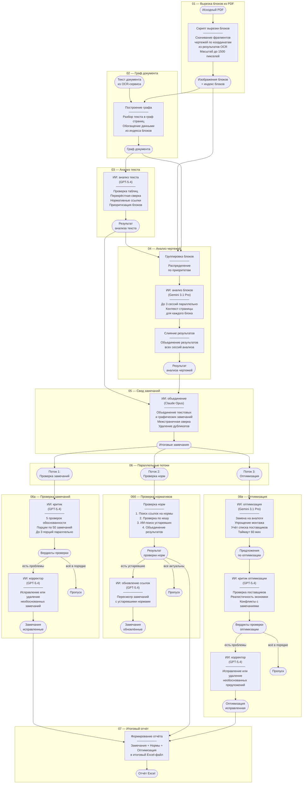
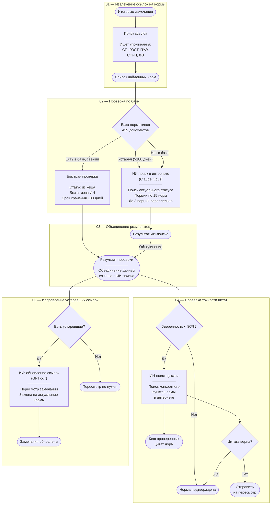
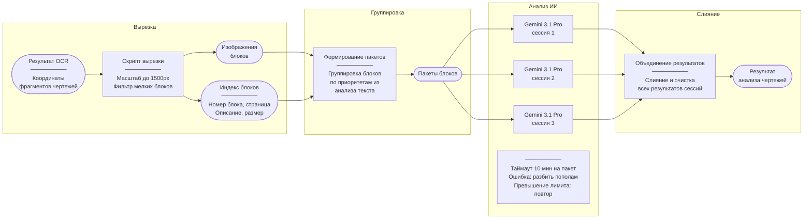
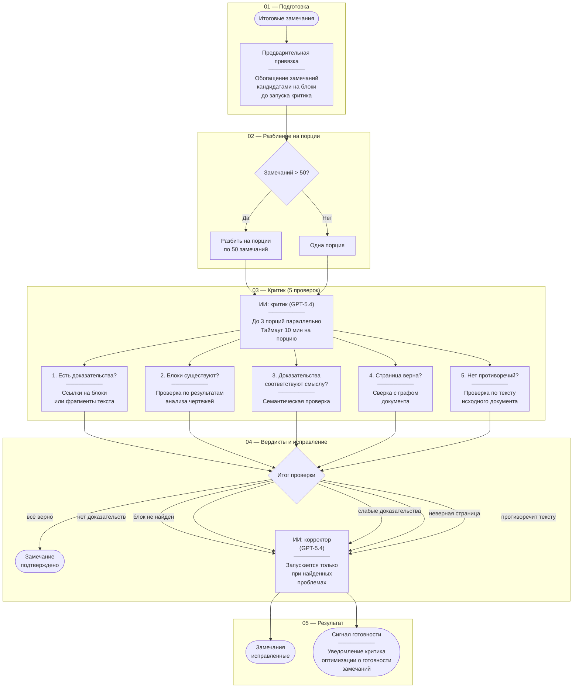
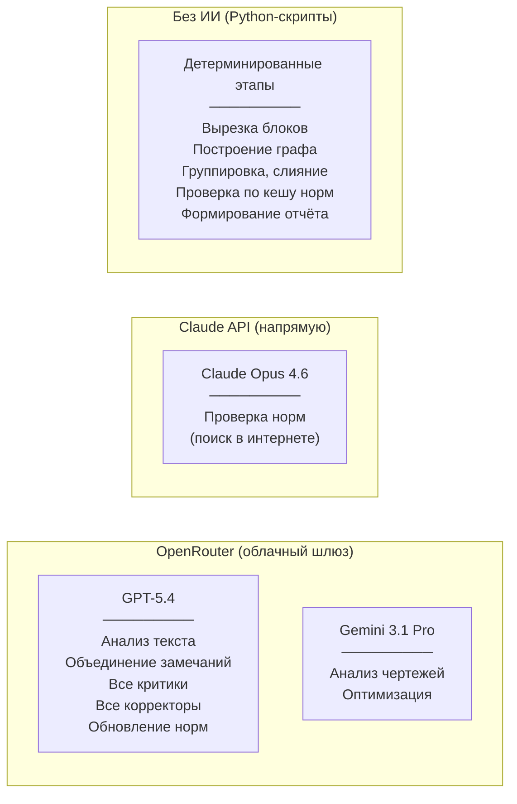

# Диаграммы конвейера Audit Manager

> Актуально на 2026-03-25. Модели: OpenRouter (GPT-5.4, Gemini 3.1 Pro) + Claude Opus.

## 1. Основной конвейер аудита



## 2. Проверка нормативных документов



## 3. Анализ чертежей (детали)



## 4. Проверка замечаний (Критик → Корректор)



## 5. Распределение моделей ИИ



---

> **Как использовать:** скопируй содержимое между ` ```mermaid ` и ` ``` ` (без самих бэктиков) в:
> - **Eraser.io** — бесплатный рендерер с автоматической стилизацией
> - **Mermaid Live** (mermaid.live) — редактор + экспорт в PNG/SVG
> - **GitHub** — прямо в любой `.md` файл
> - **VS Code** — расширение "Markdown Preview Mermaid Support"
