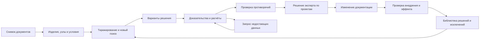

# План развития «Оптимизации раздела»

Дата: 2026-09-28. Статус: выполняется, реализована рабочая основа S01–S11;
полный объём этапов и инженерный пилот ещё не завершены.

Основание: аудит текущего кода сервисов, API, интерфейса и тестов раздела.
Это план разработки; он не запускает анализ проектов, обращения к моделям,
миграцию данных или выпуск в production.

Реализовано в первой поставке:

- профиль ведомости металлоизделий, раздельные масса единицы и общая масса;
- запрет суммирования количества при неизвестной единице;
- fail-closed проверка ссылок текстового агента на строки досье;
- разделение разных инженерных действий над одной позицией;
- отпечаток входов, повторный анализ новой ревизии и признак устаревшего досье;
- сохранение решения эксперта отдельно по каждому целевому проекту с историей,
  проверкой ревизии и защитой от параллельного изменения.

Последующие небольшие поставки добавили:

- детерминированный Critic с блокировкой принятия при незакрытых существенных
  вопросах и управляемые запросы недостающих данных;
- инженерный паспорт действия, предметов, ограничений, целей и параметров;
- консервативное сравнение исходного и предлагаемого вариантов: наблюдаемые
  количества и масса отделены от неизвестного и заявленного эффекта;
- самостоятельные кандидаты на исследование сокращения типоразмеров без
  заявления взаимозаменяемости;
- карту возможного влияния на инженерные интерфейсы со статусом `unknown` и
  требуемыми доказательствами;
- отдельный жизненный цикл внедрения по целевому проекту с доказательствами и
  журналом, который не смешивается с принятием решения.

Это частичное выполнение S01–S11. Этапы не считаются полностью закрытыми, пока
не выполнены все их критерии готовности ниже. В частности, ещё нужны устойчивая
очередь S05, редактируемые альтернативы и формулы S08, подтверждение связей S09,
точечный повтор после ответа S10, библиотека опыта S11 и пилот S12.

## 1. Целевой результат

Инженер получает рабочее место для поиска, сравнения, обоснования и
сопровождения решений по всем комплектам раздела. Для каждого предложения
видно, что меняется, где оно применимо, какие условия проверены, каких данных
не хватает, что затрагивается и какой эффект подтверждён.

Целевой процесс:

Принятие решения, фактическое изменение проекта и подтверждение эффекта —
разные события. PDF и спецификации автоматически не переписываются.

## 2. Основания и границы

В текущей реализации уже есть сбор спецификаций, принятых проектных решений,
поиск кандидатов на тиражирование, сохранение снимков и досье, текстовый агент,
точечная графическая проверка и повтор недоведённой графики.

Локальные проверки аудита выявили следующие случаи:

| Случай | Наблюдаемое поведение | Исправление |
|---|---|---|
| Таблица «Марка / Обозначение / Описание / Кол-во / Масса» | Количество попадает в изготовителя, масса — в количество; заголовок становится строкой данных | S01 |
| Одна из одинаковых позиций без единицы измерения | Количества складываются с позицией, у которой единица известна | S01 |
| Новая версия цели при прежнем исходном решении | Идентификатор кандидата прежний; старое досье блокирует новый анализ | S02 |
| Другое принятое действие по той же позиции | Новый кандидат подавляется как уже обработанный | S03 |
| Агент сослался только на несуществующие строки | Валидатор подставляет допустимые строки и сохраняет положительный вердикт | S04 |

На момент аудита прошли 30 профильных backend-тестов; во frontend прошли
9 из 10, один тест упал на несовпадении ожидаемого текста. Эти результаты
показывают исходное состояние, но не доказывают инженерную точность.

Отдельный критик и сохранение экспертного решения уровня раздела ещё не
реализованы. В [описании раздела](section_optimization.md) часть целевых
требований сформулирована как действующее поведение; S00 должен устранить
это смешение.

Правила исполнения плана:

- Разработка на `main`, небольшими изолированными коммитами; один логический
  результат на коммит. Чужие изменения не включаются.
- Каждому запросу к OpenRouter, включая повтор, проверку и косвенный вызов,
  предшествует отдельное явное разрешение пользователя согласно
  [AGENTS.md](../AGENTS.md). Очередь не хранит бессрочное разрешение на будущие
  обращения. Наличие этого плана не является разрешением на запрос.
- Локальные регрессии используют подставные исполнители моделей. Запуски
  настоящих агентов выделяются в отдельные проверяемые операции.
- Для исследований и проверки интеграции с ProjectChange применим только
  установленный корпус: объект 272, Садовническая 76 / Балчуг Эстейт,
  OLD=`stage_1`, NEW=`stage_2`, логический baseline v002. Соблюдаются split и
  guard из `experiments/project_change_272/`. Ранее известные случаи не
  называются слепыми; validation/final reserve не участвуют в настройке до
  заморозки кандидата. Межпроектная генерализация не является условием выпуска.

## 3. Очереди, зависимости и трудоёмкость

Оценки ниже предварительные, в инженерных человеко-днях разработки и
тестирования. Они предполагают использование существующего хранения,
авторизации, просмотра PDF и запуска агентов. Внешние согласования,
восстановление исходных документов и ожидание эксперта в оценки не входят.
После S00 диапазоны уточняются; это не календарное обязательство.

| Этап | Результат | Зависимости | Оценка |
|---|---|---|---:|
| S00 | Контракты, контрольные примеры, исходные метрики | — | 1–2 |
| S01 | Корректные спецификации и единицы | S00 | 4–6 |
| S02 | Актуальность, версии и повторный анализ | S00 | 4–6 |
| S03 | Паспорт решения и параметрическое сопоставление | S01, S02 | 4–6 |
| S04 | Проверяемые доказательства, контекст и критик | S02, S03 | 5–8 |
| S05 | Устойчивое исполнение задач | S00, S02 | 3–5 |
| S06 | Матрица применимости и решения эксперта | S03, S04, S05 | 5–8 |
| S07 | Самостоятельный поиск инженерных возможностей | S03, S04, S06 | 5–8 |
| S08 | Сравнение альтернатив и расчёт эффекта | S03, S06, S07 | 6–10 |
| S09 | Зависимости и влияние на смежные решения | S03, S06 | 4–7 |
| S10 | Управление недостающими данными | S04, S06 | 4–6 |
| S11 | Контроль внедрения и библиотека опыта | S02, S06, S08, S09, S10 | 4–7 |
| S12 | Пилот, проверка миграции и выпуск | Все этапы для полного выпуска | 3–5 |

Суммарный первоначальный диапазон: **52–84 человеко-дня**. Полное покрытие
всех видов спецификаций и дисциплин потребует отдельных оценок после пилота;
диапазон относится к общей платформе и согласованным пилотным профилям.

Очереди поставки:

1. **Достоверность:** S00–S05. Исправляется существующий механизм.
2. **Рабочее место эксперта:** S06 и S10. Досье превращается в управляемое решение.
3. **Инженерный поиск:** S07–S09. Появляются новые идеи, альтернативы и зависимости.
4. **Внедрение:** S11–S12. Подтверждается изменение документации и результат.

S01 и S02 после S00 могут разрабатываться независимо; S05 — после контракта
S02. После S06 независимыми направлениями становятся S07, S09 и S10.
Это зависимости работ, а не разрешение на запуск фоновых агентов.
Каждая очередь выпускается отдельно после применимых проверок S12.

## 4. Контракты и архитектура

### 4.1. Основные сущности

Названия ниже — проектируемые контракты, а не существующие API.

| Сущность | Обязательное содержание |
|---|---|
| `SectionSnapshot` | Объект, раздел, состав документов, версии и хеши артефактов, время, версии извлечения и нормализации |
| `SpecificationRow` | Исходные ячейки и заголовки, тип таблицы, типизированные значения, единицы, качество разбора, адрес источника |
| `EngineeringSubject` | Изделие, узел или система; функция, расположение, параметры и связанные строки |
| `OptimizationCase` | Стабильный ID идеи, ревизия, исходное решение, действие, условия, цели и альтернативы |
| `RequirementCheck` | Требуемый параметр, фактическое значение, метод проверки, результат и доказательство |
| `EvidenceRef` | Объект, документ, версия, хеш, физическая страница, лист, строка/блок; координаты при наличии |
| `TargetAssessment` | Оценка конкретной цели и ревизии; выполненные проверки, неизвестные условия, противоречия |
| `ExpertDecision` | Кто, когда и по каким целям принял/отклонил/вернул решение, условия, причина, версия досье |
| `DataRequest` | Конкретный вопрос, блокируемые проверки, источник ответа, ответственный, состояние |
| `AlternativeEvaluation` | Исходный вариант, альтернативы, ограничения, критерии, натуральный и денежный эффект, допущения |
| `Dependency` | Связь решений/систем: требует изменения, несовместимо, альтернатива, общее основание или общий эффект |
| `ImplementationCheck` | Принятое изменение, новая версия, найденные доказательства выполнения, исключения |

Неизвестное значение не превращается в ноль и не считается совпадением.
Проверки требований имеют состояния `satisfied`, `violated`, `unknown`,
`not_applicable`; последнее требует основания. Для количественных проверок
хранятся единицы, формула, версия метода и допустимая точность.

### 4.2. Идентичность и состояния

- Стабильный `case_id` связывает историю одной идеи; `case_revision` и
  `input_fingerprint` определяют конкретное проверяемое досье.
- Версии исходных решений, экспертных условий, документов и существенных
  артефактов входят в отпечаток. Изменение данных внутри той же версии также
  учитывается.
- Ключ задачи включает ревизию, целевой проект, этап и версию алгоритма/промпта.
  Набор целей не теряется при анализе подмножества проектов.
- Состояние выполнения задачи, актуальность данных и инженерное решение
  хранятся отдельно. `completed` не означает «одобрено»; `not_visible` не
  означает технический сбой.
- Инженерный жизненный цикл: `proposed → in_review → accepted/rejected/returned`.
  После принятия отдельно ведутся `change_requested → implementation_pending
  → implemented/partially_implemented/not_implemented → effect_verified`.
  Актуальность: `current`, `stale`, `legacy_unverified`.

### 4.3. Разделение модулей

Существующие сервисы остаются точками совместимости; новые обязанности
выносятся постепенно в пакет `backend/app/services/section_optimization/`:
контракты, парсеры, параметры, сопоставление, доказательства, оценка,
экспертные решения, эффект, зависимости и внедрение.

API остаётся под `/optimization/section/{section_code}`. Предлагаемые ресурсы:
`snapshots`, `cases`, `cases/{id}/assessments`, `cases/{id}/decisions`,
`data-requests`, `alternatives`, `implementation-checks`. Пути новых обработчиков
регистрируются до существующего маршрута с `{section_code:path}`. Записи имеют
проверку полномочий, object scope, ожидаемой ревизии и ключа идемпотентности.

Состояние страницы выносится из общего `app.js` в отдельный модуль раздела
по мере изменения функциональности. Сначала сохраняются действующие маршруты
и вкладки; новый обзор добавляется без обязательной полной загрузки строк.

## 5. Этапы реализации

### S00. Зафиксировать исходное состояние и правила проверки

Работы:

- Разделить в текущей документации реализованное поведение и целевые требования.
- Зафиксировать схемы из раздела 4, каталог событий и соглашение о версиях API.
- Превратить пять воспроизведённых случаев из раздела 2 в регрессии.
- Собрать версионируемый набор допустимых примеров: распознавание таблиц,
  применимость/неприменимость, неизвестные параметры, разные действия по одной
  позиции, противоречащие источники. Разметку утверждает инженер дисциплины.
- Выбрать пилотные семейства по доступным разрешённым данным; зафиксировать
  границы поддержки и исходное время экспертной проверки.

Готовность: каждому дефекту соответствует воспроизводимый пример; утверждены
контракты, состав пилота и метрики. Исходное поведение и новая логика сравниваются
на одинаковом наборе документов.

### S01. Исправить извлечение и представление спецификаций

Работы:

- Ввести определение семейства таблицы и явные схемы колонок. Первые профили:
  форма 7 оборудования и ведомость металлоизделий; арматура, отделка, двери и
  окна добавляются по отдельным размеченным примерам.
- Распознавать «Описание», «Марка», «Кол-во эл-в», массу единицы и общую массу;
  отделять повторные заголовки, итоги, группы и продолжения страниц/блоков.
- Сохранять неизвестные колонки как исходные данные. Не подгонять неоднозначную
  таблицу под форму 7 без признака качества и предупреждения.
- Использовать точное числовое представление и проверяемое приведение единиц;
  безразмерные количества, длина, площадь, объём и масса не смешиваются.
- Проверять арифметику количества и массы там, где смысл колонок установлен;
  расхождение порождает задачу проверки извлечения, а не вывод об ошибке проекта.
- Добавить просмотр исходной строки, заголовка и фрагмента страницы. Если
  координаты отсутствуют, показывать страницу без выдуманного выделения строки.
- В интерфейсе отображать дополнительные поля по типу таблицы; добавить поиск,
  фильтр неполного разбора и постраничную/виртуальную загрузку больших таблиц.

Модули: `section_optimization_service.py`, модель строки, адаптер источников,
таблица в `frontend/index.html` и модуль страницы.

Готовность: на размеченных регрессиях нет смещения колонок; заголовки не
считаются позициями; неизвестная единица блокирует суммирование; каждое
отображаемое значение можно сопоставить с исходником. Неподдерживаемый формат
явно обозначается и не поступает в положительную инженерную оценку.

### S02. Ввести актуальность и инкрементальное обновление

Работы:

- Создавать манифест снимка с хешами PDF/извлечения, решений и условий экспертов.
- Проверять согласованность входов до публикации снимка; изменение артефакта
  во время сбора не должно создавать незаметно смешанный срез.
- Разделить историю идеи и идентичность анализа; убрать дедупликацию только
  по `signal_id` и учитывать новые цели при сохранённом анализе старых.
- Добавить причины устаревания, список затронутых целей и точечный пересчёт.
- Передавать версию и объект при открытии таблицы, PDF и графического блока;
  ожидать загрузку нужных данных вместо фиксированной задержки интерфейса.
- Старые досье сохранять для просмотра. Без доказанного совпадения входов
  помечать их `legacy_unverified`, не блокировать ими новую ревизию.

Модули: сервис снимков, `section_optimization_replication_service.py`,
маршруты API и переходы к источникам.

Готовность: одинаковый ввод не порождает дубликат; новая версия/изменённое
решение/новая цель анализируются; незатронутые оценки сохраняются; источник
открывается в зафиксированной версии; изменение файла внутри версии замечается.

### S03. Реализовать паспорт решения и сопоставление по параметрам

Работы:

- Извлекать функцию, класс предмета, действие, расположение, параметры и
  обязательные ограничения. Для каждого факта сохранять источник и состояние
  подтверждения; отличать документальный факт от гипотезы модели.
- Ввести профили семейств: размеры, материал, покрытие, нагрузки, среда,
  пожарные/акустические характеристики, интерфейсы — только применимые поля.
- Разделить широкий поиск похожих позиций и проверку совместимости. Лексический
  поиск используется для отбора, но не доказывает взаимозаменяемость.
- Сравнивать идентичность действия и условия при исключении уже принятых
  решений. Изменение покрытия не поглощает изменение крепления.
- Исключить транзитивное слияние противоречивых решений; хранить допустимые
  группы и объяснимые исключения.
- Переносить в паспорт фактические ограничения и комментарии эксперта,
  сохраняя их автора, ревизию и связь с исходным решением.

Готовность: совместимые, несовместимые и неизвестные параметры различаются;
все обязательные поля профиля участвуют в проверке; два разных действия над
одним изделием остаются отдельными; неизвестное не даёт положительного вывода.

### S04. Проверять доказательства и собирать инженерный контекст

Работы:

- Убрать подстановку допустимых строк вместо ошибочных ссылок агента.
  Неразрешимая ссылка сохраняется как причина неуспешной валидации.
- Привязать каждую существенную проверку к факту и источнику целевого проекта;
  ссылка на исходное принятое решение подтверждает происхождение идеи.
- Добавить получение общих указаний, примечаний к узлам, расчётов и связанных
  документов по конкретному незакрытому требованию. Связь документа с целью
  и версия проверяются перед включением в досье.
- Ограничивать размер контекста; разбивать большие наборы целей на проверяемые
  части, сохранять покрытие каждой цели и явно отражать пропуски/обрезку.
- Объединять текстовую, табличную и графическую оценку через `RequirementCheck`.
  Подтверждение одного условия не закрывает остальные неизвестные.
- Добавить независимый проход критика по собранному досье: противоречия,
  незакрытые требования, точность ссылок, непроверенные нормативные утверждения,
  зависимости и возможный двойной счёт. Проверяемые правила выполняются кодом;
  модель формулирует инженерные вопросы, но не придумывает расчётные данные.
- Заменить пользовательскую «уверенность, %» перечнем подтверждённых и
  неподтверждённых условий; сырую уверенность оставить в диагностике.

Готовность: неверная ссылка не проходит; положительная применимость требует
закрытия обязательных проверок; конфликт источников виден; вывод vision не
теряет текстовые ограничения; нормативное требование имеет проверяемый источник.

### S05. Сделать выполнение устойчивым

Работы:

- Сохранить задачи, попытки, контрольные точки и допустимые переходы состояний.
- Реализовать атомарное владение задачей, heartbeat и восстановление после
  перезапуска; статус не определяется наличием задачи в памяти web-процесса.
- Сначала оценить переиспользование существующих механизмов
  `distributed_workers/job_service.py` и хранилища. Если их контракт не подходит,
  выделить локальный исполнитель с транзакционной очередью; решение записать в
  ADR. Не вводить отдельный брокер без обоснованной необходимости.
- Сохранять результат каждого целевого проекта, чтобы сбой следующего не
  требовал повторять завершённые вызовы. Для неопределённого исхода вызова
  сначала выполнять сверку, а не бесконтрольный повтор.
- Разделить лимиты вызовов, объёма контекста, времени и конкурентности;
  фиксировать модель, версию промпта, расход, длительность и причины остановки.
- Для OpenRouter каждая попытка, включая восстановление, требует отдельного
  разрешения. Переход на другой провайдер не выполняется скрыто.

Готовность: два исполнителя не запускают одну попытку; перезапуск не теряет
готовые результаты; незавершённый этап возобновляется корректно; отмена и
частичный результат различаются; автоматический повтор не обходит разрешения.

### S06. Сделать матрицу применимости и экспертное решение

Работы:

- Добавить обзор «решение × проект/зона»: применимо, неприменимо, недостаточно
  данных, принято, возвращено, устарело. Группировать исполнения по назначению.
- Показывать паспорт, различия вариантов, доказательства и исключения рядом;
  дать открыть источник без потери положения в списке.
- Реализовать сохранение решения по каждой цели: принять, принять с условиями,
  отклонить, вернуть на доработку; поддержать текст причины и историю ревизий.
- Условия принятия разделить на подтверждённые ограничения применения и
  обязательства до внедрения. Незакрытое существенное условие не становится
  подтверждённым техническим фактом после нажатия кнопки.
- Пакетное действие разрешать только для явно выбранных целей; различия и
  нерешённые условия показывать до записи.
- Добавить проверку одновременного редактирования, роли и журнал действий.
  Решения раздела не перезаписывают молча `expert_review.json` проектов.
- Поддержать экспорт паспорта, матрицы и ссылок на доказательства для согласования.

Готовность: решение сохраняется и переживает перезапуск; параллельная правка
не затирается; принятие в одном проекте не принимает остальные; устаревание
видно; история восстанавливает автора, основание и набор документов.

### S07. Добавить самостоятельный поиск возможностей

Работы:

- Ввести отдельные источники кандидатов: перенос принятого решения,
  библиотека проверенных решений и поиск по функциям/параметрам текущего раздела.
- Реализовать первый набор генераторов: сокращение типоразмеров, повторное
  использование узлов, снижение числа монтажных операций, улучшение доступа
  и обслуживания, проверка необоснованного запаса, уменьшение отходов раскроя.
- Для генератора определить входные данные, применимые семейства, ограничения,
  необходимый расчёт, доказательства и основания не выдавать предложение.
- Начать с выбранного в S00 семейства. Для остальных показывать честное
  покрытие: доступно, не поддерживается, данных недостаточно, не запускалось.
- Сравнивать предложения с уже имеющимися делами, сохраняя происхождение идеи.
  Упорядочивать по проверяемому потенциалу, охвату и трудоёмкости проверки;
  неизвестный эффект показывать явно.

Готовность: полезный кандидат появляется без исходного принятого решения;
разные эксплуатационные условия образуют исключения; каждое предложение
объясняет действие, ожидаемый натуральный эффект и путь проверки. Избыточность
параметра не объявляется доказанной без необходимого расчёта.

### S08. Сравнивать альтернативы и считать эффект

Работы:

- Сохранять исходный вариант и минимум один предложенный; поддержать несколько
  альтернатив, включая сохранение текущего решения.
- Сначала проверять обязательные ограничения, затем сравнивать допустимые
  варианты по материалу, монтажу, срокам, обслуживанию, ремонтопригодности и риску.
- Считать натуральные показатели детерминированно: количество типоразмеров,
  масса, детали, соединения, операции. Формулы и входы должны быть обозримы.
- Денежную оценку строить на ценах с источником, датой, единицей, валютой и
  сопоставимым составом затрат. Учитывать переработку проекта, сопутствующие
  изменения, монтаж и эксплуатацию за явно заданный период.
- Показывать диапазоны и чувствительность к допущениям; неизвестные затраты
  не заменять нулём. Разделить потенциальный, принятый и подтверждённый эффект.
- Ввести реестр объёмов эффекта и взаимоисключающих вариантов; эффекты по
  одному объёму не складывать автоматически. Полный учёт зависимостей — S09.

Готовность: расчёт воспроизводим из сохранённых входов; исходный вариант может
оказаться предпочтительным; несовместимый вариант не выигрывает за счёт цены;
альтернативные экономии не суммируются; при отсутствии цен остаётся натуральная
оценка с явным перечнем недостающих данных.

### S09. Учитывать зависимости и смежные разделы

Работы:

- Ввести связи изделия с узлом и системой, а изменения — с другими решениями.
  Различать подтверждённую связь и предположение, требующее проверки.
- Показывать последствия: питание, автоматика, крепления, проходки, габариты,
  доступ, обслуживание и другие применимые интерфейсы.
- Начать со связей внутри раздела, затем подключить смежные документы того же
  объекта через адресуемые доказательства и версии.
- Формировать перечень требуемых согласований и изменений с ответственными.
- Считать совместимые наборы решений; учитывать взаимоисключение, обязательные
  сопутствующие затраты и общий объём эффекта.

Готовность: изменение элемента показывает затронутые интерфейсы; отсутствие
сведений о смежной системе не трактуется как отсутствие влияния; несовместимые
решения не предлагаются к совместному внедрению; общий эффект не задвоен.

### S10. Превратить неизвестные данные в управляемые вопросы

Работы:

- Из каждого существенного `unknown` создавать конкретный вопрос, связанный
  с требованием и альтернативами, на выбор которых влияет ответ.
- Для вопроса указать предполагаемый документ, ответственного, срок при
  необходимости и критерий достаточности ответа.
- Поддержать указание другой страницы/блока, расширение области просмотра,
  добавление расчёта или письменного подтверждения с происхождением.
- При новом ответе повторять только затронутые проверки; технический повтор
  отличать от повторной проверки по новым доказательствам.
- Ограничить число попыток поиска и останавливать цикл без нового материала.
  Приоритет определять влиянием ответа на выбор решения и трудоёмкостью.
- Сначала реализовать внутренние задачи. Отправка писем/сообщений — отдельное
  явно разрешённое пользователем действие.

Готовность: `needs_data` содержит выполнимую задачу; ответ открывает конкретную
заблокированную проверку; неподтверждённый ответ не закрывает её автоматически;
повтор использует новые источники и не гоняет весь раздел заново.

### S11. Подтверждать внедрение и сохранять опыт

Работы:

- После принятия формировать перечень ожидаемых изменений по проектам и
  условия, которые должны быть выполнены до внедрения.
- Сопоставлять этот перечень с новой версией документов. Использовать готовые
  результаты ProjectChange через адаптер там, где они доступны; не дублировать
  независимый движок сравнения в модуле оптимизации.
- Проверять полноту: выполнено, частично, не выполнено, данных недостаточно.
  Отсутствие найденного изменения не равно доказательству его отсутствия.
- Подтверждать эффект по фактическим объёмам и сохранённой методике S08.
- Создать библиотеку паспортов: область применимости, успешные внедрения,
  причины отказа и исключения. Новую цель проверять отдельно даже для
  многократно применявшегося решения.
- Версионировать библиотеку и правила; обратная связь не изменяет промпты
  и критерии в обход проверки. Не переносить факт из другого проекта без ссылки
  и проверки применимости.

Готовность: принятие не помечает решение внедрённым; частичное выполнение
видно по целям; подтверждение ведёт к новой версии и доказательствам;
отклонённое ранее решение не возвращается без учёта причины или новых данных.

### S12. Провести пилот и выпускать по очередям

Работы:

- Пройти сквозной сценарий от таблицы до решения и подтверждения внедрения
  на зафиксированном наборе; оценку выполняет инженер соответствующей дисциплины.
- На одной группе сравнить текущий механизм и новую реализацию по времени,
  качеству доказательств, пропущенным возможностям и принятым решениям.
- Заморозить настройки до отложенной оценки; публиковать размер выборки,
  непроверенные случаи и границы покрытия вместе с показателями.
- Проверить миграцию копий старых снимков и досье, восстановление, отмену,
  повтор, два процесса, одновременное решение экспертов и устаревание.
- Сначала включать новые функции флагами на согласованном объекте/разделе;
  сохранять возможность отключить генераторы, не теряя историю решений.
- Пройти source guard и обычный процесс выпуска. До релиза коммиты должны
  быть достижимы из `origin/main`; наличие коммита локально не означает deployment.

Готовность: применимые критерии этапов выполнены, нет открытых дефектов
корректности доказательств и версий, результат пилота опубликован с ограничениями,
проверены резервная копия и откат. Следующая очередь не требует перезаписывать
принятые решения предыдущей.

## 6. Проверки и критерии качества

| Уровень | Обязательные проверки |
|---|---|
| Данные | Семейства таблиц, повторные заголовки, продолжения, масса/количество, единицы, неизвестные значения, адреса источников |
| Применимость | Разные действия по одной позиции, противоречащие параметры, неполные условия, несколько вариантов исполнения |
| Доказательства | Несуществующие ссылки, чужая версия/объект, доказательство только из исходного проекта, конфликт text/vision |
| Состояния | Новая цель, новая версия, изменение внутри версии, старое досье, два исполнителя, частичный результат, повтор и отмена |
| Эксперт | Две одновременные правки, решения по подмножеству целей, условия, история, права доступа |
| Эффект | Несопоставимые единицы/цены, неизвестные затраты, чувствительность, альтернативы, двойной счёт, сопутствующие изменения |
| Интерфейс | Открытие точной версии, фильтрация матрицы, видимые неизвестные условия, сохранение решения, возврат из источника |

Профильные unit-тесты проверяют правила; интеграционные — полный цикл с
подставными моделями; пользовательские сценарии — поведение интерфейса, а не
только наличие строк в HTML. Модельные оценки проверяются на замороженных
досье с экспертной разметкой и учётом покрытия.

Нулевой допуск в контрольном наборе: перепутанная версия/объект, подменённое
доказательство, скрытая неизвестная единица в сумме, положительный вывод при
незакрытом обязательном требовании, потеря экспертного решения. Прохождение
набора не объявляется гарантией отсутствия всех ошибок на неизвестных данных.

Продуктовые метрики:

- Доля корректно разобранных размеченных строк и доля явно неопределённых.
- Доля предложений с достаточным обоснованием среди просмотренных экспертом.
- Покрытие известных возможностей на размеченном наборе; пропуски учитываются
  отдельно от точности выданных предложений.
- Медианное время инженера на подтверждённое решение и на закрытие вопроса.
- Доля принятых решений, отражённых в следующей версии, и доля подтверждённого
  эффекта среди заявленного при сопоставимых единицах и базе расчёта.
- Время и расход анализа, число повторов, доля успешно переиспользованных оценок.

Для показателей пользы пороги фиксируются в S00 после измерения исходного
состояния; их нельзя выбирать по результату итоговой проверки. Публикуются
числитель, знаменатель и размер выборки. Число кандидатов само по себе не
является критерием успеха.

## 7. Миграция и обратимость

1. Сохранить исходные JSON и их хеши; провести пробную миграцию на копии.
2. Ввести чтение прежних схем и явную версию новой. Миграция повторяема.
3. Старое досье не получает новые доказательства или подтверждённую актуальность
   по умолчанию. Недостающие поля отмечаются как неизвестные.
4. Разделить вычисляемые снимки и журнал экспертных событий. Повторный сбор
   источников никогда не стирает ручные решения.
5. Сначала включить новую логику в режиме сравнения результатов, затем чтение
   в интерфейсе, затем запись экспертных решений.
6. Для каждой очереди проверить план отката. Если новая запись несовместима со
   старым кодом, откат включает совместимый reader или временный режим чтения;
   новые решения не удаляются ради возврата версии приложения.

## 8. Ответственность и первые коммиты

Backend отвечает за контракты, извлечение, идентичность, проверки, исполнение
и расчёты. Frontend — за матрицу, паспорт, сравнение и работу с источниками.
Инженер дисциплины определяет значимые условия, размечает контрольные случаи
и оценивает полезность. За выпуск отвечает владелец приложения. Это роли;
назначение конкретных исполнителей не меняет порядок зависимостей.

Начальная последовательность небольших коммитов:

1. Регрессия и исправление нестандартной таблицы АР, явные поля масс.
2. Регрессия и запрет суммы при неизвестной/несовместимой единице.
3. Регрессия и запрет подстановки строк вместо ошибочных ссылок агента.
4. Контракт ревизии и отпечатка, миграция чтения старых досье.
5. Повторный анализ новой ревизии и новых целей без дубликатов.
6. Открытие точной версии источника и индикатор актуальности.
7. Паспорт действия и исправление подавления другого решения по той же позиции.

После этих исправлений продолжаются полноценные S03–S06. Первой законченной
пользовательской поставкой становится достоверная матрица применимости с
сохранением решения эксперта; самостоятельный поиск расширяет её следующей
очередью.

## 9. Покрытие предложений аудита

| Предложение | Этапы |
|---|---|
| Разные спецификации, единицы, исходный PDF | S01 |
| Актуальность, версии, инкрементальный пересчёт | S02 |
| Сопоставление предмета, действия и условий | S03 |
| Проверка ссылок и объединение text/table/vision | S04 |
| Расширенный контекст и независимый критик | S04, S10 |
| Устойчивые задачи, лимиты, повтор и тестирование | S00, S05, S12 |
| Инженерный паспорт | S03, S06 |
| Матрица решений по корпусам и зонам | S06 |
| Самостоятельный поиск новых возможностей | S07 |
| Альтернативы, натуральный и денежный эффект | S08 |
| Последствия для связанных решений и дисциплин | S09 |
| Недостаток данных как инженерная задача | S10 |
| Контроль внедрения, фактический эффект и библиотека опыта | S11 |
